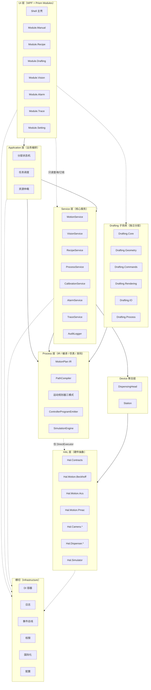
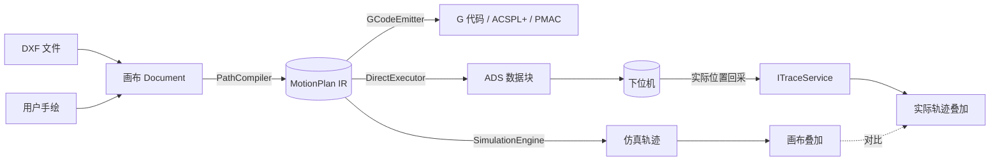
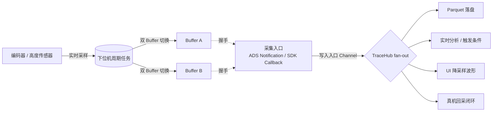
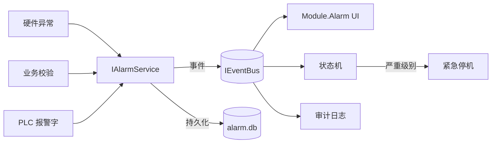
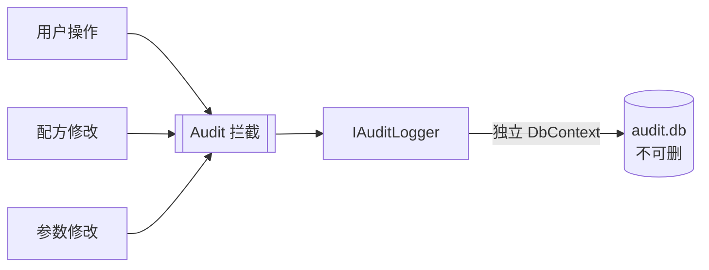
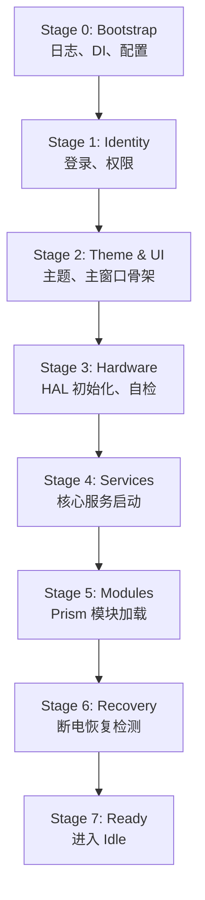
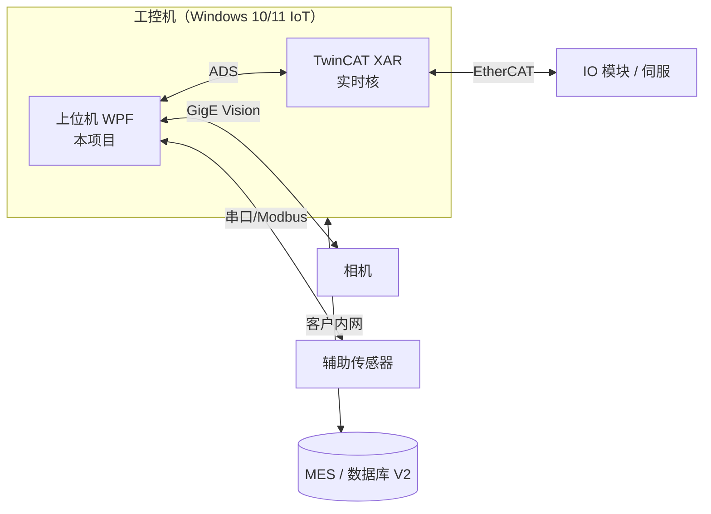

# 文档 1 — 架构总览（Architecture.md）

> 版本：v0.1 · 最后更新：2026-05-20

本文是整个项目的"地图"。无论是新人接手还是自己回头查阅，都从这里入手。本文不深入实现细节，只回答"这个项目是什么 / 为什么这么设计 / 由哪些块组成 / 数据怎么流"。具体接口、目录、状态机等内容散落在配套文档中，参见 [`docs/README.md`](./README.md)。

---

## 1. 项目背景与目标

### 1.1 业务定位

本项目是一套面向**工业超精密点胶**场景的上位机软件平台，跑在 Windows 工控机上，与下位机控制器（Beckhoff TwinCAT、ACS、Omron PMAC 等）协同完成产品从上料到下料的全流程。

典型应用场景包括：

- 半导体封装中的底填充、芯片粘接
- 电子组装中的 SMT 点胶、点锡膏、灌封
- 显示面板的封边胶
- 电流体打印（EHD）等高端微纳制造场景
- 医疗器械的微量胶水分配

这些场景共同的特征是：**高精度（微米级）、高一致性、可追溯、对工艺参数敏感、客户定制需求多**。

### 1.2 商业模式

项目采取**"标准平台 + 定制配置"**的商业模式：

- 一套主代码库服务多个客户和多个机型
- 客户差异通过**配置包**承载，不是代码分支
- 定制需求优先做成**可选模块**，主程序通过配置启用
- 极少数情况才允许"客户专属模块"，且不允许修改 Core / Contracts

这套模式决定了架构必须**配置驱动 + 高度模块化**，否则主线会被定制需求拖垮。

### 1.3 设计原则

整个架构围绕五条原则展开。后续所有设计决策都可以追溯到这些原则：

1. **分层与解耦**：硬件、工艺、UI 三者彻底解耦。任何一层变更不影响其他两层。
2. **接口先行**：所有跨模块协作通过接口，先定义接口再实现。
3. **配置驱动**：硬件清单、模块启用、UI 布局、工艺模板尽可能通过配置文件描述，避免改代码。
4. **可测试**：核心逻辑必须能脱离真实硬件运行，仿真器是一等公民。
5. **可演进**：单人开发的项目，必须能在"功能新增"和"代码腐化"之间保持平衡，文档与 ADR 是基本要求。

---

## 2. 总体架构理念

### 2.1 三大解耦

> 把"硬件"、"工艺"、"UI"三者彻底解耦，靠"接口 + 插件 + 项目自有事件总线"粘起来。

这是整个架构最核心的一句话。具体表现为：

- **硬件层（HAL）**：每类硬件定义抽象接口，各厂家实现独立 DLL。换硬件 = 换 DLL + 改配置。
- **工艺层（Drafting / Process）**：编辑、编译、仿真、发码只围绕 IR 与工艺模型工作，不直接依赖具体硬件；只有执行适配层（如 `Process.DirectExecutor`）和 Service / Device 实现层接触 `Hal.Contracts`。
- **UI 层（Modules）**：通过 Shell + Prism 的 UI 组织能力承载功能页面。当前阶段只保留 `Modules` 逻辑层/目录；只有功能需要独立加载、客户裁剪或复用时，才按文档 2 的规则创建独立 Module 项目。

三层之间通过：

- **接口（Contracts）**：定义"做什么"，不暴露"怎么做"
- **依赖注入（DI）**：上层只声明需要哪些接口，由容器装配实现
- **事件总线（IEventBus）**：模块之间不直接引用，发布/订阅事件解耦；事件总线是项目自有抽象，不使用 Prism 作为业务总线

### 2.2 接口先行 + 配置驱动 + 消息总线

这三件事互相配合：

| 机制 | 作用 | 典型用法 |
|------|------|----------|
| 接口先行 | 让"扩展硬件/功能"变成"实现一个接口"的小事 | `IMotionController`、`ICamera`、`IDispenser` |
| 配置驱动 | 让"客户差异"变成"换一份 JSON"的小事 | `hardware.json`、`modules.json` |
| 消息总线 | 让"模块协作"变成"发个事件"的小事 | `AxisHomedEvent`、`AlarmRaisedEvent` |

### 2.3 上下位机分工边界

工业项目里**实时性边界**是头号决定项目生死的问题。Windows + C# 不是实时系统，所以必须明确分工：

**下位机（PLC / 运动控制器）负责**：

- 所有时序敏感动作（运动轨迹插补、IO 触发、PSO 位置同步输出）
- 安全联锁与急停响应
- 电子凸轮、飞行点胶等需要微秒级精度的功能
- 高频数据采集与缓冲
- 轴回零、限位保护

**上位机（C# / WPF）负责**：

- 配方下发、状态监视、UI 交互
- 数据记录、报警显示、日志归档
- 视觉算法（除非走专用视觉控制器）
- 工艺规划、路径编辑、仿真
- 用户管理、审计、追溯查询

**上下位机接口**：通过下位机全局变量（约定好的命令字 / 状态字 / 数据块）。这套"上下位机协议"被作为正式接口对待，与 HAL 接口同等地位，单独维护版本号和文档。

---

## 3. 技术栈选型

每一项的选型理由简述如下，详细 ADR 见 `docs/adr/`。

### 3.1 UI 框架与控件库

| 项 | 选型 | 理由 |
|----|------|------|
| UI 框架 | **WPF** | 成熟、工业上位机主流、控件生态丰富 |
| 模块化框架 | **Prism** | 用于 Shell、Region、Module Catalog、导航和对话等 UI 组织能力 |
| MVVM 助手 | **CommunityToolkit.Mvvm** | source generator 写 ViewModel 极简，与 Prism 共存 |
| 控件库（基础） | **Wpf.Ui** | 现代 Fluent 风格，主题切换体验好 |
| 控件库（工业） | **HandyControl** | 工业控件齐全（PropertyGrid、Step、Growl 等） |
| 代码编辑器控件 | **AvalonEdit** | 用于 G 代码视图，语法高亮、行号、折叠 |

### 3.2 渲染与图形

| 项 | 选型 | 理由 |
|----|------|------|
| 2D 渲染 | **SkiaSharp** | 硬件加速、性能好、API 友好，编辑器画布核心 |
| 3D 预览（路径高度） | **HelixToolkit.Wpf** | WPF 生态成熟的 3D 库 |
| 图表 | **ScottPlot** | 高频数据波形、SPC 图表；与设计系统中的 `WaveformPanel` 保持一致 |

### 3.3 数据与持久化

| 项 | 选型 | 理由 |
|----|------|------|
| 关系数据库 | **SQLite** | 轻量、零运维、单机够用 |
| ORM（业务） | **EF Core** | 实体 CRUD、迁移工具好 |
| ORM（高频/批量） | **Dapper** | 批量插入和复杂查询性能 |
| 列式归档 | **Parquet（ParquetSharp）** | 高频追溯数据的标准格式 |
| 配置 | **JSON + System.Text.Json** | 强类型 Options 模式 |
| Schema 校验 | **JsonSchema.Net** | 启动时校验配置文件 |

### 3.4 控制与并发

| 项 | 选型 | 理由 |
|----|------|------|
| 状态机 | **Stateless** | API 优雅、轻量 |
| 反应式 | **System.Reactive (Rx.NET)** | 高频数据流和事件组合 |
| 生产者-消费者 | **System.Threading.Channels** | 性能远超 BlockingCollection |
| 单元换算 | **UnitsNet** | 防止单位错误 |
| 校验 | **FluentValidation** | 配方参数、工艺参数校验 |

### 3.5 通讯

| 协议/接口 | 用途 |
|-----------|------|
| **Beckhoff.TwinCAT.Ads** | 与 Beckhoff PLC 通讯 |
| **ACS C# SDK** | 与 ACS 控制器通讯 |
| **PMAC Pcomm32** | 与 Omron PMAC 通讯（P/Invoke） |
| **GigE Vision / GenICam** | 工业相机统一接口 |
| **Basler Pylon / 海康 MVS / 华睿 IMVS** | 各家相机 SDK |
| **NModbus / 自研串口** | 简单 IO、传感器 |

### 3.6 日志、诊断与测试

| 项 | 选型 | 理由 |
|----|------|------|
| 日志 | **Serilog + Sinks.File + Sinks.Seq** | 结构化日志、Seq 调试体验好 |
| 单元测试 | **xUnit** | .NET 主流 |
| Mock | **NSubstitute** | API 友好 |
| 性能基准 | **BenchmarkDotNet** | 关键路径性能验证 |
| 文档生成 | **DocFX** | 从 XML 注释生成 API 文档 |

### 3.7 几何与算法

| 项 | 选型 | 理由 |
|----|------|------|
| DXF 导入 | **netDxf** | 开源、活跃 |
| 视觉算法 | **OpenCvSharp** | OpenCV 的 .NET 绑定 |
| 视觉算法（高端口子） | **Halcon** | 接口预留，第一版自研 |
| 几何运算 | **自研 + NetTopologySuite** | 偏移、布尔运算 |

---

## 4. 分层架构

### 4.1 总体分层图



实线表示主要编排依赖，虚线表示受限制的间接关系或横切关注点。图里的 `UI -.只读查询/订阅.-> Service` 表示 UI 可以读取状态、订阅数据和展示结果；启动生产、下发、暂停、恢复等会改变设备状态的命令必须走 Application 层，由状态机、调度器和资源仲裁统一把关。Process 层只有 `Process.DirectExecutor` 允许依赖 `Hal.Contracts` 用于执行适配；`Process.Ir`、`Process.Compiler`、`Process.Simulation`、`Process.Emitter` 不依赖 HAL 实现，也不直接依赖具体硬件 SDK。

### 4.2 各层职责

#### HAL 层（Hardware Abstraction Layer）

定义所有硬件的接口，每个接口只暴露"做什么"，不关心"谁来做"。

接口示例：`IAxis`、`IMotionGroup`、`IDispenser`、`ICamera`、`IIoModule`、`ISensor`、`IHeater`、`IPressureRegulator`、`ISafetyController`。

每个具体厂家（Beckhoff、ACS、PMAC、Basler、海康、华睿…）写一个独立 DLL 实现这些接口。换硬件 = 换 DLL + 改配置。

特别地，**`Hal.Simulator`** 提供全套接口的"假实现"，用于无硬件时的开发和测试，是一等公民。

#### Device 聚合层

把多个底层硬件组合成"逻辑设备"。例如 `DispensingHead` = 一个阀 + 一个加热器 + 一个压力传感器 + 一个针头。上层只跟逻辑设备打交道，不需要知道里面有几个 IO。

`Station`（工位）也是聚合：一个工位可能包含多个轴 + 一个相机 + 一个执行头。多工位场景下，每个工位是独立实例。

#### Service 层（核心服务）

每个服务负责一个明确的领域：

- `IMotionService`：插补、回零、坐标系标定、安全区
- `IVisionService`：定位、Mark 识别、胶宽检测
- `IRecipeService`：配方管理、版本、模板
- `IProcessService`：工艺流程编排
- `ICalibrationService`：所有坐标变换矩阵的集中管理
- `IAlarmService`：报警的产生 / 确认 / 清除生命周期
- `ITraceService`：高频数据通道的订阅与分发
- `IAuditLogger`：审计日志的统一入口

服务之间通过接口和事件协作，避免直接引用。

#### Application 层（业务编排）

把"上料 → 视觉定位 → 点胶 → 检测 → 下料"编排起来。核心机制：

- **分层状态机**：设备级 / 工位级 / 任务级 / 配方执行级
- **任务调度**：多工位并行调度、节拍优化
- **资源仲裁**：共享空间、共享设备的申请释放

#### Drafting 子系统

编辑器是独立分层。它有自己的领域模型（DraftingDocument）、几何运算、命令系统、渲染管线。Drafting 不直接依赖 HAL，它通过 Process 层把设计成果（路径 + 工艺）编译成 IR，再下发。

#### Process 层

包含中间表示（IR）和所有"翻译"工作：

- **PathCompiler**：画布 → IR
- **SimulationEngine**：IR → 仿真轨迹
- **ControllerProgramEmitter**：IR → G 代码 / ACSPL+ / PMAC Program
- **DirectExecutor**：IR → 控制器执行协议 / 结构化命令（ADS 只是 Beckhoff 场景的实现方式）
- **运动规划器**：自定义 S 曲线 / Beckhoff 离线 / PLC 虚拟模式三种实现

详见文档 5《同步机制设计》。

#### UI 层

`Shell` 是壳，只负责导航、状态栏、登录、报警栏。功能页面先按 `Modules` 逻辑层组织，通过 Region 注入到主壳；当某个页面/功能需要插件化、客户裁剪或独立交付时，再拆成独立 Prism Module 项目。主壳只认识模块清单和导航契约，不直接耦合具体页面实现。

#### Cross-cutting（横切）

日志、DI 容器、事件总线、权限、国际化、配置、异常处理。所有层都通过项目自有抽象使用这些能力；Prism 只能出现在 UI 组织层，不作为跨层事件总线或业务契约。

### 4.3 依赖方向规则

**核心规则**：

1. 上层可以依赖下层，下层不能依赖上层
2. 同层之间通过接口（Contracts 项目）依赖，不直接引用实现
3. 横切层（Infrastructure / Logging / Events）所有层都可以引用，但其 public API 不能暴露 Prism 类型
4. **绝对禁止**：HAL 实现项目互相引用（Beckhoff 不能引用 ACS）
5. **绝对禁止**：Module 之间互相引用（用事件总线通信）
6. **Prism 影响范围限制**：Prism 只允许出现在 Shell、Modules、DesignSystem 的 UI 适配层，用于 UI 组织、Region、Module Catalog、导航和对话适配。`Core` / `Application` / `Process` / `HAL` / `Drafting` 的 public API 和实现代码都不得引用 Prism 命名空间，也不得引入 Prism 包。跨层协作必须通过本项目自己的 Contracts / 服务接口 / 事件包装完成，不能让 Prism 类型成为业务契约的一部分。

依赖方向通过 Roslyn 分析器自动校验，详见文档 10。

---

## 5. 关键数据流

本节给出几条最重要的数据流，帮助理解模块如何串起来。

### 5.1 路径设计 → 编译 → 仿真 → 下发流（含 IR）

这是项目最重要的数据流，由 IR（中间表示）作为唯一权威源。



关键约束：

- 画布、仿真、G 代码、下发、回采**五者必须同源于 IR**
- IR 不可变，带 hash 链，可追溯到画布版本
- 用户改了画布未重新编译，UI 标记 G 代码 / 仿真"已过期"，禁止下发

详见文档 5《同步机制设计》。

### 5.2 高频采集流（PLC → ADS/SDK → TraceHub → 多消费者）



关键设计：

- PLC 侧维护双缓冲（Ping-Pong），写满切换，避免读写冲突
- 每个数据点带 PLC 周期内时间戳（不是上位机收到的时间）
- 上位机用 `System.Threading.Channels` 承接采集入口，避免采集回调阻塞
- `TraceHub` 负责广播分发；每个消费者拿到独立订阅通道或 `IObservable<T>`，不是多个消费者抢同一个 `Channel<T>`
- 数据通道有"注册中心"概念，新增传感器只需注册新通道

详见文档 5《同步机制设计》第 8 节。

### 5.3 报警流



关键设计：

- 任何模块通过 `IAlarmService.Raise(...)` 上报，UI 自动显示
- 报警有完整生命周期：产生 → 确认 → 清除
- 报警分四级：Fatal / Critical / Warning / Info
- 报警事件同时驱动状态机（致命级强制进 Alarm 状态）
- 每条报警有全球唯一编号（如 `ALM-MOTION-0023`），方便客户报修

详见文档 6《状态机与恢复机制设计》第 6 节。

### 5.4 审计流



关键设计：

- 审计日志走独立 DbContext，业务代码不能 update / delete
- 字段：时间戳、用户、操作类型、目标对象、变更前值、变更后值
- 审计库文件单独，方便后期加签名链
- 第一版做基础，未来可升级到 21 CFR Part 11 标准

### 5.5 启动流



每个阶段有明确的失败处理：失败时显示错误页 + 详细日志，不能黑屏。

### 5.6 关闭流

按启动相反顺序：业务停 → 模块卸载 → 服务停 → 硬件断开 → 配置写入 → 日志 flush。

关闭命令统一走 `IShutdownCoordinator`。每步有超时，超时强制。异常关闭也要尽量走完关键步骤（写 checkpoint、flush 日志、释放硬件）。

---

## 6. 模块拓扑

### 6.1 Prism 模块清单

| 模块名 | 职责 | 工程师可见 | 操作员可见 |
|--------|------|-----------|-----------|
| `Module.Manual` | 手动调试：Jog、IO 控制、单步动作 | ✅ | ❌（受限） |
| `Module.Recipe` | 配方管理：列表、编辑、版本 | ✅ | 只读 |
| `Module.Drafting` | 编辑器：画布、工具、命令行 | ✅ | ❌ |
| `Module.Vision` | 视觉调试：相机预览、算法配置 | ✅ | ❌ |
| `Module.Production` | 生产运行：开始/停止、产品计数 | ✅ | ✅ |
| `Module.Alarm` | 报警栏 + 报警历史 | ✅ | ✅ |
| `Module.Trace` | 追溯查询：产品历史、波形回看 | ✅ | 只读 |
| `Module.Calibration` | 标定：相机、手眼、Mark | ✅ | ❌ |
| `Module.Setting` | 系统设置：用户、主题、语言、网络 | ✅ | 受限 |
| `Module.Maintenance` | 维护模式工具集 | ✅ | ❌ |

模块启用通过配置文件 `modules.json` 控制。某些模块可按客户裁剪。

### 6.2 HAL 实现候选清单

| 名称 | 类型 | 说明 |
|--------|------|------|
| `Hal.Contracts` | 接口 | 所有 HAL 接口定义 |
| `Hal.Simulator` | 仿真 | 全套接口的假实现 |
| `Hal.Motion.Beckhoff` | 运动 | TwinCAT NCI / NC PTP |
| `Hal.Motion.Acs` | 运动 | ACS 运动控制器 |
| `Hal.Motion.Pmac` | 运动 | Omron PMAC（候选 / 预留） |
| `Hal.Camera.Basler` | 视觉 | Basler Pylon |
| `Hal.Camera.Hikvision` | 视觉 | 海康 MVS |
| `Hal.Camera.Huaray` | 视觉 | 华睿 IMVS |
| `Hal.Dispenser.Generic` | 点胶 | 通用 IO 控制阀 |
| `Hal.Sensor.Keyence` | 传感 | 基恩士高度传感器 |
| `Hal.Io.Beckhoff` | IO | EtherCAT IO 模块（通过 ADS） |

### 6.3 启动与模块加载顺序

启动过程分成运行时装配和 UI 模块加载两段，避免把硬件实现、核心服务和 Prism Module 混成同一种东西。当前未项目化的实现可先由所在层内部注册；只有已经独立插件化的实现才从外部 DLL 加载：

1. Bootstrap：日志、配置、DI、权限、主题等基础设施就绪
2. 插件发现：按 `hardware.json`、`modules.json` 和扩展配置加载已声明的外部 DLL；未声明或尚未插件化的能力由当前项目内注册表解析
3. 硬件与服务启动：注册 HAL 实现，初始化 Device / Service / Application 编排
4. UI 模块加载：Prism 只加载已启用的 `Modules.*`，并按 `modules.json` 声明的 UI 依赖拓扑排序

非关键 UI 模块加载失败要降级处理，不能让整个 UI 崩溃；关键硬件或核心服务启动失败则进入启动错误页。

---

## 7. 部署形态

### 7.1 单机部署架构

典型的单机部署：



可选拓扑变体：

- **ACS 控制器**：上位机 ↔ ACS（以太网）↔ 伺服
- **PMAC 控制器**：上位机 ↔ PMAC（以太网或 PCI）↔ 伺服
- **混合**：Beckhoff 主控 + ACS 高动态副轴

### 7.2 安装包结构

```
DispensingPlatform/
├─ DispensingPlatform.exe        主程序
├─ *.dll                          核心程序集
├─ plugins/                       后续插件化阶段运行时加载的 HAL / Module DLL
│   ├─ Hal.Motion.Beckhoff.dll
│   ├─ Hal.Camera.Basler.dll
│   └─ Module.Drafting.dll
├─ configs/                       客户与机型配置
│   ├─ _shared/
│   └─ customer-XYZ/
│       └─ model-A1/
├─ data/                          运行时数据（数据库、追溯）
│   ├─ system.db
│   ├─ recipe.db
│   ├─ production.db
│   ├─ alarm.db
│   ├─ audit.db
│   └─ trace/
│       └─ 2026-05-20.parquet
├─ logs/                          日志
├─ cache/                         缓存（缩略图、临时文件）
└─ docs/                          运维手册（部分随包发布）
```

### 7.3 系统要求

建议最低配置：

- CPU：4 核以上（推荐 6 核）
- 内存：8 GB（推荐 16 GB）
- 显卡：支持 DirectX 11 的独显或核显（SkiaSharp / WPF 渲染需要）
- 操作系统：Windows 10/11 IoT Enterprise LTSC
- .NET：.NET 8 Runtime

---

## 8. 命名与编码约定

### 8.1 项目与命名空间命名

统一前缀 `DispensingPlatform.`，按层级分类。注意：除文档 2 “当前项目”明确列出的 `.csproj` 外，下列名称默认表示逻辑命名空间或未来拆分候选，不代表当前必须创建独立项目。

```
DispensingPlatform.Shell                       # 启动入口
DispensingPlatform.Core.Contracts              # 跨模块接口
DispensingPlatform.Core.Infrastructure         # DI、日志、配置
DispensingPlatform.Core.Services               # 服务实现
DispensingPlatform.Hal.Contracts               # HAL 接口
DispensingPlatform.Hal.Motion.Beckhoff         # HAL 实现
DispensingPlatform.Hal.Simulator
DispensingPlatform.Process.Ir                  # IR 数据模型
DispensingPlatform.Process.Compiler
DispensingPlatform.Process.Planner
DispensingPlatform.Process.Emitter
DispensingPlatform.Drafting.Core
DispensingPlatform.Drafting.Geometry
DispensingPlatform.Drafting.Rendering
DispensingPlatform.Drafting.Commands
DispensingPlatform.Drafting.IO
DispensingPlatform.Modules.Drafting            # Prism 模块
DispensingPlatform.Modules.Recipe
DispensingPlatform.Modules.Alarm
...
```

详细规则见文档 2《解决方案与项目结构》。

### 8.2 命名空间

当前阶段优先让命名空间与逻辑目录一致；某个逻辑区域被拆成独立项目后，再让项目名与根命名空间一致。子文件夹形成子命名空间。

### 8.3 文件夹约定

每个项目内部统一组织：

```
ProjectName/
├─ Abstractions/        接口
├─ Models/              数据模型 / DTO / record
├─ Services/            服务实现
├─ Internal/            内部辅助类，不对外暴露
├─ Resources/           资源文件
└─ README.md            模块说明（强制）
```

### 8.4 编码风格

- C# 12 / .NET 8 起步
- `nullable` 默认开启
- 异步默认（`Task` / `IAsyncEnumerable`），所有 IO 操作支持 `CancellationToken`
- DTO 用 `record`（不可变值对象）
- 公共 API 必须有 XML 注释
- 所有外部依赖通过接口注入

详细规则统一在 `.editorconfig` 强制。

---

## 9. 演进方向与扩展点

### 9.1 范围控制

本文只描述长期架构边界和扩展方向，不在这里规定具体版本范围。每个阶段实际做哪些功能，由实施计划、Issue 或里程碑单独控制。

### 9.2 后续演进方向

- 更多控制器实现：ACS、PMAC 或其他客户现场控制器
- 多工位（多执行器 + 多载台）调度
- 实时叠加的真机回采
- 操作员 UI 深化
- 视觉算法库扩展（Halcon 接口）
- 高级编辑器功能（块编辑、阵列、参数化绘图）
- 多客户多机型完整支持
- MES 上传
- 21 CFR Part 11 合规
- SECS/GEM 协议
- 远程协助、自动升级
- AI 辅助路径优化
- SPC 与过程能力分析

### 9.3 预留扩展点清单

架构期就明确预留的扩展点，避免未来推倒重来：

| 扩展点 | 接口 / 机制 | 状态 |
|--------|-------------|-------------|
| 新硬件厂家 | 新建 Hal.* 项目实现接口 | 基础扩展点 |
| 新 UI 模块 | 新建 Modules.* 项目 | 基础扩展点 |
| 新 G 代码方言 | 实现 `IControllerProgramEmitter` | 基础扩展点 |
| 新工艺图元类型 | 继承 `EntityBase` + 注册命令 | 基础扩展点 |
| 新运动规划器 | 实现 `IMotionPlanner` | 基础扩展点 |
| 新数据通道 | 注册到 `ITraceService` | 基础扩展点 |
| 参数化绘图 | `IConstraintSolver` 占位 | 预留 |
| 电子签名 | `IAuditLogger` 装饰器扩展 | 预留 |
| Halcon 视觉 | `IVisionAlgorithm` 多实现 | 预留 |
| MES 接口 | `IMesAdapter` | 预留 |

---

## 附录 A — 术语表

| 术语 | 含义 |
|------|------|
| HAL | Hardware Abstraction Layer，硬件抽象层 |
| IR | Intermediate Representation，中间表示，本项目指 MotionPlan |
| ADS | Automation Device Specification，Beckhoff 通讯协议 |
| PSO | Position Synchronized Output，位置同步输出 |
| NCI | Numerical Controller Interpolation，Beckhoff 插补内核 |
| MES | Manufacturing Execution System，制造执行系统 |
| SPC | Statistical Process Control，统计过程控制 |
| Mark | 视觉对位用的基准点（Fiducial） |
| Purge | 打胶清针动作 |
| Pot life | 胶水可用时间 |
| EHD | Electrohydrodynamic，电流体动力（电流体打印） |
| UCS | User Coordinate System，用户坐标系 |
| Eye-in-Hand | 相机装在执行头上 |
| Eye-to-Hand | 相机固定在外部 |

---

## 附录 B — 参考文档

- 文档 2：[2 Solution-Structure.md](./2%20Solution-Structure.md) — 解决方案与项目结构细节
- 文档 3：[3 Core-Contracts.md](./3%20Core-Contracts.md) — 接口与数据模型契约
- 文档 4：[4 Drafting-Subsystem.md](./4%20Drafting-Subsystem.md) — 编辑器子系统
- 文档 5：[5 Sync-Mechanism.md](./5%20Sync-Mechanism.md) — 五者同步
- 文档 6：[6 StateMachine-Design.md](./6%20StateMachine-Design.md) — 状态机
- 文档 7：[7 Data-Persistence.md](./7%20Data-Persistence.md) — 数据持久化
- 文档 8：[8 Design-System.md](./8%20Design-System.md) — UI 设计系统
- 文档 9：[9 Config-Multitenancy.md](./9%20Config-Multitenancy.md) — 多客户配置
- 文档 10：[10 DevOps.md](./10%20DevOps.md) — 开发与发布
