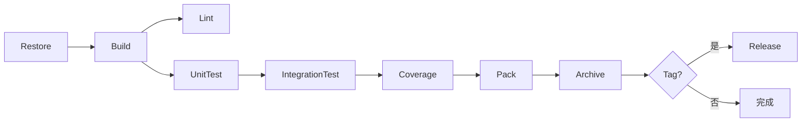

# 文档 10 — 开发与发布流程（DevOps.md）

> 版本：v0.1 · 最后更新：2026-05-20

本文是单人开发项目的"工程纪律"。一个人写代码、一个人维护、一个人发版、一个人现场支持，靠的不是天赋，而是流程。本文把所有"应该写下来防止自己忘掉的事"一次性钉死。

---

## 1. 仓库与分支

### 1.1 仓库划分

```
DispensingPlatform/                # 主仓库（公司私有 / 公开混合）
├─ src/                            # 主代码
├─ tests/
├─ tools/
├─ configs/
│   ├─ _shared/                    # 全局共享配置
│   └─ public-templates/           # 公共示例
├─ docs/
└─ samples/

DispensingPlatform-Customer-XYZ/   # 客户私有仓库（每个客户一个）
├─ configs/customer-XYZ/
├─ secrets/                        # 加密 / .gitignore 处理
├─ plugins/                        # 客户专属模块
└─ docs/                           # 客户专属文档

DispensingPlatform-PLC-Beckhoff/   # 下位机 PLC 程序仓库（独立维护人）
├─ TwinCAT/
└─ docs/

DispensingPlatform-Schemas/        # JSON Schema 文档（如分仓库）
└─ schemas/

DispensingPlatform-Releases/       # 发布产物（可选，二进制）
└─ releases/
```

### 1.2 分支策略

主仓库严格简单：

| 分支 | 用途 | 规则 |
|------|------|------|
| `main` | 主线，始终可发布 | 受保护，不允许 force push |
| `feature/<name>` | 功能开发 | 短生命周期，PR 合并后删除 |
| `fix/<issue>` | 修复 | 同上 |
| `release/<version>` | 发布准备 | 仅在发布期开 |
| `hotfix/<version>` | 紧急修复 | 从某个 release tag 拉，回流到 main |

不使用 git-flow（develop 分支多余），不使用 trunk-based 直接 push（容易破坏主线）。

### 1.3 标签规范

```
v1.0.0           # 正式版
v1.0.0-rc.1      # 候选版
v1.0.0-beta.1    # 测试版
v1.0.0-customer-xyz   # 客户专属构建（极少用）
```

每次发布打 tag，CI 自动从 tag 触发发布流水线。

### 1.4 单人开发的 PR 自审流程

虽然单人开发，仍然走 PR 自审：

- 不直接 push 到 main
- 创建 feature 分支 → PR → 等 CI 跑过 → 自己 review → 合入

CI 在 PR 上跑，是质量底线。自己 review 时强制冷却（30 分钟后再看），更容易发现问题。

### 1.5 受保护分支

main 分支保护：

- 必须 PR
- CI 必须通过
- 至少 1 approve（自己点）
- 禁止 force push
- 禁止删除

通过 GitHub / GitLab 的分支保护规则配置。

### 1.6 Issue 与 PR 模板

`.github/ISSUE_TEMPLATE/`：

- `bug.md`：复现步骤、期望、实际、环境
- `feature.md`：用户故事、动机、验收标准
- `customer-request.md`：客户、机型、紧急度

`.github/pull_request_template.md`：

- 关联的 issue
- 改动描述
- 测试覆盖
- 是否需要 ADR
- 是否影响客户配置 / schema

### 1.7 子模块与依赖仓库

主仓库不引用客户仓库（避免循环 / 隐私泄漏）。客户仓库通过 NuGet / 二进制下载主仓库的发布产物。

PLC 仓库与上位机仓库独立，但要保持上下位机协议版本同步（详见文档 5 §7.5）。

---

## 2. Git 提交规范

### 2.1 Conventional Commits

提交信息格式：

```
<type>(<scope>): <subject>

<body>

<footer>
```

`type` 取值：

| 类型 | 含义 |
|------|------|
| `feat` | 新功能 |
| `fix` | bug 修复 |
| `docs` | 文档变更 |
| `style` | 代码风格（不影响功能） |
| `refactor` | 重构（不改功能） |
| `perf` | 性能优化 |
| `test` | 测试改动 |
| `build` | 构建系统 / 依赖 |
| `ci` | CI 配置 |
| `chore` | 杂项 |
| `revert` | 回滚 |

`scope` 例：`hal` / `drafting` / `process` / `module-recipe` / `docs-arch`。

### 2.2 提交示例

```
feat(drafting): 添加圆弧绘制工具

实现 ARC 命令，支持以下子模式：
- 三点定义
- 起点 + 终点 + 半径
- 圆心 + 起点 + 终点

Closes #142
```

```
fix(hal-beckhoff): 修复轴使能后位置突跳

启用伺服时若上次断电位置异常，新版本通过预读 PLC 实际位置
作为初始值，避免使能瞬间发出错误的目标位置。

测试：仿真 + 真机各跑一次
Refs ALM-MOTION-0023
```

### 2.3 与 changelog 的关联

每次发布从 commit 自动生成 changelog（`conventional-changelog` 工具）：

- `feat:` → "新功能"
- `fix:` → "修复"
- `perf:` → "优化"
- 其他不进 changelog（除非 BREAKING）

### 2.4 BREAKING CHANGE

破坏性变更必须在 footer 标注：

```
feat(hal): 重命名 IAxis.MoveAbsolute 为 MoveAbsoluteAsync

BREAKING CHANGE: IAxis.MoveAbsolute 改为异步方法。所有 HAL
实现需要更新签名。详见 docs/adr/ADR-0023.md。
```

CI 检测 BREAKING CHANGE → 强制提示要写 ADR。

### 2.5 提交粒度

- 一次提交解决一件事
- 不混合"修 bug + 重构 + 加功能"
- 长 PR 拆成多个独立 commit
- "wip" / "中间状态" 提交在 PR 阶段 squash

### 2.6 commit message 校验

`commitlint` 在 git hook + CI 双重校验：

- 不符合 Conventional Commits → 拒绝提交
- type 不在白名单 → 拒绝
- subject 超过 100 字符 → 拒绝

### 2.7 中文还是英文

提交 message：

- type / scope / 关键字英文
- subject / body 中英都可（团队内中文为主）

ADR / 架构文档：中文优先（与 docs/ 一致）。
代码注释：英文（XML 注释）+ 关键术语中文（业务领域名词）。

---

## 3. 版本号策略

### 3.1 SemVer 规则

`MAJOR.MINOR.PATCH`：

- `MAJOR`：不兼容的变更（API / IR Schema / 配置 schema）
- `MINOR`：向后兼容的新功能
- `PATCH`：向后兼容的修复

预发布：`-rc.1` / `-beta.2` / `-alpha.3`。

构建元数据（不影响优先级）：`+sha.abc1234`。

### 3.2 GitVersion 自动化

通过 `GitVersion` 从 git history 自动计算版本号：

- main 分支：自动递增 patch
- feature 分支：`-feature.<name>.<count>`
- release 分支：`-rc.<count>`
- tag 生效：以 tag 为准

`GitVersion.yml` 配置在仓库根。

### 3.3 主版本 / 次版本 / 补丁的判定

| 变更 | 版本号变化 |
|------|-----------|
| HAL 接口改动（增减方法、改签名） | MAJOR |
| Core 接口改动 | MAJOR |
| IR Schema 改动 | MAJOR |
| 配置文件 schema 不兼容 | MAJOR |
| 数据库 schema 不兼容 | MAJOR（带迁移） |
| 新增 HAL 实现 | MINOR |
| 新增 Module | MINOR |
| 新增 Token / 主题 | MINOR |
| 性能优化 | MINOR 或 PATCH |
| Bug 修复 | PATCH |
| 文档更新 | PATCH 或 不发版 |
| 第三方依赖小升级 | PATCH |
| 第三方依赖大升级 | MAJOR 或 MINOR（视影响） |

### 3.4 IR Schema 版本

IR Schema 独立版本号（参见文档 3 §5.1），与主程序版本解耦：

- 主程序 v1.5.0，IR Schema v1.0
- 主程序 v2.0.0，IR Schema v2.0（破坏性）

### 3.5 配置 Schema 版本

每个配置文件独立 `schemaVersion`，与主程序版本解耦（详见文档 9 §5.4）。

### 3.6 上下位机协议版本

独立版本号（参见文档 5 附录 B）。上下位机的协议版本号写入 PLC 全局变量与上位机配置，启动时校验。

### 3.7 版本号显示

UI 上多处显示：

- 启动 splash：`v1.5.0+sha.abc1234`
- 关于页：完整版本 + Git 提交 + 构建时间
- 状态栏（调试模式）：缩短版本
- 诊断包 `manifest.json`：完整信息

---

## 4. 开发环境

### 4.1 工具链

| 工具 | 推荐版本 | 用途 |
|------|----------|------|
| .NET SDK | 8.0+（global.json 固定） | 编译 / 运行 |
| Visual Studio 2022 / Rider | 最新稳定版 | 主 IDE |
| VS Code / Cursor | 最新 | 文档 / 配置 |
| Git | 2.40+ | VCS |
| TwinCAT 3 XAE | 4.10+ | PLC 开发（开发机） |
| TwinCAT 3 XAR | 4.10+ | PLC 运行时（工控机） |
| ACS / PMAC SDK | 各家最新 | 视客户硬件 |
| 相机厂家 SDK | 各家最新 | 视客户硬件 |
| Docker Desktop | 可选 | 跑 Seq 日志 / 测试服务 |
| Beyond Compare 4 | 可选 | diff 工具 |
| WinDbg / dotMemory / dotTrace | 性能调试 | |

### 4.2 .editorconfig

仓库根 `.editorconfig`：

```ini
root = true

[*]
charset = utf-8
end_of_line = lf
indent_style = space
trim_trailing_whitespace = true
insert_final_newline = true

[*.{cs,csproj,xaml,axaml}]
indent_size = 4

[*.{json,yml,yaml,xml}]
indent_size = 2

[*.{md,markdown}]
trim_trailing_whitespace = false   # markdown 行尾两空格 = 软换行

[*.cs]
csharp_style_var_for_built_in_types = false:warning
csharp_style_var_when_type_is_apparent = true:silent
csharp_style_var_elsewhere = false:silent
dotnet_style_qualification_for_field = false:silent
dotnet_diagnostic.CA1062.severity = warning   # null 检查
dotnet_diagnostic.CA2007.severity = none      # 不强制 ConfigureAwait（WPF）
# ... 详细规则维护在仓库
```

### 4.3 .gitignore

```
# Build
bin/
obj/
*.user
*.suo

# IDE
.idea/
.vs/
*.sln.iml

# Output
artifacts/
publish/
*.nupkg

# Local data
data/
logs/
cache/
**/secrets/
**/.priv.json

# Tests
TestResults/
coverage/

# OS
.DS_Store
Thumbs.db

# 客户敏感（即便误放主仓库也不会上传）
configs/customer-*/secrets/
configs/customer-*/calibrations/*.priv.json
```

### 4.4 必装扩展（VS / Rider）

- ReSharper / Rider 自带（自动重构）
- XAML Styler（XAML 格式化）
- Prism Templates（项目模板）
- GitVersion（版本号）
- EditorConfig（自动应用规则）
- Markdown All in One

### 4.5 调试配置

`launchSettings.json` 提供多套调试配置：

- `Default`（自动选择上次客户 / 仿真模式）
- `Customer-XYZ-Sim`（XYZ 客户 / 仿真）
- `Customer-XYZ-Real`（XYZ 客户 / 真机）
- `Empty`（不加载客户 / 显示客户选择对话框）

避免每次手工敲启动参数。

### 4.6 本地依赖服务

- Seq（Serilog 后端）：`docker run -p 5341:80 datalust/seq`
- 仿真 PLC（TwinCAT 虚拟环境）
- 模拟相机服务（自研 / GenICam Producer）

`docker-compose.yml` 一键起本地依赖。

### 4.7 上下位机联调

开发机上：

- 上位机直接 F5 启动（仿真 HAL）
- 上位机 + TwinCAT 仿真 NC（验证 ADS 通讯）
- 上位机 + 真实 PLC（专门工位，仅工程师本人）

不允许"在客户工位调试"——避免影响生产。

### 4.8 单人开发的工作节奏

建议：

- 每日早晨 1 小时：审视前一天提交、跑测试
- 上午 3 小时：核心开发
- 下午前段：bug 修复 / 现场支持
- 下午后段：文档 / 重构 / 测试补充
- 每周五：跑完整集成测试 + 写周报 + 整理 ADR

---

## 5. 构建

### 5.1 Directory.Build.props（仓库根）

```xml
<Project>
  <PropertyGroup>
    <TargetFramework>net8.0</TargetFramework>
    <Nullable>enable</Nullable>
    <ImplicitUsings>enable</ImplicitUsings>
    <LangVersion>12</LangVersion>
    <TreatWarningsAsErrors>true</TreatWarningsAsErrors>
    <WarningsNotAsErrors>NU1901;NU1902;NU1903</WarningsNotAsErrors>
    <EnforceCodeStyleInBuild>true</EnforceCodeStyleInBuild>
    <AnalysisMode>All</AnalysisMode>
    <AnalysisLevel>latest</AnalysisLevel>
    <GenerateDocumentationFile>true</GenerateDocumentationFile>
    <DebugType>portable</DebugType>
    <DeterministicSourcePaths>true</DeterministicSourcePaths>
    <Deterministic>true</Deterministic>
    <ContinuousIntegrationBuild Condition="'$(CI)' == 'true'">true</ContinuousIntegrationBuild>
  </PropertyGroup>
</Project>
```

WPF 项目（Shell、Modules、DesignSystem.Controls）在各自 csproj 中单独声明：

```xml
<PropertyGroup>
  <TargetFramework>net8.0-windows</TargetFramework>
  <UseWPF>true</UseWPF>
</PropertyGroup>
```

非公共契约区域如果暂时无法补齐 XML 注释，可在项目级显式关闭 CS1591；`Contracts`、`Hal.Contracts`、`Process.Ir` 等稳定逻辑命名空间不允许关闭公共 API 注释规则。若这些区域未来拆成独立项目，规则随项目继承。测试需要访问 internal 时，使用 `AssemblyInfo.cs` 或项目内显式 `InternalsVisibleToAttribute`，不要在根 props 中全局开放。

### 5.2 Directory.Packages.props

集中 NuGet 版本管理（根目录 `Directory.Packages.props`，详见文档 2 的当前目录树）。CI 上 `dotnet restore --locked-mode` 确保 lockfile 一致。

### 5.3 多目标框架策略

V1 应用层起步只支持 `net8.0-windows`。`Drafting.Geometry` 等纯算法可考虑多 target：

```xml
<TargetFrameworks>net8.0;netstandard2.1</TargetFrameworks>
```

便于将来跨平台或被脚本工具引用。

### 5.4 构建产物布局

```
artifacts/
├─ bin/                     # 中间产物
│   ├─ Debug/
│   └─ Release/
├─ packages/                # NuGet 包
├─ publish/                 # 发布包
│   ├─ DispensingPlatform/  # 主程序
│   └─ plugins/             # 插件 DLL
└─ symbols/                 # PDB
```

### 5.5 构建脚本

`tools/Scripts/build.ps1`：

```powershell
param(
    [string]$Configuration = "Release",
    [string]$Version = $null,
    [switch]$NoTest
)

$ErrorActionPreference = "Stop"

if (-not $Version) { $Version = & gitversion /showvariable SemVer }

dotnet restore --locked-mode
dotnet build -c $Configuration `
    /p:Version=$Version `
    /p:ContinuousIntegrationBuild=true

if (-not $NoTest) {
    dotnet test -c $Configuration --no-build `
        --logger:"trx;LogFileName=results.trx" `
        --collect:"XPlat Code Coverage"
}

dotnet publish src/Shell/DispensingPlatform.Shell `
    -c $Configuration `
    -o artifacts/publish/DispensingPlatform `
    --no-build
```

CI 与本地都用同一个脚本，避免"我本地能跑 CI 跑不过"。

### 5.6 插件复制

插件复制属于后续插件化阶段，由打包脚本统一完成：先 publish / build 所有已经声明为外部插件的 HAL、Module、Emitter、Planner 项目，再按插件 manifest 或项目类型复制到 `artifacts/publish/DispensingPlatform/plugins/`。当前最小骨架阶段只 publish 已存在项目，不预设这些插件项目已经存在。

单个插件项目可以保留本地开发便利目标：

```xml
<Target Name="CopyToPlugins" AfterTargets="Publish">
  <Copy SourceFiles="$(TargetPath)"
        DestinationFolder="$(ArtifactsPublishDir)/plugins/Hal" />
</Target>
```

最终发布包仍由 `pack.ps1` 校验 `plugins/` 目录布局符合本文发布产物布局和实际插件 manifest。

### 5.7 增量构建

- VS / Rider 默认增量
- 改 csproj / NuGet 后清理 obj
- 大改动后 `dotnet build --no-incremental`

### 5.8 跨机构建一致性

`<Deterministic>true</Deterministic>` + Source Link：

- 尽量减少不同机器构建差异，并让 PDB 关联源码版本；签名、资源、路径映射、SDK 版本仍可能导致二进制不完全 byte-for-byte 一致
- PDB 内嵌源代码 hash，便于线上崩溃定位
- 加速 NuGet 缓存命中

## 6. 静态分析

### 6.1 Roslyn 分析器

启用以下分析器(在 `Directory.Build.props` 注入):

- Microsoft.CodeAnalysis.NetAnalyzers(.NET 自带,默认启用 AnalysisMode=All)
- StyleCop.Analyzers(代码风格)
- SonarAnalyzer.CSharp(代码质量)
- Roslynator.Analyzers(重构建议)
- Microsoft.VisualStudio.Threading.Analyzers(异步检查)
- xunit.analyzers(测试代码检查)
- AsyncFixer(async/await 易错点)

每个分析器默认严格,逐项启用 / 关闭通过 `.editorconfig` 与 `Directory.Build.props` 调整。

### 6.2 自定义分析器(tools/Analyzers/)

为本项目专属规则写自定义分析器,放在 `tools/Analyzers/`:

- **DependencyDirection**:校验文档 2 的依赖边界原则(直接编译期失败,不等运行时 NetArchTest)
- **NoCustomerNameInMainRepo**:主仓库代码中不允许出现客户名(如 "XYZ")
- **NoHardcodedColor**:XAML 里禁止硬编码颜色(必须用 Token)
- **NoHardcodedSpacing**:XAML 里禁止硬编码 Margin/Padding 数值(必须用 Token)
- **AsyncMustHaveCancellationToken**:所有 IO 异步方法必须接受 CancellationToken
- **NoFireAndForget**:`async Task` 不能丢弃,必须 await 或 ContinueWith
- **PublicApiMustHaveXmlDoc**:稳定契约命名空间 / Contracts 项目的公共 API 必须有 XML 注释
- **TokenMustExist**:DynamicResource 引用的 Token 必须在 Token 字典里定义

每条规则有 ID(`DP0001` ~ `DP9999`)、严重级别、修复建议。

### 6.3 严重级别

```
Error    → 编译失败
Warning  → 编译告警(CI 视为失败)
Info     → IDE 提示
Silent   → 仅 IDE 重构入口
```

`<TreatWarningsAsErrors>true</TreatWarningsAsErrors>` 在仓库根强制(已在 §5.1)。

### 6.4 例外管理

确实需要例外的:

- 在文件级 `#pragma warning disable DP0042 // <理由>`
- 整个项目级在 csproj `<NoWarn>DP0042</NoWarn>`
- 全局例外(罕见)在 `Directory.Build.props`

每条例外**必须有注释说明理由**,CI 上 lint 检查无理由的 disable。

### 6.5 lint 命令

`tools/Scripts/lint.ps1`:

```powershell
dotnet format --verify-no-changes
dotnet build /p:TreatWarningsAsErrors=true /warnaserror
```

CI 与本地都跑。

### 6.6 XAML lint

XAML 文件单独 lint:

- StyleCop.Analyzers 不覆盖 XAML
- 自定义 Roslyn analyzer 部分覆盖
- `XAMLStyler` 自动格式化

XAML 必须满足:

- 没有硬编码颜色 / 间距 / 字号
- DynamicResource 引用 token 必须存在
- 控件必须有 `x:Name` 才能从 code-behind 引用(强迫减少 code-behind)

### 6.7 安全扫描

- `dotnet list package --vulnerable`(NuGet 漏洞)
- `dotnet list package --deprecated`(过期包)
- CI 每次跑,有漏洞 → 构建警告 + 评估
- 高危漏洞 → 阻塞合入

### 6.8 复杂度阈值

通过 SonarAnalyzer 控制:

- 函数圈复杂度 ≤ 15
- 函数行数 ≤ 100
- 类行数 ≤ 1000
- 参数数 ≤ 7

超阈 → 警告。重构成小函数 / 类。

### 6.9 死代码

- IDE 警告未使用的字段 / 方法 / using
- CI 跑后清理

但允许:

- 公共 API（`Contracts` 逻辑命名空间，未来也可能是独立项目）即使本地没用,也保留(给客户专属模块用)
- 测试 / 反射调用的方法可以加 `[UsedImplicitly]` 标注

### 6.10 文档 lint

- markdownlint 检查 docs/ 下所有 .md
- 链接检查(避免文档之间死链)
- 中英文标点检查

CI 上跑,失败阻塞合入。

---

## 7. 测试体系

### 7.1 测试金字塔

```
       /\
      /e2e\        端到端集成测试(少,慢,珍贵)
     /------\
    / 集成测试\     模块边界测试(中等)
   /----------\
  / 单元测试    \   纯函数 / 单类(多,快)
 /--------------\
```

### 7.2 单元测试

测试项目按需创建：某个 `src/` 项目或逻辑区域开始承载可测试行为后，再创建对应 `*.Tests` 项目。

- 测试纯逻辑(算法、几何、IR 编译)
- 用 xUnit + FluentAssertions
- 覆盖率目标:核心模块 ≥ 80%

约定:

- `[Fact]` 单一行为
- `[Theory] + [InlineData]` 参数化
- `[Theory] + [MemberData]` 复杂数据
- 命名:`MethodName_Scenario_ExpectedBehavior`

### 7.3 集成测试

`tests/DispensingPlatform.Integration.Tests`:

- 跨多个模块,但仍用仿真器(不连真硬件)
- 端到端 IR 编译 + 仿真 + 发码 + 比对
- 状态机断电恢复
- 配置加载(各种客户)

每个测试约 100ms ~ 几秒。CI 全跑(并行)。

### 7.4 渲染回归测试

`tests/Drafting.Rendering.Tests`:

- 标准用例 SkiaSharp 离屏渲染
- 输出 PNG 与 baseline 比对
- 像素差异阈值 < 0.5%
- 工具:Verify.Xunit + 自研 SK 比对

baseline 提交 Git,有意修改时显式更新。

### 7.5 端到端用例

`tests/DispensingPlatform.Integration.Tests/Scenarios/`:

文档 5 §9.3 列出的 9 个标准用例:

```
01-line/
02-corner-slowdown/
03-fly-dispense-pso/
04-multi-station/
05-keepout-zone/
06-array-block/
07-vision-correction/
08-tool-change/
09-edge-cases/
```

每个用例:

- DXF / 配方 → IR → 仿真 → 发码 → 仿真硬件执行 → 偏差比对
- 黄金 IR / 黄金 G 代码 / 黄金 trace 比对
- 任意失败 → CI 失败

### 7.6 性能基准

`tests/Benchmarks/`(BenchmarkDotNet):

- 几何运算性能
- IR 编译性能
- 仿真规划性能
- Emit 性能
- 渲染帧率

baseline 写入 `tests/Benchmarks/baseline.json`,性能下降 > 20% 自动报警。

不在每次 CI 跑(慢),仅在 release 分支 + 每周定时跑。

### 7.7 仿真器联合测试

`Hal.Simulator` 提供 `ISimulationControl`(文档 3 §10.1):

- 注入故障
- 时间扭曲
- 快照 / 还原

集成测试用这套验证错误路径。

### 7.8 配置 smoke 测试

每个客户至少一份 smoke 配置进入 CI:

```
tests/CustomerConfigSmokeTests/
├─ Customer.Xyz.A1.Tests.cs
└─ Customer.Abc.B1.Tests.cs
```

测试:

- 配置加载成功
- 启动到 Idle
- 跑一个仿真 Job

### 7.9 状态机黄金序列测试

文档 6 §12.10 提到:对关键 Job 流程记录黄金状态序列,回归比对。

### 7.10 测试数据管理

```
tests/TestData/
├─ Dxf/                   # DXF 样例
│   ├─ R12/
│   ├─ R2000/
│   └─ R2018/
├─ Recipes/               # 配方
├─ Calibrations/
├─ MotionPlans/           # 黄金 IR
├─ ControllerPrograms/    # 黄金 G 代码 / ACSPL+
├─ Traces/                # 黄金 trace(parquet)
└─ Renders/               # 渲染 baseline
```

通过 Git LFS 管理大文件(parquet / png)。

### 7.11 测试隔离

- 每个测试独立工作目录(临时 data/ logs/)
- 测试结束后清理
- 数据库测试用 `:memory:` SQLite 或临时文件
- 不允许测试间共享状态

### 7.12 测试速度

- 单元测试套(全跑)< 30 秒
- 集成测试套(全跑)< 5 分钟
- 端到端用例(并行)< 10 分钟
- 性能基准(单独触发)< 30 分钟

CI 总耗时控制 ≤ 15 分钟。

### 7.13 覆盖率

CI 收集 `XPlat Code Coverage`,生成报告:

- 整体覆盖率 ≥ 70%
- Core 核心逻辑、`Hal.Contracts`、`Process.Ir` 等稳定契约区域覆盖率 ≥ 90%
- Module 覆盖率 ≥ 60%

不达标不阻塞,但有警告。每周回顾报告。

### 7.14 测试驱动的边界

- 复杂逻辑:写测试先(TDD)
- 简单 wiring:写代码再测
- UI:不强求高覆盖,核心交互写测试,样式靠 baseline

不为覆盖率写"假测试"(call 一下不 assert)。

---

## 8. CI 流水线

### 8.1 触发规则

| 触发 | 跑哪些任务 |
|------|-----------|
| Push 到 main | 完整 CI + 性能基准 + 部署 nightly |
| PR | 完整 CI(无部署) |
| 推 tag(v*) | 完整 CI + 发布 |
| 每天定时 | 完整 CI + 安全扫描 |
| 手动 | 视场景 |

### 8.2 流水线阶段



每阶段独立可重跑,失败立即停止后续。

### 8.3 配置文件

GitHub Actions(`.github/workflows/ci.yml`):

```yaml
name: CI

on:
  push:
    branches: [ main ]
    tags:     [ 'v*' ]
  pull_request:
    branches: [ main ]
  schedule:
    - cron: '0 2 * * *'    # 每天凌晨 2 点
  workflow_dispatch:

jobs:
  build-test:
    runs-on: windows-2022
    steps:
      - uses: actions/checkout@v4
        with: { fetch-depth: 0 }
      - uses: actions/setup-dotnet@v4
        with: { dotnet-version: 8.0.x }
      - uses: gittools/actions/gitversion/setup@v1
        with: { versionSpec: '5.x' }
      - id: gitversion
        uses: gittools/actions/gitversion/execute@v1
      - run: ./tools/Scripts/build.ps1 -Version ${{ steps.gitversion.outputs.semVer }}
      - run: ./tools/Scripts/lint.ps1
      - run: ./tools/Scripts/test.ps1
      - uses: actions/upload-artifact@v4
        with:
          name: publish
          path: artifacts/publish/
      - uses: actions/upload-artifact@v4
        with:
          name: test-results
          path: '**/TestResults/'

  release:
    needs: build-test
    if: startsWith(github.ref, 'refs/tags/v')
    runs-on: windows-2022
    steps:
      - uses: actions/download-artifact@v4
        with: { name: publish }
      - run: ./tools/Scripts/package.ps1
      - uses: softprops/action-gh-release@v1
        with:
          files: artifacts/release/*.zip
          generate_release_notes: true
```

### 8.4 失败通知

- 主仓库 main 失败 → 邮件通知主开发者
- PR 失败 → PR 评论显示
- 性能基准下降 → 邮件 + Slack(如配置)
- 安全漏洞 → 邮件 + 加 issue 标签

### 8.5 缓存策略

- NuGet 缓存(`actions/cache` + `~/.nuget/packages`)
- 构建中间产物缓存(`obj/`,按 csproj hash)
- 预热 dotnet workloads

加速 CI(命中缓存时 < 5 分钟)。

### 8.6 并行执行

- 单元测试套并行(xUnit `parallelizeAssembly=true`)
- 集成测试套按子项目并行
- 多个客户 smoke 配置并行

### 8.7 流水线产物

每次 CI 上传:

- `publish/` 完整发布目录
- `test-results/` 测试报告(trx + 覆盖率)
- `benchmark/` 性能数据(release 分支)
- `lint/` lint 报告

保留 30 天。release tag 永久保留。

### 8.8 自托管 Runner

如客户内网环境需要(连真实 PLC 测试):

- 自托管 Windows Runner 接 TwinCAT XAR
- 单独 workflow 触发"真机集成测试"
- 不能跑公共 PR(避免外部代码访问内网)

---

## 9. CD 流水线(可选)

### 9.1 客户内网推送

工业项目通常**不**走互联网自动更新。客户内网部署:

- CI 产生 release zip
- 工程师手动下载
- 通过客户提供的安全通道(SFTP / 移动硬盘)推到客户内网
- 现场工程师执行升级

### 9.2 升级流程

现场升级前:

```
□ 当前 Job 已停止
□ 备份当前 data/ 目录
□ 备份当前 plugins/ 目录
□ 记录当前版本号
□ 确认客户配置仓库版本与目标版本兼容
□ 客户书面确认升级窗口
```

升级中:

```
□ 关闭应用(走 ShutdownCoordinator)
□ 解压新版本到临时目录
□ 备份旧版本 / 移除旧版本
□ 移入新版本
□ 启动 → 自动跑数据库迁移
□ 校验配置加载成功
□ 跑一次仿真 Job
□ 跑一次真机短 Job(可选)
```

升级后:

```
□ 操作员培训(如有 UI 变化)
□ 文档更新(版本号、变更记录)
□ 留 24 小时观察期
```

### 9.3 安装包签名

正式发布的 zip / msi 用代码签名证书签名:

- 客户 IT 信任
- 防止包被篡改
- 自动卡 Windows SmartScreen

签名证书在专门机器,签名脚本走 CI 但密钥不在 CI 仓库(从 Azure Key Vault / 本地硬件密钥读)。

### 9.4 升级清单生成

每次 release 自动生成 `UPGRADE-NOTES.md`:

```
# 升级说明 v1.5.0 → v1.6.0

## 影响
- 数据库 schema 升级:recipe.db v3 → v4(自动迁移)
- IR Schema:不变(v1.0)
- 配置 Schema:不变(v1.0)

## 主要变化
- feat(drafting):新增样条偏移工具
- fix(hal-beckhoff):修复 Z 轴使能位置突跳

## 操作员需要知道
- 无

## 工程师需要知道
- 升级前确认 PLC 程序版本 ≥ 4.10.215

## 已知问题
- 无
```

### 9.5 回滚

升级失败回滚:

```
□ 关闭应用
□ 移除新版本
□ 还原旧版本(从备份目录)
□ 还原数据库(从迁移前备份)
□ 启动旧版本
□ 校验
```

数据库迁移**必须可逆**(关键表除外)或**有备份**。

### 9.6 多客户多版本并行

不同客户在不同版本:

- 客户 A 在 v1.5,客户 B 在 v1.6
- 主仓库继续在 v1.7 开发
- bug fix 视情况 backport(从 v1.7 cherry-pick 到 v1.6 / v1.5 hotfix 分支)

backport 流程文档化,每次记录到 ADR。

---

## 10. 发布包

### 10.1 发布包结构

```
DispensingPlatform-v1.6.0/
├─ DispensingPlatform.exe
├─ *.dll                          # 主程序集
├─ runtimes/                      # SkiaSharp 等原生依赖
├─ plugins/                       # HAL / Module DLL
│   ├─ Hal/
│   ├─ Modules/
│   ├─ Emitters/
│   └─ Planners/
├─ configs/
│   └─ _shared/                   # 全局共享配置
├─ schemas/                       # JSON Schema 文件
├─ docs/                          # 运维 / 用户手册(部分)
├─ tools/                         # 现场常用工具(配置校验、迁移)
├─ THIRD-PARTY-LICENSES.txt
├─ CHANGELOG.md
├─ UPGRADE-NOTES.md
├─ install.ps1                    # 安装脚本
└─ uninstall.ps1                  # 卸载脚本
```

### 10.2 升级包 vs 全量包

- **全量包**(zip):首次安装、大版本升级
- **升级包**(zip):只含变化的文件 + 数据库迁移脚本,小版本

升级包安装时与现场版本对比 hash,只覆盖必要文件。

### 10.3 配置包独立打包

客户配置仓库独立打包:

```
DispensingPlatform-Customer-XYZ-v2026.05.20-1.zip
├─ configs/customer-XYZ/
├─ plugins/Customer/Xyz/        # 如有客户专属模块
└─ docs/customer-XYZ/
```

主程序与客户配置版本独立,但**兼容矩阵**必须维护(主程序 v1.6 兼容客户配置 v2026.05.x ~ v2026.06.x)。

### 10.4 数据库迁移脚本

每次 release 附带迁移脚本:

```
migrations/
├─ from-v1.5.0-to-v1.6.0/
│   ├─ system.db.sql
│   ├─ recipe.db.sql
│   ├─ production.db.sql
│   └─ pre-checks.ps1
└─ ...
```

升级流程自动执行(如果用 EF Core Migrations),手工迁移备份。

### 10.5 安装脚本

`install.ps1`:

```powershell
param(
    [Parameter(Mandatory)] [string]$InstallDir,
    [Parameter(Mandatory)] [string]$Customer,
    [Parameter(Mandatory)] [string]$Model
)

$ErrorActionPreference = "Stop"

Assert-Administrator  # 写 HKLM / Program Files 前必须确认管理员权限

# 1. 检查 .NET 8 Runtime
Test-DotNetRuntime

# 2. 创建目录
New-Item -ItemType Directory -Force -Path $InstallDir | Out-Null

# 3. 复制文件
Copy-Item -Recurse -Force -Path .\* -Destination $InstallDir

# 4. 注册表设置(可选)
Set-ItemProperty -Path "HKLM:\Software\DispensingPlatform" `
                 -Name "ActiveCustomer" -Value $Customer
Set-ItemProperty -Path "HKLM:\Software\DispensingPlatform" `
                 -Name "ActiveModel"    -Value $Model

# 5. 创建快捷方式
New-Shortcut "$env:USERPROFILE\Desktop\DispensingPlatform.lnk" `
             "$InstallDir\DispensingPlatform.exe"

# 6. 首次启动数据初始化
Push-Location $InstallDir
.\DispensingPlatform.exe --initialize
Pop-Location

Write-Host "安装完成"
```

### 10.6 MSI 与 zip 的取舍

- **zip**:简单、便于现场调整
- **MSI**(WiX / Velopack):正式部署、Windows 标准、卸载干净

V1 用 zip + ps1 脚本。V2 视客户需求引入 MSI。

### 10.7 卸载流程

`uninstall.ps1`:

```
□ 停止应用
□ 备份 data/ 到指定位置(用户选)
□ 删除安装目录
□ 删除快捷方式
□ 清除注册表
□ 提示"配置 / 数据备份位置"
```

绝不**直接**删除 data/ 目录(客户数据资产)。

### 10.8 第三方许可证清单

`THIRD-PARTY-LICENSES.txt` 由 CI 自动生成:

- 列出所有 NuGet 包及其许可证
- 列出所有自带字体 / 图标的许可证
- 列出所有 PLC 厂家 SDK 许可
- 客户合规审计时直接引用

### 10.9 包完整性

每个 zip 附 SHA-256:

```
DispensingPlatform-v1.6.0.zip
DispensingPlatform-v1.6.0.zip.sha256
```

签名(§9.3)+ 校验和保证完整性。

### 10.10 Release Notes

每次 release 在 GitHub / GitLab Release 页面附:

- 版本号 + 发布时间
- changelog(自动生成)
- 升级说明(UPGRADE-NOTES.md)
- 已知问题
- 升级测试结果(主要客户配置已验证)
- 下载链接 + 校验和

## 11. 升级与回滚

### 11.1 升级路径分类

| 类型 | 触发 | 流程 |
|------|------|------|
| 补丁升级 | PATCH 版本 | 现场快速覆盖,无需停产培训 |
| 次版本升级 | MINOR 版本 | 计划停产窗口,操作员简单培训 |
| 主版本升级 | MAJOR 版本 | 项目化升级,完整培训 + 验证 |
| 紧急修复 | hotfix | 同补丁,但跳过部分前置检查 |

### 11.2 升级前置检查

任何升级前(自动 + 人工):

- 当前版本与目标版本兼容性(版本矩阵查表)
- 数据库 schema 迁移路径完整(不允许跨大版本一次升)
- 客户配置版本与目标版本兼容
- 当前 PLC 程序版本满足目标版本要求
- 备份完成(data/ + plugins/ + configs/)
- 客户书面授权升级窗口
- 升级失败回滚预案明确

### 11.3 升级流程详细步骤

```
1. [前置] 阅读目标版本的 UPGRADE-NOTES.md
2. [前置] 跑前置检查脚本 pre-upgrade-check.ps1
3. [备份] 整机备份到 backup/<version>-<timestamp>/
4. [停产] 走 ShutdownCoordinator 关闭应用
5. [快照] 备份数据库(单独保留,与整机备份分开)
6. [部署] 解压新版本到临时目录
7. [验证] 校验新版本完整性(SHA-256)
8. [替换] 备份旧版本目录,移入新版本
9. [启动] 启动应用,等待数据库迁移
10. [校验] 跑 post-upgrade-check.ps1
    - 配置加载成功
    - HAL 全部连接成功
    - 状态机进入 Idle
11. [冒烟] 跑一次仿真 Job
12. [冒烟] 跑一次真机短 Job(可选,客户授权)
13. [完成] 记录到升级日志,通知客户
14. [观察] 24-72 小时观察期
```

### 11.4 回滚流程

升级失败 / 观察期发现严重问题:

```
1. [停止] 关闭应用
2. [还原] 删除新版本目录,恢复旧版本目录
3. [还原] 恢复数据库快照
4. [启动] 启动旧版本
5. [校验] 状态机进 Idle,无报警
6. [记录] 写诊断包,提交主线
7. [复盘] 分析失败原因,更新 UPGRADE-NOTES
```

### 11.5 配置 / 数据兼容性

升级时:

- **配置 schema 升级**:`tools/migrate-config.ps1` 自动迁移
- **数据库 schema 升级**:启动时自动迁移(EF Core Migrations)
- **IR Schema 升级**:旧 IR 自动转新 IR(只读迁移)
- **配方文件升级**:旧 .dpdoc 打开时自动升级,保存时新格式

不允许"破坏性升级 + 没迁移"。

### 11.6 跨大版本升级

不允许 v1.5 直接升 v3.0。必须:

- 先升 v2.0(中间版本)
- 再升 v3.0
- 每步都跑迁移 + 校验

中间版本即便不在客户当前路线图,也要保留可升级性。

### 11.7 升级测试

每个 release 前必须验证:

- 从上一个 release 升级
- 从最早受支持的版本升级(覆盖所有客户)
- 跨多个版本连续升级
- 升级后回滚

CI 上有 "upgrade matrix" 测试。

### 11.8 客户特殊版本(LTS)

某些客户可能锁在某个版本不升级(合规要求 / 政策):

- 标记为 LTS
- 仅 backport 安全修复
- 文档化告知客户"不支持新功能"
- 维护成本计入服务费

---

## 12. 文档体系

### 12.1 docs/ 目录组织

```
docs/
├─ README.md                  # 文档索引
├─ 1 Architecture.md            # 文档 1
├─ 2 Solution-Structure.md      # 文档 2
├─ 3 Core-Contracts.md          # 文档 3
├─ 4 Drafting-Subsystem.md      # 文档 4
├─ 5 Sync-Mechanism.md          # 文档 5
├─ 6 StateMachine-Design.md     # 文档 6
├─ 7 Data-Persistence.md        # 文档 7
├─ 8 Design-System.md           # 文档 8
├─ 9 Config-Multitenancy.md     # 文档 9
├─ 10 DevOps.md                 # 文档 10
├─ adr/                       # 架构决策记录
│   ├─ README.md
│   └─ ADR-0001-*.md
├─ design-tokens/             # 自动生成的 Token 文档
├─ protocol/                  # 上下位机协议
│   └─ host-plc-protocol.md
├─ user-manual/               # 操作员手册
│   ├─ zh-CN/
│   └─ en-US/
├─ engineer-manual/           # 工程师手册
├─ service-manual/            # 售后维护手册
├─ runbooks/                  # 现场处理手册
│   ├─ pre-upgrade-check.md
│   ├─ post-incident-recovery.md
│   ├─ how-to-add-customer.md
│   └─ how-to-onboard-engineer.md
└─ api/                       # DocFX 自动生成的 API 文档
```

### 12.2 ADR(架构决策记录)

任何"重要架构决策"都要写 ADR。模板:

```markdown
# ADR-NNNN: <决策标题>

- 状态:Proposed / Accepted / Deprecated / Superseded by ADR-XXXX
- 日期:YYYY-MM-DD
- 决策者:<姓名>
- 关联:Issue #N / PR #M

## 背景
<面对什么问题>

## 选项
1. <选项 A>:优势 / 劣势
2. <选项 B>:优势 / 劣势
3. <选项 C>:优势 / 劣势

## 决策
<选了哪个 + 简短理由>

## 后果
<这个决策带来什么>
- 正面:...
- 负面:...
- 风险:...

## 备注
<其他参考>
```

什么时候写 ADR:

- 选型(框架、库、协议)
- 跨模块的架构变化
- 破坏性变更
- 客户专属模块
- 任何"半年后会忘的"非常规决策

### 12.3 自动生成 API 文档

DocFX 从 XML 注释生成:

- `Core.Contracts` 全部接口
- `Hal.Contracts` 全部接口
- `Process.Ir` 数据模型
- 每次 release 同步生成
- 部署到内部文档站点(GitHub Pages / 内网静态站)

### 12.4 用户手册

操作员手册 `user-manual/`:

- 简体中文优先,英文紧随
- 含截图(每次主版本更新)
- 印刷版可打印(PDF 排版)
- 涵盖:开机、报警处理、配方选择、产品上料 / 下料、班次交接

工程师手册 `engineer-manual/`:

- 工艺调试
- 标定流程
- 报警分析与处理
- 维护模式使用

售后手册 `service-manual/`:

- 硬件诊断
- 固件升级
- 异地备份恢复
- 客户接入流程

### 12.5 Runbook

现场处理具体场景的"操作步骤手册":

- `pre-upgrade-check.md`:升级前检查清单
- `post-incident-recovery.md`:事故后恢复
- `how-to-add-customer.md`:新客户接入
- `how-to-onboard-engineer.md`:新工程师入职
- `how-to-debug-deviation.md`:偏差诊断
- `how-to-update-plc.md`:PLC 程序升级

每个 runbook 是"按步骤照做"的清单,不是知识介绍。

### 12.6 文档与代码同步

- 改架构 → 先改文档 → 再改代码(不允许"代码先行,文档后补")
- 改文档触发 PR 评审,与代码 PR 同等
- CI 上 markdownlint + 链接检查
- 大改动伴随 ADR

### 12.7 文档版本

文档与代码同仓库同 tag:

- v1.5 release tag 对应该版本的文档快照
- 客户看到的文档与他们运行的版本一致
- 历史版本文档保留(供 LTS 客户查阅)

---

## 13. 现场服务支持

### 13.1 一键问题包导出

`Modules.Maintenance` 提供"导出问题包"功能:

```
diagpack-<machineId>-<timestamp>.zip
├─ manifest.json                # 客户、机型、版本、时间
├─ system-info.json              # OS / CPU / 内存 / 磁盘 / IP
├─ logs/                         # 最近 N 天日志
├─ alarms.json                   # 最近 N 天报警
├─ audit.json                    # 最近 N 天审计(脱敏)
├─ recipes/<active>/             # 当前活跃配方副本
├─ ir/<latest>.json              # 最近编译 IR
├─ traces/<latest>.parquet       # 最近回采数据
├─ checkpoints/<latest>.json
├─ screenshots/                  # 关键页面截图
├─ configs-merged.json           # 合并后的配置(脱敏)
└─ DIAG-<id>.txt                 # 工单编号
```

工程师 / 售后一键发送给总部即可远程复盘。

### 13.2 远程协助

V1 不集成自动远程协助。手动方案:

- 客户提供 VPN / TeamViewer / AnyDesk
- 工程师远程登录工控机
- 不允许自动外发数据(避免合规问题)
- 远程协助记录到审计

V2 视客户接受度引入"自托管远程协助通道"。

### 13.3 日志归档与回传

- 日志按天滚动,保留 30 天
- 重要事件(报警、状态切换)写额外的"事件日志"(单独保留 90 天)
- 客户授权下,工程师可定期归档日志到客户 NAS / 总部

### 13.4 远程升级控制(V2)

V2 视客户接受度引入:

- 现场工控机检查总部是否有新版本
- 仅"提示"不"自动升级"
- 工程师手动审批后才下载并应用

### 13.5 工单与版本绑定

每个客户工单关联:

- 当前主程序版本
- 当前客户配置版本
- 当前 PLC 程序版本
- 上次升级时间

便于"这个 bug 影响哪些客户"反查。

---

## 14. 安全与合规

### 14.1 第三方包许可证审计

CI 上自动:

- 扫描所有 NuGet 包许可证
- 列出非 MIT/Apache2/BSD 的包
- GPL/AGPL 直接报警(避免传染性)
- 商业 SDK(Halcon / 各家相机)单独许可登记

工具:`dotnet-project-licenses` / `nuget-license`。

### 14.2 安全漏洞扫描

每日定时:

- `dotnet list package --vulnerable`
- GitHub Dependabot
- Trivy(全仓扫描)

高危漏洞:

- 阻塞合入
- 邮件通知
- 24 小时内决策修复或缓解

### 14.3 客户网络合规

部分客户(半导体、医疗)合规要求:

- 工控机不连互联网(气隙网络)
- 不允许自动更新
- 不允许向外发数据(包括崩溃报告)
- 客户审计可查所有外发流量

设计上:

- 所有外发请求**显式可关闭**(配置项 `network.outgoingEnabled`)
- 敏感数据**默认不发**
- 诊断包只在用户主动操作下生成,不自动发送

### 14.4 数据合规

- PII(个人信息)按需收集,默认最少
- 客户专有数据加密存储
- 跨境传输合规(GDPR / 客户内部规定)
- 备份加密(V2)

### 14.5 代码安全审计

定期(每季度)代码审计:

- SQL 注入风险
- 反序列化风险(Json / Xml)
- 路径遍历风险
- 命令注入风险
- 依赖混淆(NuGet typosquatting)

工具:Roslyn analyzer + 手工 review 关键路径。

### 14.6 凭据管理

- 不允许凭据进 Git(`.gitignore` + lint 检查)
- 开发期用 DPAPI 本地加密
- 生产期用客户 KMS / 硬件密钥
- 凭据轮换流程文档化

### 14.7 二进制供应链

- 所有第三方 DLL 来源记录(NuGet 官方 / 厂家官方)
- 不接受"网上找的 DLL"
- 厂家 SDK 的版本与签名核对
- 关键二进制随发布包附校验和

---

## 15. 单人开发的纪律建议

### 15.1 每周回顾节奏

每周五留 1 小时:

- 回顾本周 commit / PR
- 看本周 ADR / issue
- 更新路线图
- 写周报(给自己 / 给老板 / 给客户)
- 整理需要重构的代码片段

不做就会快速腐化。

### 15.2 ADR 的写作时机

下列情况**当下**写 ADR(不要拖):

- 选型(库 / 框架 / 协议)
- 拒绝某种方案
- 客户专属代码引入
- 破坏性变更
- 性能优化的"魔法数字"
- 关键算法选择(如运动规划器策略)

ADR 是"我半年后会感谢自己"的产物。

### 15.3 防止过度设计

警惕:

- 新增抽象层"以防万一"
- 添加配置项"将来可能要"
- 为不存在的客户定制
- 一次重构 5 个不相关的事
- 引入复杂模式(CQRS / Event Sourcing)而无明确收益

YAGNI(You Aren't Gonna Need It)是单人开发的护身符。除非已经痛过,才允许引入抽象。

### 15.4 防止技术债积压

每月留 2-3 天专门还债:

- 把 `// TODO` 清单走一遍
- 把 `#pragma warning disable` 清单走一遍
- 跑覆盖率报告,补关键缺口
- 重命名糟糕的命名
- 拆分过大的文件 / 函数

不还债就会还得更多。

### 15.5 文档驱动开发

新功能开发前:

1. 先在 docs/ 写一段说明(目标 / 接口 / 影响)
2. 把这段贴到 PR 描述
3. 如果发现说不清 → 设计还没想清楚 → 暂停先想

写文档的过程比文档本身更重要(它逼你想清楚)。

### 15.6 自我代码 Review

PR 提交后强制冷却 30 分钟,然后假装"别人写的"再看一遍:

- 命名是否一致
- 错误处理是否完整
- 测试是否覆盖
- 文档是否同步
- 副作用是否明显

冷却期间写注释 / 跑测试 / 喝水。

### 15.7 现场支持的边界

单人不可能 24/7:

- 现场严重故障 → 走应急联系人
- 一般问题 → 工作时间响应
- 工单分级:P0 / P1 / P2 / P3,SLA 文档化
- 不要对客户承诺"立刻"

### 15.8 知识管理

把"做过的事"沉淀:

- 每个 PR 关联 issue / runbook
- 每个客户工单建独立目录
- 每次现场支持写"事故复盘"(即使简单)
- 用 Wiki / Notion 索引

防止"老问题反复踩"。

### 15.9 工具自动化

省下时间专注业务逻辑:

- 模板(dotnet new)
- 脚本(build / test / lint / package)
- CI(自动跑测试)
- IDE 配置(VS / Rider 模板)
- 快捷键 / 宏

每周省 1 小时 = 一年省 50 小时。

### 15.10 心力管理

工业项目压力大,单人尤其:

- 不要"刚发现 bug 就连夜修",除非是 P0
- 周末 / 节假日明确划界
- 现场支持 ≠ 7x24,有事提前说
- 留 buffer 时间(不要把日程排满)
- 健康优先

代码质量比"修得快"重要。慌忙写出来的代码比 bug 本身更糟。

### 15.11 应急联系人 / 二线支持

即使单人开发,也要有"备份":

- 文档完整性(任何工程师可以接手)
- 一份"如果我突然离职" runbook
- 关键密钥 / 凭据由公司管理(不只在你机器)
- 二线支持:其他工程师 / 外部顾问

工业项目 5-10 年生命周期,人会变。

---

## 附录 A — 关键脚本清单

```
tools/Scripts/
├─ build.ps1                        # 构建
├─ test.ps1                         # 测试
├─ lint.ps1                         # 静态分析
├─ pack.ps1                         # 打包
├─ release.ps1                      # 发布(打 tag + 触发 CD)
├─ install.ps1                      # 现场安装
├─ uninstall.ps1                    # 现场卸载
├─ migrate-config.ps1               # 配置迁移
├─ validate-config.ps1              # 配置校验
├─ pre-upgrade-check.ps1            # 升级前检查
├─ post-upgrade-check.ps1           # 升级后校验
├─ generate-diagpack.ps1            # 生成诊断包
├─ apply-customer-config.ps1        # 应用客户配置
├─ create-customer-template.ps1     # 创建新客户骨架
└─ seed-database.ps1                # 数据库初始化
```

每个脚本都有 `--help`。

---

## 附录 B — CI 矩阵速查

| 触发 | 单元测试 | 集成测试 | E2E | 渲染回归 | 性能基准 | 安全扫描 | 部署 |
|------|---------|---------|-----|---------|---------|---------|------|
| PR | ✓ | ✓ | ✓ | ✓ | — | — | — |
| Main push | ✓ | ✓ | ✓ | ✓ | — | — | nightly artifact |
| 定时(每天) | ✓ | ✓ | ✓ | ✓ | ✓ | ✓ | — |
| Release tag | ✓ | ✓ | ✓ | ✓ | ✓ | ✓ | release |
| 手动 | 视参数 | | | | | | |

---

## 附录 C — 单人开发者工具箱

软件:

- Visual Studio 2022 + ReSharper 或 Rider
- VS Code / Cursor(文档)
- Beyond Compare(diff)
- Seq(日志查看)
- DBeaver(数据库浏览)
- Postman(网络调试)
- Wireshark(协议抓包)
- TwinCAT XAE(PLC 开发)
- 各家相机调试工具

习惯:

- 每天 git pull
- 每天看一眼 CI 状态
- 每天 1 小时不间断专注
- 每周一次回顾
- 每月一次还债
- 每季度一次代码审计

---

## 附录 D — 与其他文档的关系

- 文档 1 Architecture:技术栈选型来源
- 文档 2 Solution-Structure:项目/目录骨架、按需项目化策略、依赖边界校验
- 文档 3 Core-Contracts:稳定性等级 → 改动严格度
- 文档 4 Drafting-Subsystem:渲染回归测试覆盖
- 文档 5 Sync-Mechanism:端到端用例 / 黄金文件
- 文档 6 StateMachine-Design:Watchdog 配置、状态机黄金序列
- 文档 7 Data-Persistence:数据库迁移 CI、备份策略
- 文档 8 Design-System:Token / 主题 lint 强制
- 文档 9 Config-Multitenancy:配置 schema 校验、客户配置仓库 CI
