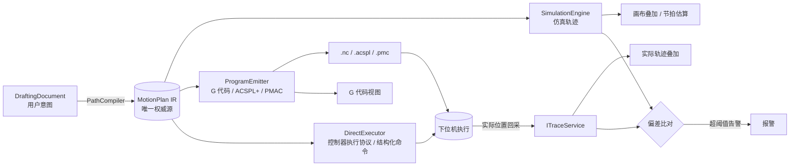

# 文档 5 — 同步机制设计（Sync-Mechanism.md）

> 版本：v0.1 · 最后更新：2026-05-20

本文回答一个关键问题：**画布、IR、仿真、G 代码、真机回采五者如何保证一致**？这个问题在工业 CAM 软件里是头号 bug 来源——画布上看着对、仿真也对，真机一跑发现差一截。本文把这条链路的每一步都钉死。

---

## 1. 问题背景：为什么会不一致

### 1.1 五个语义层

链路上五个环节，每一个都有自己的"语义"：

| 层 | 语义 | 形式 | 谁来产生 |
|----|------|------|----------|
| 画布 | 用户意图（几何 + 工艺标注） | DraftingDocument | 用户 |
| IR | 标准化的运动计划 | MotionPlan | PathCompiler |
| 仿真 | 时间序列上的位置 + IO | SimulationTrace | MotionPlanner |
| G 代码 | 控制器原生指令 | 文本 / 二进制 | ProgramEmitter |
| 真机 | 实际执行的轨迹 | 高频回采序列 | 控制器 + ITraceService |

每经过一次"翻译"，都可能引入差异。这才是"画布对、仿真对、真机错"的根本原因。

### 1.2 常见 bug 模式

工程上典型的不一致来源：

1. **拐角处理差异**：画布上是直角，仿真做了圆弧过渡，G 代码翻译时圆弧参数被截断
2. **单位换算差异**：画布 mm，G 代码某行用了 inch
3. **坐标系差异**：画布工件坐标，G 代码下发时忘了变换到机械坐标
4. **顺序差异**：路径优化在某一层做了，另一层没做
5. **抬笔点丢失**：画布隐含的抬笔，仿真显示了，G 代码没生成
6. **工艺联动指令丢失**：画布上"开胶/关胶"标注，G 代码忘了同步开关阀
7. **数值精度差异**：画布 double，G 代码格式化只保留 3 位小数，长程累积偏差
8. **控制器解释差异**：同段 G 代码，Beckhoff NCI 与 ACS 圆弧插补行为不同
9. **运动规划器差异**：仿真用自定义 S 曲线，真机走 PLC 内置规划，节拍和拐角速度不同
10. **下位机版本不匹配**：上位机生成的指令依赖 PLC 某变量，PLC 没升级

### 1.3 解决方案的关键决定

我们采取业界标准做法（GCC / LLVM / Three.js / Blender 都是这思路）：

> **定义唯一的中间表示 IR，画布、仿真、G 代码都从同一个 IR 派生，不互相翻译。**

### 1.4 本文的范围

- 5 个层之间的契约
- IR 的完整定义（数据模型见文档 3，§5）
- 编译流水线
- 三种运动规划器的统一适配
- 各家 G 代码方言的发码器
- 真机回采闭环
- 一致性强制保证机制
- 测试策略

---

## 2. 单一中间表示（IR）原则

### 2.1 拓扑



五者**同源于 IR**，五者**通过 IR 相互比对**。

### 2.2 唯一权威源约定

任何派生产物（仿真轨迹、G 代码、ADS 数据块、回采叠加）都只能由 IR 派生，**不允许跳过 IR 直接互转**：

- ❌ 不允许：画布 → G 代码（直接）
- ❌ 不允许：仿真轨迹 → G 代码（反推）
- ❌ 不允许：G 代码 → ADS（手工翻译）
- ✅ 允许：画布 → IR → 任意派生
- ✅ 允许：用户编辑控制器程序 → 标记为 `Detached` 诊断产物（V1 不回写 IR，不作为受控生产下发依据）

### 2.3 不可变性

`MotionPlan` 与所有 Segment 都是不可变 record（详见文档 3 §5）。一旦生成，所有人持有的就是同一个 hash 对应的同一份内容。

修改路径意味着**重新编译产生新 IR**，旧 IR 仍然存在（用于审计与对比）。

### 2.4 Hash 链与版本

每个 IR 携带：

- `IrHash`：基于规范化 JSON 的 SHA-256
- `SourceHash`：源画布文档的内容 hash
- `SchemaVersion`：IR schema 版本
- 时间戳、生成者、编译器版本

派生产物（G 代码、仿真轨迹、ADS 数据块）必须**反向引用 IrHash**，UI 通过 hash 比对判断"过期 / 当前"。

### 2.5 IR 的生命周期

- **临时 IR**：编辑器内每次"重新编译"产生，未持久化（缓存在内存）
- **快照 IR**：每次"保存配方版本" / "下发执行" / "导出 G 代码"时持久化（写入 recipe 库或 production 库）
- **执行 IR**：每次 Job 启动时锁定的 IR 版本，运行期间不可变；Job 结束后归档到 production.db

---

## 3. IR 数据模型详解

> 数据 record 定义见文档 3 §5。本节聚焦"为什么这么设计"。

### 3.1 顶层结构回顾

```
MotionPlan
├─ Id (含 IrHash, SourceHash, SchemaVersion)
├─ Header (LengthUnit, AngleUnit, Frame, MachineModelId, RecipeName, RecipeVersion)
├─ Segments[]
└─ Metadata (GeneratedAt, GeneratedBy, CompilerVersion, Signature)
```

### 3.2 段类型清单与设计意图

| Segment | 设计意图 | 备注 |
|---------|----------|------|
| `RapidMove` | 快速定位（不胶） | 对应 G0；速度独立、不参与拐角速度规划 |
| `LinearMove` | 直线插补 | 对应 G1 |
| `ArcMove` | 圆弧插补 | 对应 G2/G3；center + direction 形式 |
| `SplineMove` | 样条插补 | V1 编译时**离散为 LinearMove 序列**给 PLC，IR 保留原始形态供仿真用 |
| `DispenseOn / Off` | 开关阀 | 携带工艺参数 |
| `Purge` | 清针 | 时间 + 参数 |
| `Wait` | 延时 | |
| `SetPressure / SetTemperature` | 工艺前置 | 进段前应用 |
| `ToolChange` | 换针 | 触发 IDispensingHead.ChangeTool |
| `VisionTrigger` | 视觉触发 | 编译时生成受控暂停点、视觉请求事件和恢复点；具体下发形式由 DirectExecutor / Emitter 映射 |
| `IoOperation` | 通用 IO | 通配出口 |
| `Barrier` | 同步原语 | 多工位场景：等待所有工位到达此点 |
| `Trigger` | PSO 飞行点胶 | Position/Time/Io 触发条件下执行子动作 |

### 3.3 所有段共有元数据

每个 Segment 除了类型专属字段，还有：

```csharp
abstract record Segment(int Index, string? Tag) {
    public required SegmentMetadata Meta { get; init; }
}

public sealed record SegmentMetadata(
    SourceRef? Source,                                 // 来源画布 entity id 链
    string? RecipeRef,                                 // 关联工艺模板 id
    string? StationId,                                 // 多工位场景指派
    SegmentFlags Flags);                               // 是否可被打断、是否需要审计、是否致命错则停机

public sealed record SourceRef(
    EntityId DraftingEntity,                           // 画布对应实体
    int? SubIndex,                                     // 多段线第几段
    string DocumentHash);                              // 来源文档 hash（防错配）
```

`SourceRef` 是双向高亮的关键，文档 4 §11.8 与 §18.3 都依赖它。

### 3.4 拐角策略

```csharp
public sealed record TransitionPolicy(
    TransitionKind Kind,                               // Sharp / Rounded / Lookahead
    Length? RoundingRadius,
    Speed? CornerSpeed);
```

拐角策略由编译器决定（基于工艺模板 + 几何夹角），不依赖控制器。Emitter 把策略翻译为目标控制器能执行的语法（NCI 的 G641 / ACS 的 SmoothPath）。

### 3.5 触发条件（PSO）

```csharp
public abstract record TriggerCondition;
public sealed record PositionTrigger(string AxisId, Length AtPosition, TriggerEdge Edge) : TriggerCondition;
public sealed record TimeTrigger(TimeSpan AtElapsed) : TriggerCondition;
public sealed record IoTrigger(string IoId, bool RisingEdge) : TriggerCondition;
```

`Trigger` Segment 嵌套子 Segment，但**只允许嵌套 ProcessSegment / IoOperation**（运动段不允许嵌套，避免树形复杂度爆炸）。

### 3.6 元数据与签名

`Metadata.Signature` 字段为 V2/V3 电子签名预留，V1 留空。规则见文档 7。

### 3.7 IR 版本与 Schema 演进

每次 schema 变更：

1. `SchemaVersion` +1
2. 提供 N→N+1 的迁移函数
3. 旧 IR 自动迁移（读取时升级）
4. 写入永远使用最新版本
5. 大版本断点（不兼容）必须配 ADR + 数据库迁移

---

## 4. 编译流水线（画布 → IR）

逻辑命名空间：`DispensingPlatform.Process.Compiler`。当前它可作为 `Process` 层内部目录存在；只有编译器需要独立测试、复用或版本隔离时，才拆成独立项目。

### 4.1 PathCompiler 接口

```csharp
public interface IPathCompiler {
    Task<CompileResult> CompileAsync(CompileRequest req, CancellationToken ct);
}

public sealed record CompileRequest(
    DraftingDocument Document,
    CompilerOptions Options,                           // 优化等级、目标控制器、目标坐标系等
    string MachineModelId,
    IRecipeService Recipes,
    ICalibrationService Calibration);

public sealed record CompileResult(
    MotionPlan? Plan,
    IReadOnlyList<CompileDiagnostic> Diagnostics,
    bool Succeeded);
```

### 4.2 编译阶段

类似编译器经典 pass 设计：


### 4.3 各阶段职责

#### ① 收集（Collect）

- 遍历 DraftingDocument 中所有可见、未冻结的工艺图元
- 应用图层过滤：仅 `Process_*` 图层参与
- 每个工艺图元解析其挂载的几何
- 每个 KeepOutZone 加入约束集
- 每个 Mark / Probe 单独入队
- 输出：临时的 `WorkItem` 列表

#### ② 展开（Expand）

- 块引用展开为独立段（应用块变换矩阵 + 工件坐标变换）
- 阵列展开
- 嵌套块递归展开（带循环检测）
- 输出：扁平 WorkItem 列表

#### ③ 标准化（Normalize）

- 单位归一化为 SI（mm / s）
- 坐标系归一化到 IR Header 指定 Frame
- 工艺模板引用解析为内联参数（去引用，IR 自包含）
- 应用视觉对位变换（Mark 偏差 → 仿射变换）
- 输出：标准化 WorkItem

#### ④ 优化（Optimize）

- 路径顺序优化（如未在画布手动指定）
- 短段合并（< tolerance 的连续直线合并）
- 冗余抬笔消除（连续 KeepOut 跳跃合并）
- 同参数 DispenseOn 之间的过渡用 LinearMove 而非 Rapid（保持速度连续）

#### ⑤ 拐角规划（Corner）

- 计算每个拐角的夹角
- 根据夹角 + 工艺模板的 `MaxCornerError` + 控制器能力，决定 Sharp / Rounded / Lookahead
- 计算拐角速度（与前后段速度匹配）
- 写入每段的 `TransitionIn` / `TransitionOut`

#### ⑥ 离散化（Discretize）

- 样条按弦高公差离散为 LinearMove 序列（默认 1 μm 弦高）
- 椭圆 / 椭圆弧离散
- 大角度圆弧不拆（保留 ArcMove 让控制器自己插补）
- 输出：可直接执行的 Segment 序列

#### ⑦ 注入工艺（InjectProcess）

- 在路径起点前插入：`SetPressure / SetTemperature / DispenseOn`
- 在路径终点后插入：`DispenseOff` + 可选 `Wait`（拖尾时间）
- 抬笔策略翻译为：`Z 轴 RapidMove + 段间过渡`
- 换针、清针、测高指令插入到对应位置
- VisionTrigger 拆分为受控暂停点、视觉定位请求、偏差应用和恢复点；这些可以表现为 DirectExecutor 协议字段、控制器程序注释 / M 函数或上位机执行事件，不强制要求 IR 中存在 `Pause` / `Resume` Segment 类型

#### ⑧ 校验（Validate）

逐段校验：

- 速度是否超出轴最大速度
- 加速度是否超出轴最大加速度
- 位置是否进入 KeepOutZone（不允许）
- 位置是否超出工件坐标系定义的工作区
- 拐角速度是否合理
- 工艺参数是否完整
- 段间时序是否冲突（多工位场景）

任何 Error 级别的诊断 → 编译失败。

#### ⑨ 序列化为 IR

- 计算所有 hash
- 写入 metadata
- 输出不可变 `MotionPlan`

### 4.4 编译诊断（Diagnostic）

```csharp
public sealed record CompileDiagnostic(
    DiagnosticSeverity Severity,                       // Info / Warning / Error
    string Code,                                       // CMP-1003
    string Message,
    SourceRef? Source,                                 // 关联画布实体
    DiagnosticActionHint? Hint);                       // 建议的修复操作
```

UI 上"问题面板"显示所有 Diagnostic。点击诊断条目 → 在画布定位源实体。

### 4.5 增量编译（V2 预留）

V1 全量编译。V2 接口预留：

- 每个 Segment 标记其依赖的源实体集合
- 画布变更事件 → 计算受影响的 Segment 子集 → 仅重编译这部分
- Hash 链分段（按工位 / 按工艺组）

V1 全量编译性能目标：1 万 Segment 内 < 2 s。

### 4.6 编译器版本管理

`MotionPlan.Metadata.CompilerVersion` 写入完整版本号。重要更新（拐角算法变更、采样策略变更）需提升次版本号，影响 hash。

---

## 5. 仿真派生（IR → 仿真）

`DispensingPlatform.Process.Simulation`

### 5.1 SimulationEngine 接口

```csharp
public interface ISimulationEngine {
    Task<SimulationResult> RunAsync(SimulationRequest req, CancellationToken ct);
}

public sealed record SimulationRequest(
    MotionPlan Plan,
    IMotionPlanner Planner,                            // 选择三种规划器之一
    SimulationOptions Options);                        // 粒度、采样率、起止段、对比模式

public sealed record SimulationResult(
    SimulationTrace Trace,
    EstimatedKpis Kpis,                                // 节拍、胶量、最大速度、最大加速度
    IReadOnlyList<SimulationDiagnostic> Diagnostics);
```

### 5.2 三种规划器适配

```csharp
public interface IMotionPlanner {
    PlannerId Id { get; }
    PlannerCapabilities Capabilities { get; }
    Task<SimulationTrace> PlanAsync(MotionPlan plan, PlannerOptions opts, CancellationToken ct);
}
```

三种实现：

| 实现 | 项目 | 说明 |
|------|------|------|
| `CustomSCurvePlanner` | Process.Planner.Custom | 自研 S 曲线规划器；纯 C# 跨平台；调试友好 |
| `BeckhoffOfflinePlanner` | Process.Planner.Beckhoff | 调用 TwinCAT 离线规划接口；与真机最接近 |
| `PlcVirtualModePlanner` | Process.Planner.PlcVirtual | 把 IR 下发到 PLC 虚拟轴跑一次，回采轨迹 |

### 5.3 SimulationTrace 统一格式

无论哪种规划器，输出**必须是统一格式**，否则上层渲染要写三套。

```csharp
public sealed record SimulationTrace(
    string SourceIrHash,
    PlannerId Planner,
    Frequency SampleRate,                              // 默认 1 kHz
    IReadOnlyList<TraceSample> Samples,
    IReadOnlyList<SegmentExecutionRecord> SegmentLog,  // 每段起止时刻、起止索引
    IReadOnlyList<TraceEvent> Events);                 // 开关阀、IO 翻转、报警等

public sealed record TraceSample(
    Duration Timestamp,                                // 从 t=0 起算
    ImmutableDictionary<string, Length> AxisPositions,
    ImmutableDictionary<string, Speed> AxisVelocities,
    ImmutableDictionary<string, bool> IoStates,
    ProcessState ProcessState);                        // 阀状态、压力、温度
```

### 5.4 仿真粒度

```csharp
public enum SimulationFidelity {
    Geometric,    // 仅几何形状，速度恒定，最快
    Motion,       // 含加减速曲线，能看真实节拍
    Full          // 含 IO、视觉、报警全套
}
```

UI 上根据用途选择：

- 编辑时调试 → Geometric
- 工艺验证 → Motion
- 节拍优化与端到端验证 → Full

### 5.5 三模式对比

UI 提供"对比模式"：同一 IR 用三种规划器各跑一次，叠加显示三条轨迹。差异区域高亮。

意义：自研 S 曲线和 PLC 虚拟模式跑出来差很多 → 肯定是某一边算错了；这是调试运动规划的利器。

### 5.6 KPI 估算

```csharp
public sealed record EstimatedKpis(
    Duration TotalCycleTime,
    Length TotalPathLength,
    Length TotalRapidLength,
    int RapidCount,
    int LiftCount,
    Volume EstimatedDispenseVolume,
    Speed PeakAxisVelocity,
    Acceleration PeakAxisAcceleration,
    Duration BottleneckSegmentDuration,
    int BottleneckSegmentIndex);
```

UI 显示在仿真面板。"瓶颈段"高亮，方便用户优化。

### 5.7 仿真诊断

仿真过程中可以发现编译期没发现的问题：

- 实际加速度超过轴限（即使规划器降速也超不了？需要重编译）
- 某段实际速度被前瞻减速降到 0（路径过短，建议合并）
- 拐角实际速度低于预期（拐角圆角策略需要调整）

诊断写入 `SimulationDiagnostic`，UI 提示。

### 5.8 与画布的联动

仿真播放时，SimulationEngine 暴露 `IObservable<TraceSample>`，画布订阅渲染"当前光标"。同时 G 代码视图同步高亮当前行。

播放控制：

- 播放 / 暂停 / 单步
- 倍速（0.1x / 0.5x / 1x / 2x / 10x / 最快）
- 拖动时间轴跳转
- 关键事件断点（开关阀、IO 翻转）

---

## 6. 控制器程序生成（IR → 控制器原生指令）

逻辑命名空间：`DispensingPlatform.Process.Emitter`。当前它可作为 `Process` 层内部目录存在；只有控制器方言生成器需要独立发布或插件化时，才拆成独立项目。

### 6.1 IControllerProgramEmitter 接口

```csharp
public interface IControllerProgramEmitter {
    EmitterId Id { get; }                              // BeckhoffNci / Acspl / PmacProg
    EmitterCapabilities Capabilities { get; }
    Task<EmitResult> EmitAsync(EmitRequest req, CancellationToken ct);
}

public sealed record EmitRequest(
    MotionPlan Plan,
    EmitterOptions Options,
    string TargetControllerId);                        // 用于绑定具体控制器型号

public sealed record EmitResult(
    EmittedProgram Program,
    IReadOnlyList<EmitDiagnostic> Diagnostics,
    bool Succeeded);

public sealed record EmittedProgram(
    string SourceIrHash,
    EmitterId Emitter,
    string FormatId,                                   // "nc" / "acspl" / "pmc"
    byte[] Content,                                    // 文本或二进制
    IReadOnlyList<SegmentLineMap> LineMap);            // 段索引 → 行号 双向映射

public sealed record SegmentLineMap(int SegmentIndex, int LineNumber, int LineCount);
```

### 6.2 命名澄清

之前提到过的"GCode" 实际上是**"控制器原生指令"**的代名词。Beckhoff 用扩展 G 代码、ACS 用 ACSPL+、PMAC 用 Motion Program——三者只有 Beckhoff 真叫"G 代码"。我们的接口命名为 `IControllerProgramEmitter`，避免误导。UI 上显示统一称"控制器程序"，根据当前控制器自动选择方言。

### 6.3 BeckhoffNciEmitter

输出 `.nc` 文件，遵循 DIN 66025 + Beckhoff 扩展。

要点：

- 工件坐标系：G54-G59
- 单位：G71（mm）
- 拐角策略：G641（带半径）/ G642（自动）/ G500（关闭）
- 高速循环：G261 LookAhead
- 子程序：处理重复结构
- 工艺联动：通过 M 函数调用 PLC（M100=开胶、M101=关胶、M110=Purge…）
- 同步段：M-syn 与 PLC 全局变量握手
- 行注释保留 SourceRef 信息：`; SEG=0042 SRC=ENT-7c2f IR=ab12cd34`

### 6.4 AcsProgramEmitter

输出 `.acspl` 程序段（缓冲下发）。

要点：

- ACS 主用 ACSPL+ 而非 G 代码，IR → ACSPL+ 是更"重"的翻译
- 运动指令：`PTP`、`XSEG / SEG / ENDS`（路径段）、`PEG`（PSO）
- 缓冲：`MSEG / ENDS` 缓冲段
- 工艺联动：通过 ACS Variables 与上位机握手
- 行注释带 SourceRef
- 与 ACS Buffer 数量绑定（不同型号 buffer 数不同）

### 6.5 PmacProgramEmitter

输出 PMAC Motion Program（V1 不一定上线，接口预留）。

要点：

- PROG 编号（Motion Program 1-256）
- PVT 模式 / PSpline 模式
- M 变量绑定 IO
- PLC Program 联动（PMAC 的 PLC 是 Motion Program 的伴侣）

### 6.6 G 代码方言差异处理

每家方言差异巨大，统一接口 + 多实现解决。**禁止"一份 G 代码跑三家"**——每家一份独立实现，输出形态可以差很多。

共同输出：`SegmentLineMap`（段→行 双向映射），用于 UI 高亮。

### 6.7 行注释格式（双向高亮关键）

每段开始处插入注释：

```
; SEG=<index> SRC=<entityId> SUB=<subIndex> IR=<ir-hash-8>
```

ACS 注释用 `;`（同 G 代码），PMAC 注释用 `;`。

注释由 Emitter 控制，可关闭（导出生产用 G 代码可去掉以减小体积），但 UI 内置视图始终保留。

### 6.8 Emitter 验证

Emitter 自带"反解析回 IR"能力（best-effort）：

- 接收一份 G 代码 + LineMap
- 解析出可识别的段（运动 + 工艺）
- 与原 IR 对比，差异输出诊断

这是 §9.2 双向比对工具的基础。

### 6.9 文件输出与文件命名

```
<recipeName>_v<recipeVersion>_<irHash8>.nc
```

文件头：

```
; ====================================================
; Generator       : DispensingPlatform v1.0
; Generated At    : 2026-05-20T14:30:00+08:00
; Generated By    : engineer-01
; Recipe          : MyBoardLayout v3
; IR Hash         : ab12cd34ef56...
; Source Hash     : 5f8e9a...
; Target          : Beckhoff TC3 NCI
; Machine Model   : customer-XYZ/model-A1
; ====================================================
```

---

## 7. 直发执行（IR → ADS → PLC 数据块）

`DispensingPlatform.Process.DirectExecutor`

### 7.1 为什么要直发

不是所有场景都适合走 G 代码：

- **ACS 主路径**：ACS 的 ACSPL+ 缓冲段下发，本质上就是直发；G 代码反而是中间形式
- **高动态场景**：控制器接收结构化数据块或缓冲段，比文本中间格式更高效；Beckhoff 场景可通过 ADS 实现
- **现场调试**：直接下发 IR 段进 PLC 缓冲，不落盘，迭代快
- **多工位协调**：多工位场景下，直发器协调多个工位的 IR 子集分别下发

### 7.2 IDirectExecutor 接口

```csharp
public interface IDirectExecutor {
    ExecutorId Id { get; }
    ExecutorCapabilities Capabilities { get; }
    Task<ExecutionHandle> StartAsync(ExecuteRequest req, CancellationToken ct);
    Task PauseAsync(ExecutionHandle h, PauseMode mode, CancellationToken ct);
    Task ResumeAsync(ExecutionHandle h, CancellationToken ct);
    Task StopAsync(ExecutionHandle h, StopMode mode, CancellationToken ct);
    ExecutionStatus GetStatus(ExecutionHandle h);
    IObservable<ExecutionEvent> Events { get; }
}

public sealed record ExecuteRequest(
    MotionPlan Plan,
    string TargetControllerId,
    ExecutorOptions Options);
```

### 7.3 IR → ADS 数据块的映射

每个 Segment 翻译为一个或多个 PLC 端的结构化数据元素：

```
PLC 侧（约定的全局变量）：
  arrPlanBuffer : ARRAY[0..1023] OF ST_PlanSegment;
  nWriteIndex   : INT;          // 上位机写到哪
  nReadIndex    : INT;          // PLC 读到哪
  bExecute      : BOOL;         // 上位机置 1 启动
  nState        : INT;          // PLC 反馈状态
  nLastDoneIdx  : INT;          // 最后完成段索引
```

```
ST_PlanSegment :
  STRUCT
    nIndex     : DINT;
    nKind      : INT;            // 段类型枚举
    fStartX/Y/Z : LREAL;
    fEndX/Y/Z  : LREAL;
    fFeedrate  : LREAL;
    fAccel     : LREAL;
    fParam1..4 : LREAL;          // 类型相关参数
    nTransition : INT;
    nFlags      : DWORD;
  END_STRUCT
```

ADS 客户端按"环形缓冲 + 上位机生产 / PLC 消费"模式：

- 上位机批量写入到环形缓冲（最多 N 段一批，避免 ADS 单次包过大）
- PLC 持续从 ReadIndex 读取并执行
- 上位机监视 nLastDoneIdx，及时补充
- 缓冲打满则上位机阻塞或丢弃（取决于策略）

### 7.4 段类型映射

```
Kind 枚举（PLC 侧 INT 常量与上位机 enum 必须严格对齐）：
  0 = NoOp
  1 = RapidMove
  2 = LinearMove
  3 = ArcMove
  4 = DispenseOn
  5 = DispenseOff
  6 = Purge
  7 = Wait
  8 = SetPressure
  9 = SetTemperature
 10 = ToolChange
 11 = VisionTrigger
 12 = IoOperation
 13 = Barrier
 14 = Trigger
```

枚举改动需要上下位机同步升级，写入"上下位机协议"文档（详见文档 7）。

### 7.5 协议版本号

PLC 端有 `nProtocolVersion`，上位机启动时校验，不匹配拒绝下发并明确报错。版本号写入 IR 元数据，便于审计。

### 7.6 直发与 G 代码导出的关系

二者**互斥**或**并存**取决于场景：

- 标准生产：编译 → 写 G 代码 → PLC 加载 → 执行（适合 NCI）
- 高动态生产：编译 → 直发 ADS 缓冲 → PLC 流式执行（适合 ACS）
- 现场调试：编译 → 直发，不落盘
- 客户审计：每次执行都留 G 代码归档（即便走直发，也并行导出 G 代码存档）

### 7.7 PLC 侧的 IR 解释器

PLC 侧需要一个轻量"IR 解释器"（PLC 程序里的 FB），不止是"运行 G 代码"。这块代码归 PLC 工程师维护，但**接口契约**（数据结构、协议版本、状态字含义）由上位机文档定义并版本化。

---

## 8. 真机回采闭环

### 8.1 目标

把"实际执行的轨迹"采回上位机，与"设计 / 仿真"轨迹同框对比，让现场工程师一眼看出"机器实际跑到哪、偏了多少"。这是工业 CAM 软件最有价值的能力之一。

### 8.2 高频通道回顾

数据来源：编码器位置 + 关键 IO 状态。来源、缓冲、传输见文档 1 §5.2 与文档 3 §4.8 (`ITraceService`)。

本节聚焦"回采数据如何与 IR 对齐 + 如何叠加渲染 + 如何告警偏差"。

### 8.3 回采采样的对齐

每个 TracePoint 必须包含：

- PLC 周期时间戳（绝对时间 + 周期序列号）
- 当前执行的 IR Segment 索引（`nCurrentSegmentIdx`）
- 段内进度（可选，0~1）

PLC 侧每个周期把这两个值写入回采数据结构。这样上位机才能把回采点对齐到 IR 段。

### 8.4 ITrackbackService（回采闭环服务）

```csharp
public interface ITrackbackService {
    Task<TrackbackSession> AttachAsync(MotionPlan plan, ExecutionHandle exec, TrackbackOptions opts, CancellationToken ct);
    IObservable<ActualTraceSample> Samples(TrackbackSession s);
    Task<TrackbackReport> FinalizeAsync(TrackbackSession s, CancellationToken ct);
}

public sealed record ActualTraceSample(
    DateTimeOffset PlcTimestamp,
    long Sequence,
    int? SegmentIndex,
    ImmutableDictionary<string, Length> AxisPositions,
    ImmutableDictionary<string, Speed> AxisVelocities,
    ImmutableDictionary<string, bool> IoStates);
```

V1 范围：**事后回放**。Job 结束后才生成 TrackbackReport，叠加到画布。
V2 范围：**实时叠加**。Samples 流式订阅，画布实时显示当前光标。

### 8.5 偏差计算

```csharp
public interface IDeviationAnalyzer {
    DeviationReport Analyze(MotionPlan plan, SimulationTrace expected, IReadOnlyList<ActualTraceSample> actual, DeviationOptions opts);
}

public sealed record DeviationReport(
    Length MaxDeviation,
    Length MeanDeviation,
    Length P95Deviation,
    IReadOnlyList<DeviationHotspot> Hotspots,            // 偏差超阈的片段
    IReadOnlyList<MissingIoEvent> MissingIoEvents);      // 期望发生但实际没发生的 IO

public sealed record DeviationHotspot(
    int FromSegmentIndex,
    int ToSegmentIndex,
    Length MaxDeviation,
    Duration Duration,
    SourceRef? SourceHint);
```

算法核心：每个实际采样点找到目标轨迹上"最近点"（按欧氏距离 + 时间约束），算偏差。

### 8.6 画布叠加层

画布渲染管线（文档 4 §11.5）已经预留了 z-order：

- 第 9 层：仿真叠加（设计/规划轨迹）
- 第 10 层：实际轨迹叠加（真机回采）

实际轨迹颜色与设计轨迹**对比明显**（如设计是浅蓝、实际是橙色），让用户一眼看出差异。

偏差超阈的 Hotspot 用红色高亮，鼠标悬停显示 `MaxDeviation`、`SourceHint`。

### 8.7 回放控制

类似仿真播放，但播放的是**真机数据**：

- 播放 / 暂停 / 单步
- 倍速
- 拖动时间轴
- 关键事件断点（IO 翻转、段切换、报警）

UI 提供"对比模式"：仿真轨迹 + 实际轨迹同时播放，光标分别独立移动。

### 8.8 偏差告警

阈值在工艺模板里定义（不同工艺允许的偏差不同）：

```
{
  "deviationThresholds": {
    "linearMove": "5 um",
    "arcMove":    "8 um",
    "cornerSlowdown": "20 percent"
  }
}
```

执行期偏差超阈：

- 实时模式（V2）：立即报警，可选择暂停 / 继续
- 事后模式（V1）：Job 结束后报告中标红，UI 上提示"产品偏差异常"

报警事件走 `IAlarmService`（文档 3 §4.6），分类 `ALM-MOTION-DEVIATION-XXXX`。

### 8.9 诊断包导出

一键导出"诊断包"：

```
diag_<jobId>_<irHash8>.zip
├─ manifest.json              # 元数据
├─ recipe.dpdoc               # 配方副本
├─ motion_plan.json           # IR 副本
├─ expected_trace.parquet     # 仿真轨迹
├─ actual_trace.parquet       # 真机回采
├─ deviation_report.json      # 偏差分析
├─ alarms.json                # 期间报警
├─ logs/                      # 期间日志
├─ screenshots/               # UI 截图（叠加图）
└─ controller_program.nc      # 当时下发的 G 代码
```

发回总部售后即可远程复盘。

### 8.10 历史数据回看

诊断包及关键回采数据持久化到 `production.db` + Parquet（文档 7）。

UI Module.Trace 可以按"产品 ID / 配方版本 / 时间 / 工位"检索历史，重新加载到画布做事后分析。

### 8.11 与状态机的协同

回采闭环不直接驱动状态机，但通过 `IAlarmService` 间接影响：

- 偏差致命（如撞机风险）→ Fatal 报警 → 状态机进 Alarm → 紧急停机
- 偏差严重（产品标 NG）→ Critical 报警 → Job 终止 → 标记产品废品
- 偏差轻微 → Warning → 仅记录，不影响生产

详见文档 6。

---

## 9. 一致性强制保证机制

光靠"约定"不够，必须有**机器验证**保证一致性，否则单人开发久了一定会破坏不变量。

### 9.1 Hash 链验证

- 文档 hash → IR hash → G 代码 hash → 执行记录 hash 全链路串联
- 每个派生产物在生成时**强制写入**上游 hash
- UI / API 在使用派生产物前**强制比对** hash 是否最新

强制点位：

| 操作 | 校验项 |
|------|--------|
| 用户点"下发" | G 代码 / 直发指令的 IrHash == 当前 IR 的 IrHash |
| 用户点"仿真" | SimulationTrace 的 SourceIrHash == 当前 IR 的 IrHash |
| 用户编辑 G 代码 | 标记 G 代码"已脱离 IR"，禁止下发 |
| 用户改了画布 | 标记 IR / 仿真 / G 代码"已过期"，禁止下发 |

### 9.2 双向比对工具

对应文档 4 的控制器程序映射能力：

```csharp
public interface IProgramSemanticVerifier {
    ProgramVerifyResult Verify(MotionPlan original, EmittedProgram emitted, ProgramVerifyOptions opts);
}

public sealed record ProgramVerifyResult(
    bool Passed,
    IReadOnlyList<ProgramSemanticDifference> Differences);
```

工作方式：

1. Emitter 生成结构化 `SegmentLineMap` 与必要语义元数据
2. 校验每个 IR Segment 是否有对应输出、顺序是否一致、关键参数是否在容差内
3. 对支持反解析的简单方言（如 Beckhoff 基础 G 代码）可额外执行 reparse 对比
4. 对 ACSPL+ / PMAC / 宏 / 子程序等复杂方言，不强制完整反解为 IR

CI 上每次发版前必须跑通语义校验（用一组标准测试用例）；支持反解的 Emitter 再额外跑 round-trip 测试。

### 9.3 端到端回归测试

`tests/DispensingPlatform.Integration.Tests` 包含端到端测试：

```
标准测试用例
├─ 01-line/
│  ├─ source.dxf
│  ├─ recipe.dpdoc
│  ├─ expected_ir.json          # 期望的 IR 输出（黄金文件）
│  ├─ expected_program.nc       # 期望的 G 代码（黄金文件）
│  └─ expected_trace.parquet    # 期望的仿真轨迹
├─ 02-corner-slowdown/
├─ 03-fly-dispense-pso/
├─ 04-multi-station/
├─ 05-keepout-zone/
├─ 06-array-block/
├─ 07-vision-correction/
├─ 08-tool-change/
└─ 09-edge-cases/
```

每个用例跑全流程：

```
DXF → Document → Compile → IR
                         → Simulate(Custom)    → 与 expected_trace 比对
                         → Emit(Beckhoff)      → 与 expected_program 比对
                         → DirectExec(Sim PLC) → 仿真硬件执行 → 与 expected_trace 比对
                         → Trackback           → 偏差应在阈值内
```

任意环节失败 → CI 失败。

### 9.4 现实校验闭环

真机执行时，回采数据持续与 IR 对齐：

- 每段执行偏差 → 实时（V2）/ 事后（V1）告警
- 累积统计 → 出现系统性偏差（如某轴一直慢 5 μm）→ 提示标定可能漂移
- 关键产品的回采数据归档，作为长期质量数据

---

## 10. UI 状态指示

光有内部 hash 链不够，必须在 UI 上让用户**一眼看出当前同步状态**，否则用户糊里糊涂下发，依然出问题。

### 10.1 同步状态枚举

```csharp
public enum SyncState {
    InSync,                  // IR、仿真、G 代码、画布全部一致
    DocumentDirty,           // 画布被修改，IR 过期
    IrStale,                 // IR 还在，但是基于旧画布的（编译后用户又改了）
    SimulationStale,         // IR 当前，但仿真是旧 IR 的
    ProgramStale,            // IR 当前，但 G 代码是旧 IR 的
    ProgramDetached,         // 用户手动编辑了 G 代码，与 IR 解耦
    CompileFailed,           // IR 编译失败
    CompileInProgress,       // 编译中
}
```

### 10.2 状态条（Status Bar）

编辑器顶部状态条始终显示一条**同步状态行**：

```
[● 已同步]   IR ab12cd34 · 仿真 ✓ · G 代码 ✓ · 真机匹配 ✓        [重新编译] [仿真] [生成 G 代码] [下发]
[⚠ 画布已修改]   IR 过期，需重新编译                                [重新编译]
[⚠ G 代码已脱离]   用户手动编辑，请决定                              [应用回画布] [丢弃修改] [接受为新 IR]
[× 编译失败]   3 项 Error，详见诊断面板                              [查看诊断]
```

颜色规则（按 Token）：

- 绿色：InSync
- 黄色：任意 *Stale*
- 橙色：ProgramDetached（更需注意）
- 红色：CompileFailed

### 10.3 操作按钮的可用性

| 按钮 | 启用条件 |
|------|----------|
| 编译 | 任何时候 |
| 仿真 | IR 存在且 InSync 或 IrStale 之外 |
| 生成 G 代码 | IR 当前 |
| 下发 | IR 当前 + G 代码当前（或直发模式：IR 当前即可） + 状态机在允许的状态 |
| 启动 Job | 同上 + 配方激活 + 标定有效 |

任何时候点"下发"，前置校验失败 → 弹层说明原因 + 引导到对应面板。

### 10.4 G 代码视图的过期标识

文档 4 §18 已经讲过 G 代码视图。这里补充：

- IR 过期 → G 代码视图顶部黄色横条："G 代码基于过期 IR，请重新生成"
- ProgramDetached → 橙色横条："G 代码已被手动编辑，与画布脱离同步"
- 行级标记：每行注释里的 `IR=ab12cd34` 与当前 IR hash 不匹配的行高亮

### 10.5 仿真视图的过期标识

仿真面板顶部 chip：

```
[规划器: 自定义 S 曲线]  [基于 IR ab12cd34]  [✓ 当前]
```

或：

```
[规划器: Beckhoff 离线]  [基于 IR a1b2c3d4]  [⚠ 已过期，结果可能不准]   [重新仿真]
```

### 10.6 画布上的执行光标

仿真播放或真机回采回放时，画布上有一个明显的**光标**：

- 仿真模式：浅蓝色十字 + 段索引 tooltip
- 真机模式：橙色十字 + 实际坐标 + 偏差值
- 对比模式：两个光标同时显示

### 10.7 真机执行期间的状态指示

Job 运行中，状态条扩展信息：

```
[运行中 Job-7c2f]   IR ab12cd34 · 已完成 245/1023 段 · 节拍 35.2s · 偏差 P95 3.2μm   [暂停] [停止]
```

偏差异常 → 状态条变红 + 报警栏 chip。

### 10.8 多工位场景

每个工位独立显示一行状态。可折叠汇总。

---

## 11. 异常情况处理

### 11.1 编译失败的降级

编译失败时：

- 旧 IR 不被销毁（用户可以查看上一次成功的）
- UI 标记"编译失败"+ 详细诊断
- 仿真 / 生成 G 代码 / 下发**全部禁用**
- 用户必须解决诊断后重新编译

### 11.2 仿真超时

仿真有超时配置（默认 60s）。超时时：

- 中断 SimulationEngine
- UI 提示"仿真超时，可能因数据量过大或规划器异常"
- 给出建议：降低粒度（Geometric 模式）/ 缩短范围（仅当前选区）/ 切换规划器
- 不影响下发（如果用户确认无视仿真）

### 11.3 真机偏差超限

实时模式（V2）：

- 偏差超过工艺阈值 → 触发 `ALM-MOTION-DEVIATION` 报警
- 状态机进 Alarm，机器停下
- 报警面板显示"偏差超限"+ Hotspot 位置 + 建议（重标定 / 检查机械 / 工艺参数过激进）

事后模式（V1）：

- Job 结束后报告标红
- 产品标记 NG
- 报警系列 `ALM-MOTION-DEVIATION-POST`

### 11.4 ADS 通讯异常

直发执行过程中 ADS 断线：

- 本地缓冲下发立即停止
- PLC 监视上位机心跳，超时停机
- 状态机进 Alarm
- 重连成功后由用户决定：续做（需 PLC 支持）/ 整批弃产 / 重新启动 Job

### 11.5 PLC 拒绝段

PLC 通过 `nState` 反馈错误（段参数无效、轴超限、不支持的 Kind 等）：

- 上位机停止下发
- 报警 `ALM-DIRECTEXEC-REJECTED`，诊断包含拒绝段索引
- 检查协议版本是否一致

### 11.6 IR 协议版本不匹配

上位机启动时校验 PLC 端 `nProtocolVersion`：

- 不匹配 → 阻塞下发，提示升级 PLC 或上位机
- 同步升级流程：先 PLC 程序升级 → 再上位机升级

### 11.7 文件损坏

读取 `.dpdoc` / `.nc` / `.parquet` 失败：

- 优先回退到自动备份（`autosave/`）
- 备份也损坏 → 用户决定是否新建空文档
- 损坏文件移到 `cache/corrupted/` 保留以便分析

### 11.8 Hash 不匹配

载入 G 代码时 hash 不匹配：

- 不允许直接使用
- UI 提示"G 代码 hash 与配方记录不一致，可能是手工编辑或其他工具产生"
- 用户可选：重新生成（推荐）/ 标记为脱离 IR 后使用（高级，需工程师权限）

### 11.9 时间戳异常

PLC 时间倒退（重启 / NTP 突跳）：

- 检测到 PLC 时间戳序列号倒退或大幅跳变 → 警告
- 当前 Job 的回采数据按"段间相对时间"对齐，不依赖绝对时间
- 长期日志按上位机 UTC 重写时间

### 11.10 多工位时序冲突

多工位 Barrier 等待超时：

- 触发 `ALM-SCHED-BARRIER-TIMEOUT`
- 暂停整组 Job
- 用户决定：单独跳过某工位 / 整组重启

---

## 12. 测试策略

### 12.1 IR 序列化往返

```
原 IR → 序列化为 JSON → 反序列化 → 与原 IR 比较
```

要求：canonical JSON 语义一致，重新计算 hash 后一致。不要要求普通 JSON 文本 byte-for-byte 完全一致，因为属性顺序、格式化、浮点格式和 writer 版本都可能变化。

工具：xUnit + Verify（黄金文件）。

### 12.2 三规划器一致性测试

对一组标准 IR：

```
Custom Planner   → SimulationTrace_C
Beckhoff Planner → SimulationTrace_B  (需要 TwinCAT 环境)
PlcVirtual       → SimulationTrace_V  (需要 PLC 仿真)
```

比对：

- 总节拍差异 < 5%
- 关键采样点位置差异 < 工艺阈值
- 段切换时间点差异 < 10 ms

CI 上至少跑 Custom；其他两个标记为"现场环境测试"，本地 / 现场触发。

### 12.3 控制器程序语义校验测试

```
原 IR → Emit → 结构化映射 / 可选反解 → 与原 IR 关键语义比较
```

容差：位置 0.1 μm、速度 1 mm/s、时间 1 ms。

每个 Emitter 必须通过结构化语义校验，否则不能投产；只有声明支持反解的 Emitter 才要求通过完整反解测试。

### 12.4 标准用例端到端

文档 9.3 提到的 9 个标准用例，每个都要在 CI 跑通：

```
DXF / 手绘 → 编译 → IR
                  → 仿真（Custom）→ 与黄金 trace 对比
                  → Emit Beckhoff → 与黄金 .nc 对比
                  → DirectExec(Sim PLC) → 与黄金 trace 对比
                  → 偏差应在阈值内
```

任意失败 → CI 失败 → PR 不允许合入。

### 12.5 性能基准

BenchmarkDotNet 跑：

- 1 万 Segment 编译用时 < 2 s
- 仿真 1 kHz 采样下，1 万 Segment 实时倍速 ≥ 10x
- Emit Beckhoff，1 万 Segment < 1 s
- 双向比对（reparse），1 万 Segment < 3 s
- 偏差分析，1 小时 1 kHz 数据（360 万样本）< 5 s

baseline 写入 `tests/Benchmarks/baseline.json`，性能下降 > 20% 自动报警。

### 12.6 故障注入测试

`Hal.Simulator` 提供 `ISimulationControl` 接口（文档 3 §10.1），测试中注入：

- ADS 断线
- PLC 拒绝段
- 偏差异常
- 时间倒退
- IO 反应延迟

确保上位机各类异常路径都能正确处理（不崩溃、有报警、可恢复）。

### 12.7 配置 / 协议矩阵测试

针对不同硬件配置组合：

- Beckhoff + Basler + Generic Dispenser
- ACS + 海康 + Generic
- Beckhoff（主） + ACS（副） + 华睿
- 全 Simulator

每个组合至少跑通用例 01-line / 04-multi-station。

### 12.8 黄金文件管理

- 黄金文件提交 Git
- 每次有意修改算法时，由开发者**显式更新**黄金文件，提交 PR 注明原因
- CI 严禁自动覆盖黄金文件
- 保留历史版本（Git 自带）

---

## 附录 A — 关键接口速查

以下名称是逻辑命名空间布局，不代表当前阶段必须存在同名 `.csproj`。

```
DispensingPlatform.Process.Compiler
└─ IPathCompiler
     CompileRequest / CompileResult / CompileDiagnostic

DispensingPlatform.Process.Simulation
└─ ISimulationEngine
     SimulationRequest / SimulationResult / SimulationFidelity / SimulationDiagnostic

DispensingPlatform.Process.Planner
├─ IMotionPlanner
│    PlannerId / PlannerCapabilities / SimulationTrace / TraceSample
└─ EstimatedKpis

DispensingPlatform.Process.Emitter
├─ IControllerProgramEmitter
│    EmitRequest / EmitResult / EmittedProgram / SegmentLineMap
└─ IRoundTripVerifier
     RoundTripResult / RoundTripDifference

DispensingPlatform.Process.DirectExecutor
└─ IDirectExecutor
     ExecuteRequest / ExecutionHandle / ExecutionStatus / ExecutionEvent

DispensingPlatform.Core.Contracts.Trace
└─ ITrackbackService
     TrackbackSession / ActualTraceSample / TrackbackReport
└─ IDeviationAnalyzer
     DeviationReport / DeviationHotspot / DeviationOptions
```

---

## 附录 B — 上下位机协议契约

下位机全局变量约定（节选）：

```
(* 命令字 *)
VAR_GLOBAL
    bExecute          : BOOL;            // 上位机置位启动
    bPause            : BOOL;            // 上位机置位暂停
    bStop             : BOOL;            // 上位机置位停止
    bAck              : BOOL;            // PLC 应答
END_VAR

(* 状态字 *)
VAR_GLOBAL
    nState            : INT;             // 0=Idle 1=Running 2=Paused 3=Done 4=Error
    nLastDoneIdx      : DINT;
    nCurrentIdx       : DINT;
    nProtocolVersion  : DINT;            // 协议版本
    nErrorCode        : DINT;
END_VAR

(* 计划缓冲 *)
VAR_GLOBAL
    arrPlanBuffer     : ARRAY[0..1023] OF ST_PlanSegment;
    nWriteIndex       : DINT;
    nReadIndex        : DINT;
END_VAR

(* 高频回采（双 Buffer） *)
VAR_GLOBAL
    arrTraceBuf0      : ARRAY[0..1023] OF ST_TracePoint;
    arrTraceBuf1      : ARRAY[0..1023] OF ST_TracePoint;
    nActiveBuf        : INT;             // 0/1
    bBufferReady      : BOOL;            // 写满时置位，上位机读后清零
    nBufferLen        : DINT;
END_VAR

(* 心跳 *)
VAR_GLOBAL
    nHostHeartbeat    : DINT;            // 上位机递增写入
    nPlcHeartbeat     : DINT;            // PLC 递增写入
    nHostHeartbeatTimeout : DINT;        // 超时 ms
END_VAR

(* 工艺联动 IO（示例：开关阀） *)
VAR_GLOBAL
    bDispenseOn       : BOOL;            // PLC 控制阀
    bDispenseRequest  : BOOL;            // 上位机请求（M 函数 / 段触发）
END_VAR
```

详细字段定义、bit-by-bit 含义、版本演进规则单独维护在 `docs/protocol/host-plc-protocol.md`（V0.2 产出）。

---

## 附录 C — 参考文档

- 文档 1：[1 Architecture.md](./1%20Architecture.md) — 数据流总览
- 文档 2：[2 Solution-Structure.md](./2%20Solution-Structure.md) — Process 层目录占位和按需项目化规则
- 文档 3：[3 Core-Contracts.md](./3%20Core-Contracts.md) — IR 数据模型 / ITraceService
- 文档 4：[4 Drafting-Subsystem.md](./4%20Drafting-Subsystem.md) — 画布编译入口、控制器程序视图集成
- 文档 6：[6 StateMachine-Design.md](./6%20StateMachine-Design.md) — 同步异常对状态机的影响
- 文档 7：[7 Data-Persistence.md](./7%20Data-Persistence.md) — IR / Trace / 诊断包的持久化
- 文档 8：[8 Design-System.md](./8%20Design-System.md) — 状态条 / 同步标识的 UI 设计
- 文档 10：[10 DevOps.md](./10%20DevOps.md) — CI 上的端到端用例与黄金文件管理
