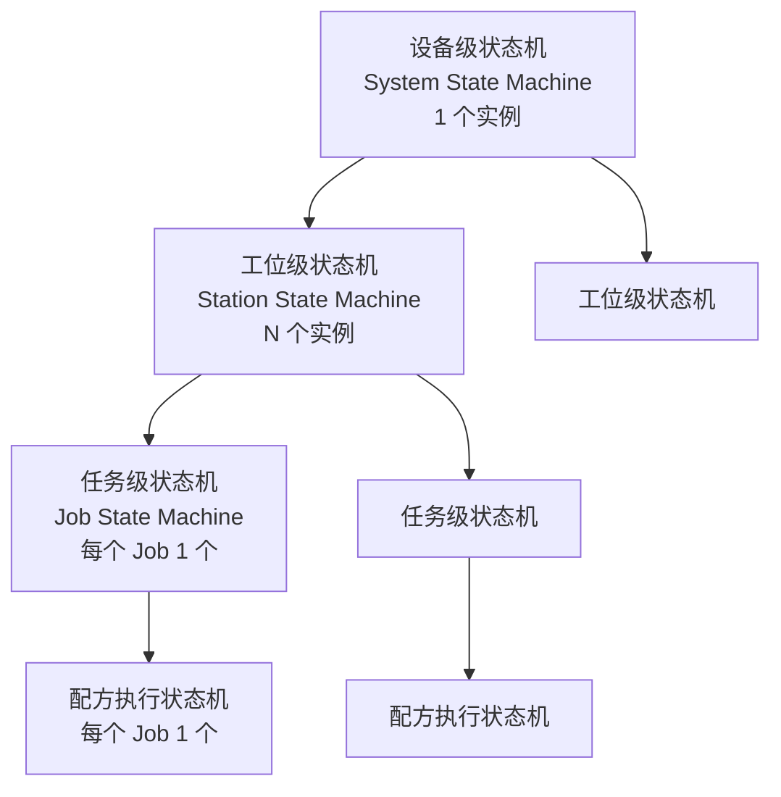
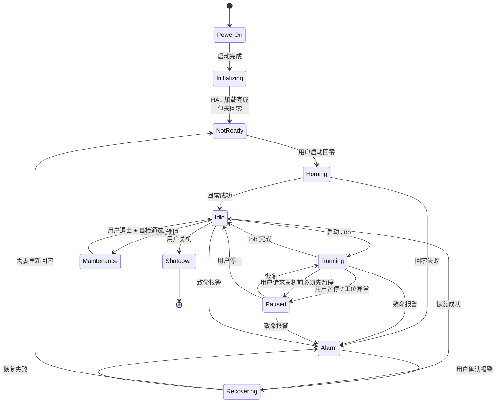
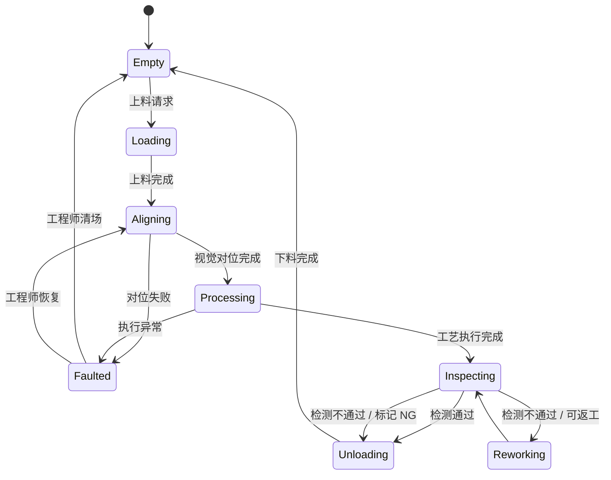
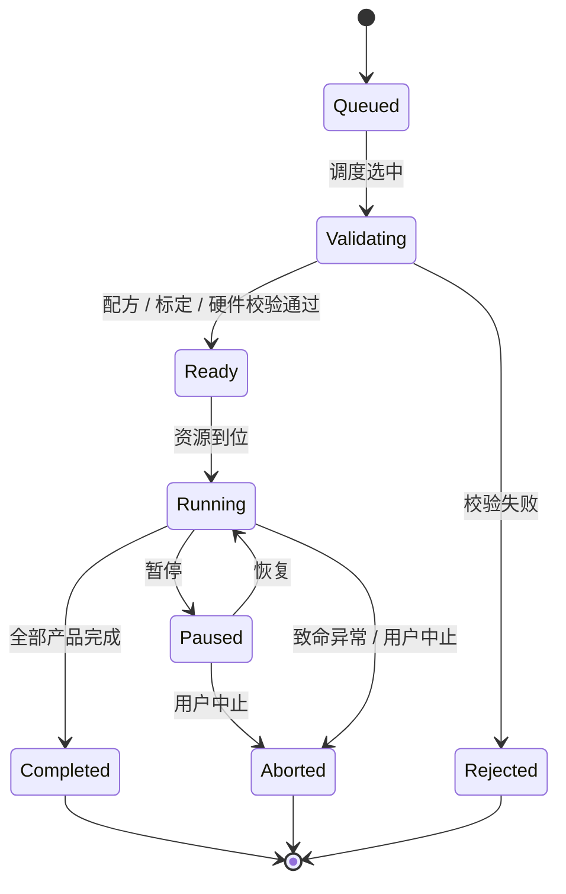
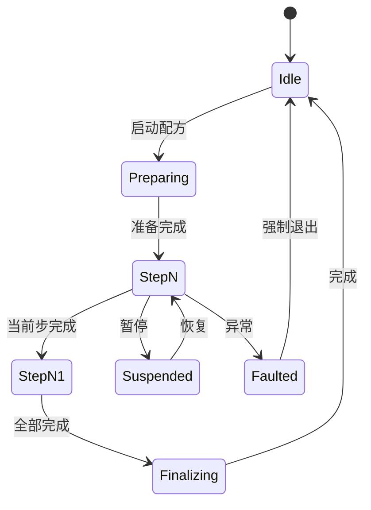
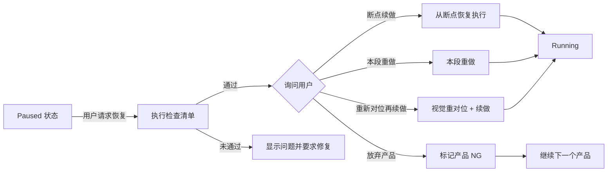
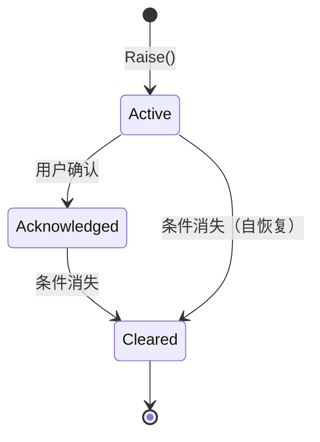
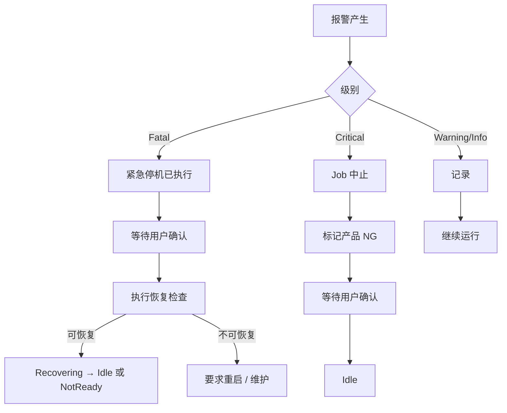
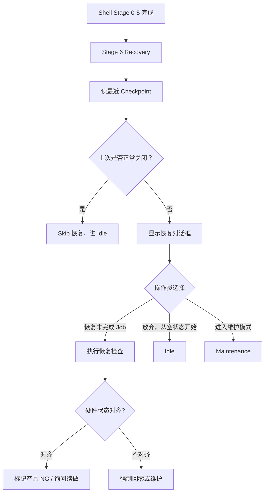

# 文档 6 — 状态机与恢复机制设计（StateMachine-Design.md）

> 版本：v0.1 · 最后更新：2026-05-20

本文回答两件事：**机器在什么时候应该处于什么状态、状态之间如何转移**；以及**异常发生后如何恢复**。这两件事决定机器跑得稳不稳、客户愿不愿意继续买。

---

## 1. 设计原则

### 1.1 分层 + 多实例 + 资源仲裁

不要把"整机一个大状态机"，那会变成上千行的 if-else 加私有标志位。本项目采用三层架构：

- **分层**：设备级 / 工位级 / 任务级 / 配方执行级，每层关心自己的事
- **多实例**：多工位场景下，每个工位独立状态机实例
- **资源仲裁**：跨实例的共享资源（空间、相机、胶水）通过 `IResourceArbiter` 协调

### 1.2 显式状态、显式触发、显式守护

每个状态机的所有状态、所有触发（Trigger）、所有守护条件（Guard）都必须**显式声明**，禁止散落在业务代码里靠标志位推断。

实现层面这意味着：

- 用 `Stateless` 库声明状态图
- 状态进入 / 退出有明确动作
- 触发由事件总线统一注入
- 守护条件是纯函数

### 1.3 与硬件状态保持同步但不耦合

状态机是**逻辑视图**，硬件状态是**物理事实**。两者通过事件总线连接：

- 硬件事件（轴回零完成、IO 翻转、报警）→ 触发状态机转移
- 状态机进入新状态 → 通过命令服务下发硬件操作

但状态机**不直接调用 HAL**，避免与硬件实现耦合。

### 1.4 持久化用于恢复，不是事实源

Checkpoint 写入 SQLite，断电恢复时**作为参考**而非权威。重启后必须**与硬件实际状态对齐**（读取 PLC 真实位置、IO 真实状态），冲突由操作员决定。

### 1.5 用户决策点必须显式

恢复、续做、报废这种决定**必须由人做**，状态机只列出选项，不自动选。"自动恢复"在工业项目里几乎都是事故源。

### 1.6 状态机必须可观测

任何时候用户都能看到当前每层状态机的状态、最近一次转移的时间和原因。开发期能看到完整状态历史（与日志同源）。

---

## 2. 状态机层级

### 2.1 总览



层级与下层关系：

- **设备级**：决定整机能否工作。处于 Alarm 时，所有下层强制停在安全状态。
- **工位级**：决定这个工位能否工作。每个工位独立。
- **任务级**：一次生产订单（Lot / Batch）的生命周期。
- **配方执行级**：执行一条具体配方时的步骤推进（IR Segment 序列）。

### 2.2 设备级状态机

整机的"红绿灯"，所有 UI 顶部状态条都看它。



#### 状态语义

| 状态 | 含义 | 允许的下层操作 |
|------|------|---------------|
| `PowerOn` | 上电瞬态 | 无 |
| `Initializing` | DI / 配置 / HAL 初始化中 | 无 |
| `NotReady` | 已初始化但未回零 | 仅手动调试有限项 |
| `Homing` | 正在回零 | 无（被回零占用） |
| `Idle` | 已就绪、空闲 | 全部 |
| `Running` | 在跑 Job | Job 控制（暂停 / 停止）+ 监视 |
| `Paused` | Job 暂停 | 恢复 / 停止 / 报警处理 |
| `Alarm` | 致命级报警未清 | 仅清除报警 / 进入维护 |
| `Recovering` | 报警清除后恢复中 | 无 |
| `Maintenance` | 维护模式 | 工程师专用工具集 |
| `Shutdown` | 关机流水线 | 无 |

#### 关键转移规则

- **任何状态 → Alarm**：致命报警立即转移，不需用户确认
- **Alarm → Recovering**：必须用户确认（`AcknowledgeAlarm` + 操作员权限）
- **Running → Paused**：可由用户主动 / 工位异常 / 安全门触发
- **Idle → Maintenance**：必须工程师权限
- **Shutdown** 只允许从非 Running 状态进（如果 Running 必须先停 Job）

### 2.3 工位级状态机

每个工位（执行器或载台）一个独立状态机。状态比设备级简单：



#### 状态语义

| 状态 | 含义 |
|------|------|
| `Empty` | 工位空闲，等待上料 |
| `Loading` | 上料中（人工或上下料机构） |
| `Aligning` | 视觉对位中 |
| `Processing` | 执行工艺（点胶） |
| `Inspecting` | 工艺后检测（视觉、重量等） |
| `Reworking` | 返工中（如二次点胶） |
| `Unloading` | 下料中 |
| `Faulted` | 工位异常（不影响其他工位） |

工位级 `Faulted` 与设备级 `Alarm` 区分开：工位异常不一定整机停，多工位场景下其他工位可继续。

### 2.4 任务级状态机

每个 Job（生产订单）的生命周期：



Job 关心的是"这一批活做完没"，不关心轨迹细节。轨迹由配方执行级管。

### 2.5 配方执行状态机

一条配方拆成 N 个步骤，每步对应若干 IR Segment 序列：



`StepN`、`StepN1` 是动态状态（按配方步骤数生成）。

### 2.6 层级约束规则

层级之间的强制约束：

| 上层状态 | 下层最多能到 |
|---------|-------------|
| System.Alarm | 所有 Station 必须停在 Faulted 或 Empty |
| System.Maintenance | 所有 Station 必须 Empty |
| System.Idle | Station 必须 Empty / Faulted / Unloading 完成后的安全等待态，不允许 Processing / Aligning 等自动动作继续运行 |
| System.Running | Station 自由推进 |
| System.Shutdown | 所有 Station 必须 Empty 或 Faulted |

约束在 Stateless 的 Guard 里实现。状态机框架在尝试进入冲突状态时拒绝转移，并触发诊断事件。

---

## 3. 状态定义详表

### 3.1 设备级触发清单

| Trigger | 来源 | 守护条件 |
|---------|------|----------|
| `InitializationCompleted` | Shell Stage 4 完成 | 全部硬件成功初始化 |
| `HomeCommanded` | UI / 调度 | NotReady |
| `HomingCompleted` | IMotionService | Homing |
| `HomingFailed` | IMotionService | Homing |
| `JobStarted` | IProcessService | Idle, 配方有效 |
| `JobPauseRequested` | UI / 异常 | Running |
| `JobResumeRequested` | UI | Paused |
| `JobStopRequested` | UI | Running / Paused |
| `JobCompleted` | IProcessService | Running |
| `FatalAlarmRaised` | IAlarmService | 任何 |
| `AlarmAcknowledged` | UI | Alarm |
| `RecoveryCompleted` | StateMachine 内部 | Recovering |
| `RecoveryFailed` | StateMachine 内部 | Recovering |
| `MaintenanceEntered` | UI（工程师） | Idle |
| `MaintenanceExited` | UI + 自检通过 | Maintenance |
| `ShutdownRequested` | UI | Idle / Maintenance / Alarm |

### 3.2 工位级触发清单

| Trigger | 来源 |
|---------|------|
| `LoadRequested` | 调度器 |
| `LoadCompleted` | IO / 操作员确认 |
| `AlignmentRequested` | StateMachine |
| `AlignmentSucceeded` | IVisionService |
| `AlignmentFailed` | IVisionService |
| `ProcessStarted` | StateMachine |
| `SegmentExecuted` | DirectExecutor / G 代码引擎 |
| `ProcessCompleted` | DirectExecutor |
| `ProcessFailed` | 异常 |
| `InspectionPassed` | IVisionService |
| `InspectionFailed` | IVisionService |
| `ReworkRequested` | UI / 自动 |
| `UnloadCompleted` | IO / 操作员 |
| `StationFaultCleared` | UI（工程师） |

### 3.3 状态进入 / 退出动作

每个状态可配置 OnEntry / OnExit 动作。例如设备级：

| 状态 | OnEntry | OnExit |
|------|---------|--------|
| `Initializing` | 显示启动进度 UI | 关闭进度 UI |
| `Homing` | 锁定其他操作 | 解锁 |
| `Running` | 启动高频回采 / Trace 订阅 | 停止订阅、写归档 |
| `Paused` | 通知所有工位停在安全位置 | 通知工位准备恢复 |
| `Alarm` | 发布紧急停机命令 / 写 checkpoint；具体硬件动作由安全服务执行 | 清除报警高亮 |
| `Recovering` | 启动恢复检查清单 | 移除恢复 UI |
| `Maintenance` | 显示维护模式提示横条 / 放宽限位 | 强制自检 / 收紧限位 |
| `Shutdown` | 启动关闭流水线 | — |

### 3.4 触发的并发策略

- 同时收到多个触发 → 按优先级排队
- 高优先级（FatalAlarmRaised、ShutdownRequested）抢占
- 同优先级 FIFO
- 转移过程中收到的触发暂存到队列，转移完成后立即处理

### 3.5 守护条件的副作用约束

Guard 函数必须是**纯函数**：只读状态、不改状态、不发起 IO。否则会引入隐藏的转移逻辑。

如需复杂判断（如"硬件已就绪"），先把硬件状态同步到一个只读快照，再让 Guard 读快照。

### 3.6 转移失败处理

如果 Guard 拒绝触发：

- 不报错，不抛异常
- 记录到诊断日志
- UI 上"操作不可用"反馈（按钮变灰）
- 调用方应该提前用 `CanFire()` 判断而不是直接 `Fire()`

---

## 4. 多工位协调

### 4.1 两类多工位场景

文档 1 和前期讨论已经定下两类：

- **多执行器**（共享空间）：多个动子在同一工件上方，主要风险是撞机
- **多载台**（独立空间）：多个底物运动载台，主要是节拍优化

两者在状态机层面**结构相同**（都是工位级状态机的多实例），但**协调方式不同**。

### 4.2 多执行器场景：共享空间仲裁

```csharp
public interface IWorkspaceArbiter {
    Task<IRegionLease> AcquireAsync(string stationId, Region region, CancellationToken ct);
    bool TryAcquire(string stationId, Region region, out IRegionLease? lease);
}
```

工作机制：

1. 工作空间划分为若干区域（按 X 坐标分带、按象限、按自定义网格）
2. 工位 A 要进入区域 R1 之前，先调 `AcquireAsync(stationA, R1)`
3. 仲裁器检查 R1 是否被其他工位持有
   - 未持有 → 立即返回 lease，工位进入
   - 已持有 → 排队等待，直到持有者释放
4. 工位完成区域内动作 → `lease.DisposeAsync()` 释放

**死锁预防**：

- 顺序锁：工位永远按"区域 ID 升序"获取多个区域锁
- 超时取消：`AcquireAsync` 带超时，超时主动放弃并触发 Faulted
- 全局监控：仲裁器周期检查死锁迹象，记录到诊断

**安全联锁**：

- 仲裁是**软锁**，不能替代硬件安全
- 物理碰撞保护由控制器层面（限位、安全区）实现，仲裁只是"调度提示"

### 4.3 多载台场景：任务调度

多载台之间不直接冲突（独立工件），调度器负责把任务最优分配：

```csharp
public interface ITaskScheduler {
    Task<TaskAssignment> AssignAsync(WorkItem item, IReadOnlyList<IStation> candidates, CancellationToken ct);
    SchedulingPolicy Policy { get; set; }
}

public enum SchedulingPolicy {
    RoundRobin,           // 轮询
    LoadBalance,          // 平衡各工位空闲时间
    DedicatedRecipe,      // 按配方绑定工位
    Manual                // 手动指定
}
```

调度结果记录到 Job 数据库。

### 4.4 通用资源仲裁泛化

不止空间，许多资源都需要仲裁：

- 共用相机（多工位共一个向下相机）
- 共用上下料机构
- 共用胶水补给
- 共用清针块

```csharp
public interface IResourceArbiter<TResource> where TResource : notnull {
    Task<IResourceLease<TResource>> AcquireAsync(string holder, TResource resource, CancellationToken ct);
}
```

实现可以按需要选不同策略：FIFO、优先级、SJF（最短作业优先）等。

### 4.5 跨工位事件协同

工位之间通过事件总线通信，不直接调用对方：

- `StationStateChangedEvent`：工位状态变化广播
- `StationFaultedEvent`：某工位故障，调度器决定其他工位是否继续
- `ResourceReleasedEvent`：资源释放，等待者抢

工位**永远不直接持有其他工位的引用**，避免耦合。

### 4.6 Barrier（同步原语）

某些工艺要求多工位**同时到达某状态**才能继续（例如双头协同点胶）。IR 中的 `Barrier` Segment 对应到这里：

- 各工位到 Barrier 时阻塞
- 全部到达后由调度器统一释放
- 超时（默认 30s）触发 `ALM-SCHED-BARRIER-TIMEOUT`

### 4.7 单工位场景的兼容性

单工位场景下：

- 工位数 = 1
- 仲裁器降级为 NoOp（永远立即获取）
- 调度器降级为单选
- Barrier 在单工位下退化为空操作

不需要专门走"单工位代码路径"，避免分支爆炸。

## 5. 暂停语义分级

"暂停"在工业项目里**不止一种**。把它们混着写会出大问题。

### 5.1 三种暂停

| 名称 | 触发场景 | 行为 |
|------|----------|------|
| 软暂停（Pause Soft） | 用户主动 / 非紧急中止 | 当前段做完后再停在安全位置 |
| 立即暂停（Pause Now） | 操作员"立即停" / 工位异常 | 立即减速停在当前位置，保持轴使能、保持胶水状态 |
| 长保持（Hold） | 班次间断、午休、计划等待 | 保持位置但启动胶水保活机制 |

### 5.2 软暂停（Pause Soft）

**最优雅的暂停方式**。等当前 Segment 自然结束，落到一个"可续做的状态"再停。

要点：

- 状态机进入 `Paused`
- 下位机执行完当前 Segment，下一段开始前停下
- Z 抬到安全高度，胶水关阀
- 记录"下一应执行段索引"到 checkpoint
- 续做时直接从该索引启动

**适用**：用户点击"暂停"按钮、班次结束准备交接、计划中的视觉重对位。

### 5.3 立即暂停（Pause Now）

中途立即减速停。要保留状态以便续做：

- 状态机进入 `Paused`
- 下位机立即执行减速停
- 轴保持使能、保持位置（不掉电）
- 胶水按"中段停止"策略：可能需要回吸防止滴胶
- 记录"中断的段索引 + 段内位置百分比"

**适用**：操作员发现异常立即停、工位 Faulted、视觉对位偏差超阈。

### 5.4 长保持（Hold）

预期较长时间不动作，需要"养着"机器：

- 状态机进入 `Paused` 的子状态 `OnHold`
- 启动周期性 Purge（防止胶水固化）
- 维持温度 SetPoint
- 关闭真空 / 灯具等非必需
- 操作员可以手动唤醒

**适用**：午休、班次间隔、设备空转待机。

`OnHold` 时间过长（默认 4 小时）触发警告，建议结束 Job 而非 Hold。

### 5.5 续做策略（按段标注）

每段在 IR 中标注续做属性：

```csharp
public enum ResumeStrategy {
    Continuable,            // 可断点续做（默认）
    MustRedoSegment,        // 必须整段重做（如填充段，部分填充会有外观差异）
    MustRedoFromMark,       // 必须从最近的视觉对位点重做
    MustRedoEntireRecipe    // 暂停后必须整张废弃
}
```

`PathCompiler` 根据工艺模板与几何特征推断默认值，工艺工程师可在画布上覆盖。

### 5.6 续做前检查清单

恢复前必须检查（自动 + 用户确认）：

- 暂停时长 vs 胶水 pot life：超过则强制 Purge
- 温度是否在工艺窗口
- 视觉对位是否过期（产品是否被人为移动）：通过简单视觉重检判断
- 安全门 / 急停 / 光栅状态
- 是否有未清的报警
- IO 状态是否符合预期

任意不符 → 阻塞恢复 + UI 提示。

### 5.7 续做的恢复路径



UI 上**永远以列表形式**呈现选项，不要让操作员凭空决策。每个选项配一段简短说明（"耗时 ~5s / 不会影响其他产品 / 需重新视觉对位"）。

### 5.8 暂停的多工位语义

多工位场景下暂停有"作用域"：

- **整机暂停**：所有工位都进 Paused
- **工位级暂停**：仅当前工位 Paused，其他继续
- **Job 级暂停**：当前 Job 涉及的工位都 Paused

UI 上的暂停按钮要明确标注作用域。默认行为可配置。

---

## 6. 报警系统

### 6.1 报警分级

按工业惯例（参考 SEMI E10、ANSI/ISA-18.2）：

| 级别 | 含义 | 状态机响应 | 典型示例 |
|------|------|-----------|----------|
| `Fatal` | 致命，可能伤人 / 损机 | 立即进入安全停机策略、设备级 → Alarm | 撞机、急停、光栅 |

Fatal 的硬件响应由安全策略决定，不统一写死为"所有轴掉电"：急停 / 光栅通常触发控制器 STO 或安全回路；跟随误差、偏差超限等场景可能先受控减速、关阀、抬 Z，再按风险等级断使能。状态机只表达逻辑状态与触发，不直接决定电气安全动作。
| `Critical` | 严重，当前任务必须中止 | Job 中止，工位 Faulted，产品标 NG | 胶水耗尽、温度严重偏差、轴跟随误差超限 |
| `Warning` | 影响质量但可继续 | 仅记录 + UI 提示 | 视觉偏差略大、胶水快用完 |
| `Info` | 提示性 | 记录 | 配方将到期、需要 maintenance |

文档 3 §4.6 已经定义 `AlarmSeverity` 枚举。

### 6.2 报警生命周期



- `Active`：刚产生，未确认。UI 高亮。
- `Acknowledged`：操作员已读，但条件可能仍存在（例如温度还没回到范围）。
- `Cleared`：条件消失，正式归档到历史库。

### 6.3 可恢复性标注

文档 3 §4.6 定义的 `AlarmRecoverability`：

| 值 | 含义 | UI 行为 |
|----|------|---------|
| `SelfRecover` | 条件消失自动清除 | 不需用户操作 |
| `OperatorClear` | 操作员可清除 | "确认" 按钮可用 |
| `EngineerClear` | 工程师可清除 | "确认" 按钮要工程师密码 |
| `Unrecoverable` | 必须重启设备 | "重启" 按钮 |

### 6.4 报警的状态机驱动

报警直接影响状态机：

| 报警级别 | 设备级影响 | 工位级影响 |
|----------|-----------|-----------|
| `Fatal` | 任何状态 → Alarm | 所有工位 → Faulted |
| `Critical` | Running → Paused（提示中止） | 相关工位 → Faulted |
| `Warning` | 不变 | 不变（仅记录） |
| `Info` | 不变 | 不变 |

`AlarmRaisedEvent` 事件会自动注入对应触发到状态机。

### 6.5 报警分类（Category）

```csharp
public enum AlarmCategory {
    Safety,            // 安全：急停、光栅、安全门
    Hardware,          // 硬件：通讯、限位、过温
    Motion,            // 运动：跟随误差、超速、未回零
    Process,           // 工艺：胶水、温度、压力、视觉偏差
    Vision,            // 视觉：相机断连、定位失败
    Configuration,     // 配置：参数无效、文件损坏
    Software,          // 软件：未捕获异常、看门狗
    Maintenance,       // 维护：保养到期、寿命计数
    Quality,           // 质量：检测不通过、SPC 越界
    Sync,              // 同步：IR 过期、回采偏差超阈
    System             // 系统：内存、磁盘、网络
}
```

### 6.6 报警的恢复路径决策树

UI 上每条报警都附带"建议操作"：



### 6.7 报警 UI 呈现规则

- 报警栏始终位于主壳顶部或底部，最高级别 chip 颜色显著
- 每条报警显示：编号 / 级别 / 时间 / 描述 / 建议操作
- 同一报警**不重复**（去重 by Code + Source），仅更新 LastSeen 时间和计数
- 操作员可"批量确认"（仅 Operator 级允许的）
- 历史报警有独立的查询页 (`Modules.Alarm`)

### 6.8 报警的去重与抑制

防止"风暴报警"：

- **去重**：相同 Code + Source 的连续报警合并为一条 + 计数
- **抑制规则**：某些报警在某些状态下抑制（如设备级 Alarm 时，不再产生子级派生报警）
- **抑制时间窗**：高频抖动报警（如阈值边缘抖动）通过短时间窗去抖
- **抑制矩阵**：配置文件定义哪些报警在哪些场景下抑制

抑制规则记录到审计日志（避免被滥用掩盖问题）。

### 6.9 报警的全球唯一编号

文档 3 §8.2 定义编号格式 `<分类>-<子系统>-<编号>`：

```
ALM-SAFETY-0001        急停按下
ALM-SAFETY-0002        安全门未关
ALM-MOTION-0023        X 轴跟随误差超限
ALM-PROCESS-0105       胶水温度偏差超阈
ALM-MOTION-DEVIATION-0001  实际轨迹偏差超工艺阈值
```

编号集中维护在 `configs/_shared/alarm-codes.json`，i18n 文本在 `Resources/i18n/<locale>/alarms.resx`。

### 6.10 自定义报警

客户机型可以扩展专有报警码：

- 编号空间：`ALM-CUSTOMER-XYZ-MOTION-0001`
- 配置文件加载到主报警表
- 不与标准报警冲突

### 6.11 报警与审计

每条报警的产生 / 确认 / 清除都自动写审计：

| 事件 | 审计 Action |
|------|------------|
| Raise | `AlarmRaised` |
| Acknowledge | `AlarmAcknowledged`（含用户） |
| Clear | `AlarmCleared` |

便于事后追溯"是谁、什么时候、为什么清掉了那条报警"。

---

## 7. 断电与异常恢复

### 7.1 总体策略

工业项目里**断电不可避免**：客户车间跳闸、UPS 没电、维护电工拉总闸都会发生。设计前提：

> **断电随时可能发生，恢复必须能让操作员明确决定下一步。**

不要追求"自动恢复"——工业项目里自动恢复几乎都是事故源。

### 7.2 Checkpoint 写入时机

文档 7 详细规定 schema，本节聚焦"何时写"：

| 时机 | 内容 |
|------|------|
| 状态机关键转移 | 进入 / 离开 Running、Paused、Alarm |
| 每个产品开始 / 结束 | 产品 ID、配方版本、IR hash、起始时间 |
| 每段 Segment 完成 | 当前段索引、累计完成时间、轴位置快照 |
| Job 启动 / 完成 / 中止 | Job ID、配方、状态、产出统计 |
| 工程师改参数 | 改前 / 改后值（同时进审计） |
| 暂停 / 恢复 | 暂停模式、恢复点 |
| 标定数据变更 | 新的变换矩阵 |
| 维护模式进 / 出 | 进入原因、退出自检结果 |

写入策略：**异步写盘 + 批量提交**，避免阻塞实时通道。

### 7.3 Checkpoint 数据结构

```csharp
public sealed record Checkpoint(
    Guid Id,
    DateTimeOffset At,
    SystemState SystemState,
    ImmutableDictionary<string, StationState> StationStates,
    JobSnapshot? CurrentJob,
    RecipeExecutionSnapshot? CurrentExecution,
    ImmutableDictionary<string, AxisSnapshot> AxisPositions,
    ImmutableDictionary<string, bool> CriticalIo,
    ImmutableDictionary<string, AlarmSnapshot> ActiveAlarms,
    string? ChecksumSha256);
```

详细 schema 见文档 7。

### 7.4 启动时恢复流程



### 7.5 与硬件实际状态的核对

恢复时**绝不能直接相信 Checkpoint**。必须读取硬件实际状态对比：

| 项 | 核对方式 |
|----|----------|
| 轴位置 | 读 PLC 实际位置 vs Checkpoint 位置 |
| IO 状态 | 读实际 IO vs Checkpoint |
| 安全状态 | 急停 / 安全门 / 光栅必须正常 |
| 报警状态 | 当前是否有未清报警 |

任意不一致 → 显式提示用户决定。

### 7.6 操作员决策点

**永远不要让程序代替操作员决定**：

- "上次断电时正在加工产品 #123 的第 245 段。是否：
  - 视觉重新对位后从段 245 续做（保留产品）
  - 标记产品 NG，从下一个产品开始
  - 完全放弃当前 Job
  - 进入维护模式"

每个选项明确说明影响：

- "续做：风险中等，产品可能有过渡线；适用于细线轨迹。"
- "标记 NG：保险但浪费一个产品。"

UI 必须把这些**直白**地呈现，不要让操作员翻文档。

### 7.7 绝对位置编码器的优势

如果硬件支持绝对位置编码器（很多伺服都支持）：

- 断电后位置不丢
- 启动时无需回零
- 恢复流程可省一个步骤

**但仍需校验**：万一断电时被人推动了机械，绝对编码器值仍然有效但物理位置不对。校验方式：上电时移动到一个已知特征点（如 Home 开关）做一次确认。

### 7.8 断电期间硬件被改动的处理

最容易被忽略的边界：

- 操作员断电后手动转动了某轴
- 操作员断电后取走了产品
- 操作员断电后做了机械调整

恢复时 UI 必须明确询问：

- "断电期间是否有任何机械操作？"
- 选 "是" → 强制回零 + 重新视觉对位 + 当前产品作废
- 选 "否" → 进入正常恢复流程

### 7.9 多工位场景的恢复

每个工位独立判断恢复路径：

- 工位 A 的产品断电时正在 Inspecting → 重新检测即可
- 工位 B 的产品断电时正在 Processing → 复杂决策
- 调度器同步等待，全部就绪后整体进入 Running

如果某工位无法恢复 → 单独 Faulted，其他工位可继续。

### 7.10 异常关闭检测

如何判断"上次是否正常关闭"：

- 系统正常关机：Shutdown 流水线写"clean shutdown"标记
- 异常关闭：标记缺失 / `Running` 状态遗留在 Checkpoint
- 任何不一致 → 视为异常

`data/system.db` 的 `system_state` 表记录最后一次状态：`{ shutdown_clean: bool, last_state: ..., last_at: ... }`。

---

## 8. 软件崩溃应对

不止断电，软件本身也会崩。

### 8.1 全局未捕获异常

```csharp
// Shell.App.xaml.cs
public partial class App : PrismApplication {
    protected override void OnStartup(StartupEventArgs e) {
        AppDomain.CurrentDomain.UnhandledException += OnUnhandledException;
        TaskScheduler.UnobservedTaskException += OnUnobservedTaskException;
        DispatcherUnhandledException += OnDispatcherUnhandledException;
        base.OnStartup(e);
    }
    // ...
}
```

捕获后：

1. 写崩溃报告到 `logs/crash-<timestamp>.log`
2. 写 Checkpoint（标记 `crashing = true`）
3. 通知 PLC 进入安全状态（看门狗会自动处理，这里是兜底）
4. UI 显示"出现未预期错误，软件即将退出"
5. 进程退出（不要试图自我修复）

### 8.2 看门狗（Watchdog）

上下位机互相监视：

**上位机 → PLC 心跳**：
- 上位机 Tick：定时（默认 100 ms）写 `nHostHeartbeat++` 到 PLC
- PLC 监视：`nHostHeartbeat` 在 `nHostHeartbeatTimeout`（默认 1s）内没变化 → 上位机假死 → PLC 进入安全状态（停止运动 / 关阀 / 报警）

**PLC → 上位机心跳**：
- PLC 周期写 `nPlcHeartbeat++`
- 上位机订阅，超时报警 `ALM-COMM-PLC-LOST` + 状态机进 Alarm

心跳变量 + 超时配置详见文档 5 附录 B。

### 8.3 自动重启策略

**默认不自动重启**。理由：

- 反复崩溃反复启动 = 反复操作硬件 = 可能造成更大损害
- 现场工程师需要看到崩溃才能诊断
- 自动重启容易掩盖根本问题

**可配置启用**（生产环境部分场景）：

- `autoRestart.enabled = true`
- `autoRestart.maxRetries = 2`（超过则停止重试）
- `autoRestart.cooldown = 5min`（两次重启间隔）
- `autoRestart.disableAfterCriticalAlarm = true`（产生过 Critical 后禁用）

### 8.4 崩溃报告内容

```
crash-2026-05-20T14-32-00.log
├─ 异常类型 / 消息 / 堆栈
├─ 当前 SystemState / StationStates
├─ 当前 Job / 配方 / 段索引
├─ 最近 50 条日志
├─ 进程内存 / CPU 状态
├─ 加载的程序集列表（带版本）
├─ 当前用户
├─ 硬件配置 hash
└─ 已订阅的诊断事件状态
```

崩溃报告可一键打包成"诊断包"（同文档 5 §8.9），发回总部。

### 8.5 内存泄漏与资源耗尽

不算"崩溃"但同样致命：

- 监控进程内存 / 句柄数 / GC 代数
- 超阈触发 `WRN-SYS-MEMORY` 警告（默认 80%）
- 严重超阈触发 `ALM-SYS-MEMORY-CRITICAL`（默认 95%）→ 状态机进 Alarm
- 部分场景（图像缓存、回采缓冲）有 LRU 主动淘汰

### 8.6 死锁检测

仲裁器（§4.4）周期检测死锁：

- 简单环检测：A 等 B、B 等 A
- 超时辅助：任何锁获取带超时
- 死锁触发 `ALM-SCHED-DEADLOCK` + 写诊断包

### 8.7 异步任务的异常逃逸

WPF + Async 的常见陷阱是异步异常被吞：

- 强制规则：所有 `async Task` 不能"fire and forget"，必须 await 或 `.ContinueWith(...)` 处理异常
- 启动时 `TaskScheduler.UnobservedTaskException` 兜底
- 工具：`Microsoft.VisualStudio.Threading.Analyzers` 静态检查

### 8.8 优雅降级

某些非核心模块崩溃不应该让整机停：

- `Modules.Trace`（追溯查询）崩溃 → 提示"追溯页不可用"，主功能继续
- `Modules.Alarm` 报警栏不能崩（这是关键）
- HAL 实现崩溃 → 视严重性决定（相机崩 = Critical 报警；点胶阀崩 = Fatal）

模块崩溃通过 try/catch 隔离 + 状态降级，不波及其他模块。

## 9. 维护模式

### 9.1 定位

维护模式是个被低估的状态。它是**工程师 / 维护人员的专属"保护壳"**，让他们在确保安全的前提下做平时不允许做的事。

### 9.2 进入条件

- 设备级状态必须是 `Idle`（不能在 Running 中直接进）
- 必须工程师权限以上
- 操作员尝试进入 → 拒绝并提示"权限不足"
- 进入时弹窗二次确认 + 简短风险提示

### 9.3 维护模式下的限制放宽

| 项 | 平时 | 维护模式 |
|----|------|---------|
| 软限位 | 严格执行 | 可临时放宽（带强烈提示） |
| 速度上限 | 工艺速度 | 可降为更低（点动级） |
| 单轴 Jog | 受限 | 全部启用 |
| 手动 IO 控制 | 不允许 | 启用 |
| 标定数据修改 | 不允许 | 启用 |
| 工艺参数修改 | 不允许 | 启用 |
| 诊断脚本 | 不允许 | 启用 |
| Job 启动 | 启用 | **禁用** |
| 自动模式 | 启用 | **禁用** |

每项放宽都写审计 + 显式标注 `mode: maintenance`。

### 9.4 维护工具集（Modules.Maintenance）

维护模式下解锁的页面：

- **轴诊断**：实时位置、速度、跟随误差、电流；可设强制位置（绕过限位）
- **IO 强制**：所有 DI / DO 强制读写
- **传感器原始读数**：高度 / 视觉 / 压力 / 温度的未经过滤值
- **PLC 变量监视器**：直接读写约定外的全局变量（高级，需 Administrator）
- **通讯诊断**：ADS / GigE / 串口的连接状态、统计、握手信息
- **报警注入**：模拟某条报警，检查响应（仅仿真模式）
- **运行时日志查看**：Serilog 实时查看
- **Trace 实时面板**：高频通道实时波形
- **配方诊断**：选定配方做"空跑"（不真实开胶）
- **回零脚本**：可选择不同回零策略

### 9.5 退出维护模式的强制自检

退出时必须跑一次完整自检：

| 检查项 | 必须状态 |
|--------|----------|
| 所有强制 IO 已恢复 | ✓ |
| 软限位已恢复默认 | ✓ |
| 速度上限已恢复 | ✓ |
| 标定数据有效（与硬件位置一致性） | ✓ |
| 急停 / 安全门正常 | ✓ |
| 当前状态机层级一致 | ✓ |
| 维护期间产生的报警已确认 | ✓ |

任意未通过 → 阻塞退出 + 红色警告。

### 9.6 UI 视觉提示

- 主窗口边框变红 + "维护模式" 大标识
- 顶部横条闪烁
- 所有关键按钮带"维护模式"水印
- 进入时间记录在状态栏（"维护模式持续 0:23:14"）
- 维持时间过长（默认 4 小时）显示提示："是否仍在维护？"

避免操作员误以为机器在正常运行。

### 9.7 维护与审计

维护模式期间所有操作 100% 写审计：

- 进入 / 退出（含工程师 ID）
- 所有强制 IO
- 所有限位放宽
- 所有标定数据修改
- 所有 PLC 变量直接读写
- 所有诊断脚本执行

便于事后追溯"维护后机器有问题，是不是哪个动作误改了什么"。

### 9.8 维护模式的恢复

维护模式期间崩溃 / 断电：

- 启动恢复时检测到上次状态是 Maintenance → 显式提示"上次维护模式未正常退出"
- 必须工程师确认 + 重新自检
- 不允许"自动恢复维护模式"

---

## 10. 状态可视化

### 10.1 顶部状态条（System State）

主窗口顶部一条始终可见的状态条：

```
[● Idle]   Job: -   Recipe: -   节拍: -   报警: 0   用户: engineer-01   主题: Dark
```

```
[▶ Running]   Job-7c2f   Recipe: PCB_v3   节拍: 35.2s   完成 245/1000   报警: 1 Warning   用户: operator-02
```

```
[⚠ Alarm]   ALM-MOTION-0023 X 轴跟随误差超限   按 Acknowledge 进入恢复
```

颜色：

| 状态 | 颜色 |
|------|------|
| Initializing / Homing / Recovering / Shutdown | 蓝色（中性，进行中） |
| NotReady | 灰色 |
| Idle | 绿色（轻） |
| Running | 绿色（亮） |
| Paused | 黄色 |
| Alarm | 红色 |
| Maintenance | 红色（带水印） |

颜色全部走 Token（文档 8）。

### 10.2 工位状态显示（Station State）

主页面布局保留每个工位的"状态色块"：

```
┌─ Station-1 (Effector) ─┐  ┌─ Station-2 (Substrate) ─┐
│ ▶ Processing            │  │ ◴ Aligning              │
│ Recipe: PCB_v3          │  │ Product: #1234           │
│ Segment: 245/1023       │  │ Mark progress: 2/4       │
│ Deviation: 3.2 μm       │  │                          │
└─────────────────────────┘  └──────────────────────────┘
```

每个工位独立着色 + 进度。点击展开详情面板。

### 10.3 任务进度（Job Progress）

`Modules.Production` 主页面：

- 当前 Job 卡片：开始时间、完成数 / 总数、节拍、预计完成时间
- 产品级表格：每个产品 ID、状态（Pass / NG / Pending）、耗时、关键 KPI
- 时间轴：可视化各工位的并行时序

### 10.4 报警栏（Alarm Bar）

主壳底部固定报警栏：

```
[!] 3 Active   ┃  ALM-MOTION-DEVIATION-001  X 偏差 5.2μm 超阈   2026-05-20 14:32:10   [确认] [详情]
```

显示当前最高级别的活跃报警；点击展开列表（`Modules.Alarm`）。

### 10.5 关键 IO 状态指示

底部状态栏显示：

- 急停按钮状态（红 / 绿）
- 安全门状态
- 光栅状态
- 气压状态
- 主电源 / 控制电源
- 上下位机心跳灯

任何异常立即变色 + 闪烁。

### 10.6 状态历史与重放

`Modules.Trace` 提供"状态机历史"页：

- 时间线显示所有状态转移
- 触发原因（哪个事件 / 谁触发的）
- 与报警 / 审计联动跳转
- 支持按时间范围导出

帮助现场工程师事后还原"机器为什么变这样"。

### 10.7 不要把状态藏在三层菜单里

UI 设计原则：

- 操作员**一眼看到**整机和所在工位状态
- 不需要点击就能知道是否正常
- 不正常时立刻看到原因和操作建议

避免"机器停了我不知道为什么"——这是工业现场最大的痛点之一。

---

## 11. Stateless 库使用规约

### 11.1 选型回顾

文档 1 §3.4 已经定下用 Stateless。本节给出统一使用规约。

### 11.2 命名规范

| 元素 | 命名 |
|------|------|
| 状态枚举 | `<Subject>State`，如 `SystemState` / `StationState` |
| 触发枚举 | `<Subject>Trigger`，如 `SystemTrigger` / `StationTrigger` |
| 状态值 | `PascalCase`，名词，如 `Idle` / `Running` |
| 触发值 | `PascalCase`，过去式或祈使句，如 `JobStarted` / `StopRequested` |

### 11.3 状态机配置位置

每个状态机一个独立类，命名 `<Subject>StateMachine`，例如：

```csharp
public sealed class SystemStateMachine {
    private readonly StateMachine<SystemState, SystemTrigger> _sm;
    public SystemStateMachine(...) {
        _sm = new StateMachine<SystemState, SystemTrigger>(SystemState.PowerOn);
        Configure();
    }
    private void Configure() {
        _sm.Configure(SystemState.Idle)
           .Permit(SystemTrigger.JobStarted, SystemState.Running)
           .Permit(SystemTrigger.MaintenanceEntered, SystemState.Maintenance)
           ...;
        // ...
    }
}
```

`Configure()` 方法把所有转移规则集中在一处，方便回顾。

### 11.4 进入 / 退出动作

OnEntry / OnExit 必须**短小且非阻塞**。如果需要长动作（回零、加载配方）：

- 在 OnEntry 启动异步任务
- 任务完成后通过事件触发下一个状态转移
- 不在 OnEntry 里 await 长时间任务（会阻塞触发响应）

### 11.5 守护条件

```csharp
_sm.Configure(SystemState.NotReady)
   .PermitIf(SystemTrigger.HomeCommanded, SystemState.Homing,
             () => _safety.IsAllOk && !_alarm.HasFatal);
```

Guard 函数纯只读，详见 §3.5。

### 11.6 持久化集成

Stateless 自带 `OnTransitioned` 钩子，用来写 Checkpoint：

```csharp
_sm.OnTransitionCompleted(t => {
    var ev = new StateTransitionRecorded(BuildCheckpoint(t), new AuditEntry(...));
    _transitionLog.Enqueue(ev); // 后台持久化队列负责写 checkpoint / audit
    _eventBus.Publish(new SystemStateChangedEvent(t.Source, t.Destination, DateTimeOffset.UtcNow));
});
```

启动时从 Checkpoint 恢复：

```csharp
var lastState = _checkpointStore.LoadLast()?.SystemState ?? SystemState.PowerOn;
_sm = new StateMachine<SystemState, SystemTrigger>(lastState);
```

但启动恢复必须经 §7 的硬件状态对齐流程，**不能直接信任 Checkpoint**。

### 11.7 触发的入口

所有触发**只能**通过 `IStateMachineGateway` 发起：

```csharp
public interface IStateMachineGateway {
    bool CanFire(SystemTrigger trigger);
    Task FireAsync(SystemTrigger trigger, FireContext ctx, CancellationToken ct);
}
```

UI / 服务 / 事件订阅都通过这个接口，不直接调 `_sm.Fire(...)`。这样所有触发都能记录日志、审计、统计。

### 11.8 内部状态与子状态

复杂场景使用 Stateless 的 SubState（如 `Paused.OnHold` 是 `Paused` 的子状态）：

```csharp
_sm.Configure(SystemState.OnHold)
   .SubstateOf(SystemState.Paused);
```

子状态进入时父状态的 OnEntry 不重复触发；退出父状态时所有子状态先依次退出。

### 11.9 多状态机的协作

四层状态机共存：

- 设备级状态机 = 单例
- 工位级状态机 = 每工位一个实例
- 任务级状态机 = 每个 Job 一个
- 配方执行级状态机 = 每个 Job 一个

通过事件总线串联，**不直接互相引用**。

### 11.10 UI 绑定

状态机暴露 `IObservable<TState>` 流给 UI：

```csharp
public interface IStateMachine<TState, TTrigger> {
    TState Current { get; }
    IObservable<StateTransition<TState, TTrigger>> Transitions { get; }
}
```

UI ViewModel 订阅，自动刷新状态条 / 状态色块。

### 11.11 测试时机

- 单元测试每条转移
- 单元测试 Guard 阻断
- 单元测试 OnEntry / OnExit 副作用（用 mock）
- 集成测试：完整 Run 一个 Job（详见 §12）

### 11.12 反模式（禁止）

- ❌ 在 OnEntry / OnExit 里直接调 HAL（会耦合）
- ❌ Guard 里 await 异步操作（破坏纯函数）
- ❌ 业务代码直接读写状态枚举做分支（应用 `IsInState` 抽象）
- ❌ 状态枚举数值依赖（`if state >= 5`）
- ❌ 把"标志位"当状态用（应该新增子状态）

---

## 12. 测试策略

### 12.1 状态转移单元测试

每个状态机一组完整的"状态转移矩阵"测试：

```csharp
[Theory]
[InlineData(SystemState.Idle, SystemTrigger.JobStarted, SystemState.Running)]
[InlineData(SystemState.Running, SystemTrigger.JobPauseRequested, SystemState.Paused)]
[InlineData(SystemState.Paused, SystemTrigger.JobResumeRequested, SystemState.Running)]
public void Should_transition(SystemState from, SystemTrigger trigger, SystemState expected) {
    var sm = new SystemStateMachine(...);
    sm.SetState(from);
    sm.Fire(trigger);
    Assert.Equal(expected, sm.Current);
}
```

非法转移必须显式测试**不发生**：

```csharp
[Fact]
public void Should_not_allow_run_from_alarm() {
    var sm = new SystemStateMachine(...);
    sm.SetState(SystemState.Alarm);
    var canFire = sm.CanFire(SystemTrigger.JobStarted);
    Assert.False(canFire);
}
```

### 12.2 守护条件测试

每个 Guard 一组用例：

```csharp
[Theory]
[InlineData(true, true, true)]                  // 全 OK，允许
[InlineData(false, true, false)]                // 安全异常，拒绝
[InlineData(true, false, false)]                // 有 Fatal 报警，拒绝
public void Home_guard(bool safetyOk, bool noFatal, bool expected) {
    // Arrange...
    var canHome = sm.CanFire(SystemTrigger.HomeCommanded);
    Assert.Equal(expected, canHome);
}
```

### 12.3 OnEntry / OnExit 副作用测试

用 mock 验证副作用：

```csharp
[Fact]
public void Entering_alarm_calls_emergency_stop() {
    var safety = Substitute.For<ISafetyCommandPublisher>();
    var sm = new SystemStateMachine(safety, ...);
    sm.SetState(SystemState.Running);
    sm.Fire(SystemTrigger.FatalAlarmRaised);
    safety.Received().PublishEmergencyStop(Arg.Any<EmergencyStopRequest>());
}
```

### 12.4 故障注入测试

用仿真器（`Hal.Simulator`）注入故障：

- 中途撞机 → 状态机应进 Alarm
- ADS 断线 → 状态机应进 Alarm
- 视觉对位失败 → 工位应进 Faulted
- 偏差超阈 → 报警 + 状态影响

每种故障测试覆盖：

- 状态机正确响应
- 报警正确产生
- Checkpoint 正确写入
- UI 收到正确事件

### 12.5 断电模拟测试

模拟"任意时刻断电"：

```csharp
[Fact]
public async Task Should_recover_from_unclean_shutdown_during_running() {
    // 1. 启动 Job、跑一段
    var session = await StartJobAsync();
    await session.AdvanceSegmentsAsync(245);

    // 2. 模拟断电（不走正常关闭）
    SimulateUncleanShutdown();

    // 3. 重启
    var newSession = await RestartAsync();

    // 4. 应进入 Recovery 流程，提示用户决策
    Assert.Equal(SystemState.Recovering, newSession.SystemState);
    Assert.True(newSession.HasPendingRecoveryDecision);
}
```

### 12.6 多工位协调测试

- 多工位资源仲裁：两个工位同时申请同一区域，应该顺序获取
- 死锁场景：故意构造循环锁，验证检测和解除
- Barrier 超时：模拟某工位卡住，验证超时报警

### 12.7 端到端 Job 用例

`tests/DispensingPlatform.Integration.Tests` 包含：

- 完整 Job 启动 → 跑完所有产品 → 完成
- Job 中途暂停 → 续做 → 完成
- Job 中途异常 → 报警 → 恢复 → 续做
- Job 中途断电 → 重启 → 决策续做
- Job 中途切换权限 → 验证可见性切换

每个用例既测试状态机，也测试报警、审计、Checkpoint 联动。

### 12.8 Stateless 配置测试

防止"加新状态忘了配 Guard"：

```csharp
[Fact]
public void Every_state_must_have_at_least_one_path_in_or_be_initial() {
    var sm = new SystemStateMachine(...);
    var graph = sm.GetInfo();
    foreach (var state in Enum.GetValues<SystemState>()) {
        if (state == SystemState.PowerOn) continue; // 初始
        Assert.True(graph.States.Any(s => s.Transitions.Any(t => t.Destination == state)),
                    $"State {state} has no inbound transition");
    }
}
```

类似的"配置完整性"用例可以快速发现遗漏。

### 12.9 性能测试

状态机的转移和触发延迟：

- 单次 Fire < 1 ms
- OnTransitioned 钩子（入持久化队列 + 发布事件）< 5 ms；实际 Checkpoint / Audit 写入由后台队列完成并监控延迟
- 高频事件下（1k 触发/s）应能稳定处理

### 12.10 黄金状态序列

针对关键 Job 流程，记录"黄金状态序列"：

```
启动 Job → Idle → Running →
  Station1: Empty → Loading → Aligning → Processing → Inspecting → Unloading → Empty →
  Station1: Empty → Loading → ... →
Job 完成 → Idle
```

每次回归测试比对实际状态序列与黄金序列。差异要么是 bug，要么是有意改动（更新黄金）。

---

## 附录 A — 关键接口速查

以下名称是逻辑命名空间布局，不代表当前阶段必须存在同名 `.csproj`。

```
DispensingPlatform.Application.StateMachine
├─ ISystemStateMachine
├─ IStationStateMachine
├─ IJobStateMachine
├─ IRecipeExecutionStateMachine
└─ IStateMachineGateway

DispensingPlatform.Application.Arbitration
├─ IWorkspaceArbiter
├─ IResourceArbiter<TResource>
├─ IRegionLease
└─ IResourceLease<TResource>

DispensingPlatform.Application.Scheduling
├─ ITaskScheduler
└─ SchedulingPolicy

DispensingPlatform.Core.Contracts.Lifecycle
└─ ICheckpointStore
     ├─ SaveAsync(Checkpoint)
     ├─ LoadLatestAsync()
     ├─ QueryAsync(...)
     └─ MarkCleanShutdownAsync()
```

---

## 附录 B — 配置项清单

`configs/<customer>/<model>/state-machine.json`：

```json
{
  "watchdog": {
    "hostHeartbeatPeriodMs": 100,
    "plcHeartbeatTimeoutMs": 1000,
    "hostHeartbeatTimeoutMs": 1000
  },
  "checkpoint": {
    "writeIntervalSeconds": 30,
    "perSegment": false,
    "perProduct": true,
    "retentionDays": 90
  },
  "autoRestart": {
    "enabled": false,
    "maxRetries": 2,
    "cooldownMinutes": 5,
    "disableAfterCriticalAlarm": true
  },
  "pause": {
    "defaultMode": "Soft",
    "holdAutoPurgeIntervalMinutes": 15,
    "holdMaxDurationHours": 4
  },
  "barrier": {
    "timeoutSeconds": 30
  },
  "maintenance": {
    "maxDurationHoursBeforeReminder": 4
  },
  "deviation": {
    "linearMoveUm": 5,
    "arcMoveUm": 8,
    "cornerSlowdownPercent": 20
  }
}
```

---

## 附录 C — 与其他文档的关系

- **文档 1 Architecture**：报警流 / 启动流 / 关闭流概览
- **文档 3 Core-Contracts**：IAlarmService / IAuditLogger / IShutdownCoordinator 接口
- **文档 5 Sync-Mechanism**：偏差告警如何驱动状态机；上下位机心跳协议
- **文档 7 Data-Persistence**：Checkpoint / 报警 / 审计的 schema
- **文档 8 Design-System**：状态条 / 报警栏 / 维护横条的 Token 设计
- **文档 10 DevOps**：Watchdog / 自动重启相关的部署配置
