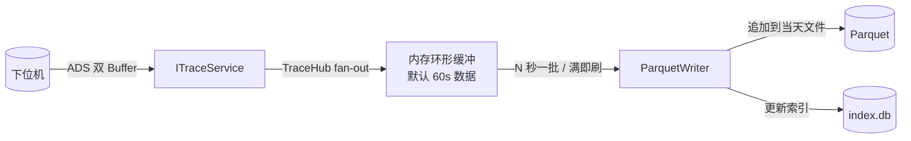
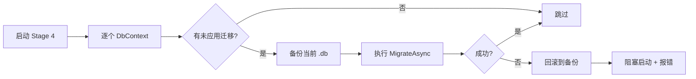

# 文档 7 — 数据模型与持久化（Data-Persistence.md）

> 版本：v0.1 · 最后更新：2026-05-20

本文回答两件事：**项目里有哪些数据需要持久化、各自该用什么方式持久化**。数据是工业项目的资产，schema 一旦定下来很难大改，本文是落地实现前必须达成共识的一份基线。

---

## 1. 数据分类

按"修改频率 / 体量 / 重要性 / 合规要求"对数据分类，决定存储介质与策略：

| 类别 | 修改频率 | 体量 | 重要性 | 合规要求 | 推荐存储 |
|------|----------|------|--------|----------|----------|
| 配置数据 | 低 | 小（KB） | 高 | 中 | JSON + Git |
| 业务数据（配方 / 标定） | 中 | 中（MB） | 极高 | 高 | SQLite (EF Core) |
| 生产数据（订单 / 产品） | 高 | 大（GB） | 高 | 高 | SQLite (Dapper) |
| 追溯数据（高频回采） | 极高 | 极大（TB） | 中 | 中 | Parquet + 索引 |
| 报警数据 | 中 | 中（MB） | 高 | 高 | SQLite |
| 审计数据 | 中 | 中（MB） | 极高 | 极高 | SQLite（独立、不可删） |
| 日志数据 | 极高 | 大（GB） | 中 | 中 | 文本文件 + 滚动 |
| Checkpoint | 中 | 小（KB） | 高 | 中 | SQLite |
| 缓存 | 高 | 中 | 低 | 无 | 文件系统 / 内存 |

### 1.1 数据所有权

每类数据有明确"所有者服务"，其他模块只能通过接口访问：

| 数据 | 所有者 |
|------|--------|
| 配置 | `IConfigurationService`（Core.Infrastructure） |
| 配方 | `IRecipeService` |
| 标定 | `ICalibrationService` |
| 用户 / 权限 | `IPermissionService` |
| 生产记录 | `IProductionService` |
| 追溯 | `ITraceService` |
| 报警 | `IAlarmService` |
| 审计 | `IAuditLogger` |
| Checkpoint | `ICheckpointStore` |

绝对禁止跨服务直接访问对方数据库。这是为后期扩展（独立部署、加密、远程同步）留口子。

### 1.2 数据生命周期

每类数据都要明确：

- **何时产生**：触发事件
- **保留多久**：默认天数（可配置）
- **如何归档**：归档介质 + 归档后的访问方式
- **如何删除**：是否允许删除、谁可以删

详见后文各章。

---

## 2. SQLite 分库策略

### 2.1 为什么分库

- 单库锁竞争：审计 / 报警 / 生产数据并发写入
- 备份粒度：不同库可以用不同备份策略
- 损坏隔离：一个库损坏不影响其他
- 权限隔离：审计库单独权限管理
- 体积管理：高频写入库可以独立切换 / 归档

### 2.2 库列表

```
data/
├─ system.db              # 用户、权限、配置元数据、设备状态
├─ recipe.db              # 配方、工艺模板、标定
├─ production.db          # 生产订单、产品记录
├─ alarm.db               # 报警当前 + 历史
├─ audit.db               # 审计日志（独立、不可删）
├─ checkpoint.db          # 状态机检查点
└─ trace/                 # 追溯数据（Parquet + 索引）
    ├─ index.db           # 索引库
    ├─ 2026-05-20/
    │   ├─ axis_position.parquet
    │   ├─ height_sensor.parquet
    │   └─ io_states.parquet
    ├─ 2026-05-21/
    └─ ...
```

每个 .db 文件独立 SQLite 数据库，独立 EF Core DbContext。

### 2.3 system.db

存放跨业务的小数据：

- `users` / `roles` / `permissions` / `user_roles`
- `settings`：UI 偏好、主题、语言、最近打开
- `system_state`：上次正常关闭标记、最后状态、最后时间
- `theme_overrides`：客户主题覆盖
- `feature_flags`：客户启用的特性

体量小，读多写少。

### 2.4 recipe.db

配方与工艺：

- `recipes` / `recipe_versions`：配方主表与版本快照
- `process_templates`：工艺模板库
- `recipe_template_refs`：配方与模板的引用
- `calibrations`：标定数据（相机、手眼、Mark）
- `calibration_history`：标定历史

读多写中等。

### 2.5 production.db

生产期间高频写入：

- `jobs`：生产订单
- `products`：每个产品的记录
- `product_segments`：每个产品的段执行记录（聚合粒度）
- `kpis`：节拍、产量统计
- `trackback_reports`：偏差分析报告

写多读多。是最大的业务库。

### 2.6 alarm.db

- `alarms_active`：当前活跃报警
- `alarms_history`：历史报警
- `alarm_acknowledgments`：确认动作
- `alarm_clears`：清除动作

中等写入。

### 2.7 audit.db

- `audit_entries`：审计条目（永久保留）
- `audit_signatures`：V2 电子签名

**独立 DbContext + 仅追加访问**：

- 业务代码持有的 DbContext 仅暴露 `Add` / `Query`，没有 `Update` / `Remove`
- 数据库文件操作系统级 ACL：只允许应用进程写
- 文件单独签名（V2）：定时计算 hash 链，防篡改

### 2.8 checkpoint.db

- `checkpoints`：状态机 Checkpoint（按时间序）
- `recovery_decisions`：恢复决策记录

写多读少（仅在恢复时读）。可以定期归档。

### 2.9 trace/

不在 SQLite，独立目录。详见 §3。

### 2.10 数据库文件命名约定

```
<purpose>.db         # 主库
<purpose>.db-wal     # WAL 文件（SQLite 自动）
<purpose>.db-shm     # 共享内存（SQLite 自动）
<purpose>.db.bak.<timestamp>  # 备份
```

### 2.11 连接字符串与并发

每个库独立 `Microsoft.Data.Sqlite.SqliteConnection`：

- 启用 WAL 模式：`PRAGMA journal_mode=WAL;`
- 同步模式 `NORMAL`（性能优先；对审计库用 `FULL`）
- 单写多读
- 跨库事务**本项目禁止使用**，跨库一致性走业务层补偿。SQLite 可通过 `ATTACH` 做跨库事务，但在 WAL、备份、归档和多 DbContext 组合下复杂度高，不作为本项目常规机制。

### 2.12 跨库一致性

跨库的"事务"必须通过业务流水号 + outbox / 补偿模式：

- 每个跨库操作先生成 `operation_id`
- 各库写入都携带 `operation_id`，便于事后追踪和补偿
- 关键事件写入 outbox，后台可靠投递到审计 / 事件总线 / 归档任务
- 失败补偿：业务层捕获后按 `operation_id` 标记或补写反向记录，避免物理删除
- 每条业务操作记录一次审计（即使跨库失败也能追溯）

---

## 3. 高频数据的 Parquet 落盘

### 3.1 为什么用 Parquet

- 列式存储：查询某个轴位置不用读其他列
- 压缩率高：浮点数列压缩后体积减半甚至更小
- 跨工具友好：pandas / Spark / DuckDB / Power BI 都直接读
- 读取性能：百万行级别毫秒响应
- 文件不可变：天然适合追溯（不会被业务代码误改）

SQLite 单表存百万行也能跑，但工业现场每天产生几千万到几亿点，必须用列存。

### 3.2 文件切分策略

按"日期 + 通道"切分：

```
trace/
├─ 2026-05-20/
│   ├─ axis_position.parquet         # 当天所有轴位置
│   ├─ axis_velocity.parquet
│   ├─ height_sensor.parquet
│   ├─ pressure.parquet
│   ├─ io_states.parquet
│   └─ process_state.parquet
├─ 2026-05-21/
└─ ...
```

每个 Parquet 文件按 row group 切分（默认每 1 MB 一组），保留 row group 元数据用于快速跳过。

**为什么按"日期 + 通道"？**

- 按日期：归档时按目录复制 / 删除
- 按通道：查询某个通道时不读其他通道
- 不按 Job：Job 跨日时切分边界尴尬

如果某天数据量过大（>2 GB 单通道），可以再按小时切分：`2026-05-20-14/`。

### 3.3 列式 schema 设计

每个通道的 schema 是稳定的，写在 `Process.Ir/Schemas/trace/` 下。例如：

```
axis_position.parquet:
  timestamp_ns       : int64    // PLC 周期时间戳，纳秒
  sequence_id        : int64
  station_id         : binary (utf8)
  axis_id            : binary (utf8)
  position_mm        : double
  velocity_mm_s      : double
  segment_index      : int32 nullable
  ir_hash_short      : int64    // IR hash 前 64 bit
```

```
io_states.parquet:
  timestamp_ns       : int64
  sequence_id        : int64
  io_id              : binary (utf8)
  value              : boolean
  source             : binary (utf8)   // PLC / 上位机模拟
```

### 3.4 索引在 SQLite 中

`trace/index.db` 维护文件级索引：

```sql
CREATE TABLE trace_files (
  channel       TEXT NOT NULL,
  date          TEXT NOT NULL,             -- YYYY-MM-DD
  hour          INTEGER NULL,              -- 可选小时切分
  file_path     TEXT NOT NULL,
  start_ts_ns   INTEGER NOT NULL,
  end_ts_ns     INTEGER NOT NULL,
  row_count     INTEGER NOT NULL,
  size_bytes    INTEGER NOT NULL,
  job_ids       TEXT NULL,                  -- JSON 数组：当天涉及的 Job
  product_ids   TEXT NULL,                  -- JSON 数组
  created_at    INTEGER NOT NULL,
  archived      INTEGER NOT NULL DEFAULT 0,
  status        TEXT NOT NULL DEFAULT 'active', -- active / archived / corrupted
  PRIMARY KEY (channel, date, hour)
);

CREATE INDEX idx_trace_jobs ON trace_files(job_ids);
CREATE INDEX idx_trace_time ON trace_files(start_ts_ns, end_ts_ns);
```

查询流程：

1. 根据时间范围 / Job ID / 通道在 SQLite 索引找到文件列表
2. 读对应 Parquet 文件，用 row group 元数据跳过不相关
3. 反序列化命中行

### 3.5 写入流程



要点：

- 内存环形缓冲容纳一段时间（默认 60s），便于"当前段回看"
- 异步刷盘：另一个线程批量写
- TraceHub 对订阅者做广播分发；落盘、实时分析、UI 波形不能竞争读取同一个入口 Channel
- 写失败 → 报警 `ALM-TRACE-WRITE-FAIL` + 缓冲扩容到 5 分钟，待重连
- Parquet 文件按时间 / 大小滚动生成不可变文件。写入时先写临时文件（`.parquet.tmp`），达到滚动条件后关闭 writer、写 footer、计算 hash，再原子改名为 `.parquet` 并更新索引。避免长期追加同一个 Parquet 文件导致 footer 重写、崩溃恢复和并发读取复杂化。

实现库：**ParquetSharp** 或 **Parquet.Net**。两者都支持流式写。

### 3.6 CSV 手动导出

虽然默认 Parquet，用户场景需要：

- 临时导出片段给客户邮件用
- 工程师本地用 Excel / Origin 看

提供 `ITraceExporter`：

```csharp
public interface ITraceExporter {
    Task ExportAsync(TraceQuery query, ExportFormat format, Stream output, CancellationToken ct);
}

public enum ExportFormat { Parquet, Csv, Json }
```

CSV 导出时：

- 表头明确单位（`position_mm`、`time_ms`）
- UTF-8 BOM（兼容 Excel 中文）
- 大文件提示用户"建议导出 Parquet 后用专业工具打开"

### 3.7 数据保留与归档

- **热数据**：最近 30 天，本机直接访问
- **温数据**：30–180 天，本机但压缩归档（zip / 7z 包整目录）
- **冷数据**：180+ 天，外部存储（NAS、客户内网备份服务）或删除

策略可配置：

```json
{
  "trace": {
    "hotDays": 30,
    "warmDays": 180,
    "archive": {
      "enabled": true,
      "destination": "//nas/dispense-archive/",
      "compress": true
    }
  }
}
```

定期任务（每日夜间）执行归档。

### 3.8 数据完整性

每个 Parquet 文件附带校验：

- ParquetSharp 自带 CRC
- 写完后计算 SHA-256 写入索引库
- 启动时校验最近 N 个文件
- 不完整文件在索引库中通过独立 `status` 字段标记为 `corrupted`，不参与查询

### 3.9 与 IR / Job 的关联

每个 TracePoint 记录的 `segment_index` + `ir_hash_short` 让追溯数据可回溯到 IR：

- 查询某段 IR 实际执行的轨迹：用 `ir_hash_short + segment_index` 过滤
- 偏差分析（文档 5 §8.5）依赖此关联

---

## 4. 表结构详细设计

本节给出关键表的 schema。完整 schema 维护在 `tools/Schemas/` 下。

### 4.1 用户与权限（system.db）

```sql
CREATE TABLE users (
  id              INTEGER PRIMARY KEY AUTOINCREMENT,
  username        TEXT NOT NULL UNIQUE,
  display_name    TEXT NOT NULL,
  password_hash   TEXT NOT NULL,           -- bcrypt / argon2
  password_salt   TEXT NOT NULL,
  email           TEXT NULL,
  is_active       INTEGER NOT NULL DEFAULT 1,
  created_at      INTEGER NOT NULL,
  last_login_at   INTEGER NULL,
  password_expires_at INTEGER NULL,
  failed_login_count INTEGER NOT NULL DEFAULT 0,
  locked_until    INTEGER NULL
);

CREATE TABLE roles (
  id              INTEGER PRIMARY KEY,
  code            TEXT NOT NULL UNIQUE,    -- Operator / Engineer / Admin / Service
  display_name    TEXT NOT NULL
);

CREATE TABLE permissions (
  id              INTEGER PRIMARY KEY,
  code            TEXT NOT NULL UNIQUE,    -- recipe.edit / station.jog / ...
  display_name    TEXT NOT NULL,
  category        TEXT NOT NULL
);

CREATE TABLE role_permissions (
  role_id         INTEGER NOT NULL,
  permission_id   INTEGER NOT NULL,
  PRIMARY KEY (role_id, permission_id),
  FOREIGN KEY (role_id) REFERENCES roles(id),
  FOREIGN KEY (permission_id) REFERENCES permissions(id)
);

CREATE TABLE user_roles (
  user_id         INTEGER NOT NULL,
  role_id         INTEGER NOT NULL,
  granted_at      INTEGER NOT NULL,
  granted_by      INTEGER NULL,
  PRIMARY KEY (user_id, role_id),
  FOREIGN KEY (user_id) REFERENCES users(id),
  FOREIGN KEY (role_id) REFERENCES roles(id)
);
```

### 4.2 配方与版本（recipe.db）

```sql
CREATE TABLE recipes (
  id              INTEGER PRIMARY KEY AUTOINCREMENT,
  uuid            TEXT NOT NULL UNIQUE,
  name            TEXT NOT NULL,
  description     TEXT NULL,
  current_version INTEGER NOT NULL DEFAULT 1,
  created_at      INTEGER NOT NULL,
  created_by      INTEGER NOT NULL,
  is_archived     INTEGER NOT NULL DEFAULT 0
);

CREATE TABLE recipe_versions (
  id              INTEGER PRIMARY KEY AUTOINCREMENT,
  recipe_id       INTEGER NOT NULL,
  version         INTEGER NOT NULL,
  document_hash   TEXT NOT NULL,            -- 关联 .dpdoc hash
  document_blob   BLOB NOT NULL,            -- .dpdoc 二进制
  ir_hash         TEXT NULL,                -- 编译后 IR hash
  ir_blob         BLOB NULL,                -- IR JSON
  comment         TEXT NULL,
  created_at      INTEGER NOT NULL,
  created_by      INTEGER NOT NULL,
  is_active       INTEGER NOT NULL DEFAULT 0,
  UNIQUE (recipe_id, version),
  FOREIGN KEY (recipe_id) REFERENCES recipes(id)
);

CREATE INDEX idx_recipe_version_active ON recipe_versions(recipe_id, is_active);
CREATE INDEX idx_recipe_version_hash ON recipe_versions(ir_hash);
```

设计要点：

- 配方与版本分离，支持版本历史
- V1 可直接存小型 `.dpdoc` / IR blob，便于事务化和备份
- 大文件或频繁版本建议转为文件对象存储：数据库只记录 hash、相对路径、大小和签名，避免 `recipe.db` 过快膨胀
- `is_active` 标记当前激活的版本

### 4.3 工艺模板（recipe.db）

```sql
CREATE TABLE process_templates (
  id              INTEGER PRIMARY KEY AUTOINCREMENT,
  uuid            TEXT NOT NULL UNIQUE,
  name            TEXT NOT NULL,
  description     TEXT NULL,
  category        TEXT NOT NULL,            -- 细线 / 填充 / 点胶
  data_json       TEXT NOT NULL,            -- 工艺参数（JSON）
  version         INTEGER NOT NULL DEFAULT 1,
  created_at      INTEGER NOT NULL,
  created_by      INTEGER NOT NULL,
  is_archived     INTEGER NOT NULL DEFAULT 0
);
```

### 4.4 标定数据（recipe.db）

```sql
CREATE TABLE calibrations (
  id              INTEGER PRIMARY KEY AUTOINCREMENT,
  name            TEXT NOT NULL,
  kind            TEXT NOT NULL,            -- camera / handeye / mark / axis
  station_id      TEXT NULL,
  data_json       TEXT NOT NULL,            -- 矩阵 / 参数
  precision_um    REAL NULL,
  calibrated_at   INTEGER NOT NULL,
  calibrated_by   INTEGER NOT NULL,
  is_active       INTEGER NOT NULL DEFAULT 0,
  UNIQUE (name, station_id, calibrated_at)
);

CREATE TABLE calibration_history (
  id              INTEGER PRIMARY KEY AUTOINCREMENT,
  calibration_id  INTEGER NOT NULL,
  data_json       TEXT NOT NULL,
  precision_um    REAL NULL,
  calibrated_at   INTEGER NOT NULL,
  calibrated_by   INTEGER NOT NULL,
  comment         TEXT NULL,
  FOREIGN KEY (calibration_id) REFERENCES calibrations(id)
);
```

### 4.5 生产订单与产品（production.db）

```sql
CREATE TABLE jobs (
  id              INTEGER PRIMARY KEY AUTOINCREMENT,
  uuid            TEXT NOT NULL UNIQUE,
  recipe_id       INTEGER NOT NULL,
  recipe_version  INTEGER NOT NULL,
  ir_hash         TEXT NOT NULL,
  customer_id     TEXT NOT NULL,
  model_id        TEXT NOT NULL,
  state           TEXT NOT NULL,            -- Queued / Running / Completed / Aborted / Rejected
  total_count     INTEGER NOT NULL,
  done_count      INTEGER NOT NULL DEFAULT 0,
  ng_count        INTEGER NOT NULL DEFAULT 0,
  started_at      INTEGER NULL,
  completed_at    INTEGER NULL,
  started_by      INTEGER NULL,
  estimated_cycle_seconds REAL NULL,
  actual_cycle_seconds REAL NULL,
  metadata_json   TEXT NULL                 -- 客户专有字段
);

CREATE INDEX idx_jobs_state ON jobs(state);
CREATE INDEX idx_jobs_recipe ON jobs(recipe_id, recipe_version);

CREATE TABLE products (
  id              INTEGER PRIMARY KEY AUTOINCREMENT,
  job_id          INTEGER NOT NULL,
  station_id      TEXT NOT NULL,
  index_in_job    INTEGER NOT NULL,
  product_uuid    TEXT NOT NULL UNIQUE,
  external_id     TEXT NULL,                -- 客户条码 / 序号
  state           TEXT NOT NULL,            -- Pending / Pass / NG / Reworked
  loaded_at       INTEGER NULL,
  unloaded_at     INTEGER NULL,
  cycle_seconds   REAL NULL,
  ng_reason       TEXT NULL,
  trackback_summary_json TEXT NULL,         -- 偏差概要
  FOREIGN KEY (job_id) REFERENCES jobs(id)
);

CREATE INDEX idx_products_job ON products(job_id);
CREATE INDEX idx_products_state ON products(state);
CREATE INDEX idx_products_uuid ON products(product_uuid);
CREATE INDEX idx_products_external ON products(external_id);
```

### 4.6 报警历史（alarm.db）

```sql
CREATE TABLE alarms_active (
  id              INTEGER PRIMARY KEY AUTOINCREMENT,
  code            TEXT NOT NULL,
  severity        TEXT NOT NULL,
  category        TEXT NOT NULL,
  source          TEXT NULL,
  station_id      TEXT NULL,
  raised_at       INTEGER NOT NULL,
  acknowledged_at INTEGER NULL,
  acknowledged_by INTEGER NULL,
  cleared_at      INTEGER NULL,
  count           INTEGER NOT NULL DEFAULT 1,
  last_seen_at    INTEGER NOT NULL,
  context_json    TEXT NULL
);

CREATE INDEX idx_alarms_active_severity ON alarms_active(severity, raised_at);

CREATE TABLE alarms_history (
  id              INTEGER PRIMARY KEY AUTOINCREMENT,
  code            TEXT NOT NULL,
  severity        TEXT NOT NULL,
  category        TEXT NOT NULL,
  source          TEXT NULL,
  station_id      TEXT NULL,
  raised_at       INTEGER NOT NULL,
  acknowledged_at INTEGER NULL,
  acknowledged_by INTEGER NULL,
  cleared_at      INTEGER NOT NULL,
  count           INTEGER NOT NULL,
  context_json    TEXT NULL
);

CREATE INDEX idx_alarms_history_time ON alarms_history(raised_at);
CREATE INDEX idx_alarms_history_code ON alarms_history(code, raised_at);
```

### 4.7 审计日志（audit.db）

```sql
CREATE TABLE audit_entries (
  id              INTEGER PRIMARY KEY AUTOINCREMENT,
  occurred_at     INTEGER NOT NULL,
  user_id         INTEGER NULL,
  username        TEXT NULL,                -- 冗余存，防用户表 join
  action          TEXT NOT NULL,            -- RecipeModified / ParamChanged / ...
  target_kind     TEXT NOT NULL,
  target_id       TEXT NOT NULL,
  old_value       TEXT NULL,                -- JSON 字符串（不用 JsonDocument）
  new_value       TEXT NULL,
  source          TEXT NULL,
  comment         TEXT NULL,
  prev_hash       TEXT NULL,                -- 前一条的 hash（链式）
  this_hash       TEXT NOT NULL,            -- 本条 hash
  signature       TEXT NULL                 -- V2 电子签名
);

CREATE INDEX idx_audit_time ON audit_entries(occurred_at);
CREATE INDEX idx_audit_user ON audit_entries(user_id, occurred_at);
CREATE INDEX idx_audit_action ON audit_entries(action, occurred_at);
CREATE INDEX idx_audit_target ON audit_entries(target_kind, target_id);
```

每条记录的 `this_hash = SHA256(prev_hash || serialize(this_row))`，构成单向链。任意一条被篡改，后续 hash 全部不一致，校验工具可定位篡改点。

### 4.8 Checkpoint（checkpoint.db）

```sql
CREATE TABLE checkpoints (
  id              INTEGER PRIMARY KEY AUTOINCREMENT,
  uuid            TEXT NOT NULL UNIQUE,
  occurred_at     INTEGER NOT NULL,
  trigger_kind    TEXT NOT NULL,            -- StateTransition / Periodic / Manual
  system_state    TEXT NOT NULL,
  station_states  TEXT NOT NULL,            -- JSON
  job_id          INTEGER NULL,
  recipe_version_id INTEGER NULL,
  ir_hash         TEXT NULL,
  current_segment_index INTEGER NULL,
  axis_positions  TEXT NOT NULL,            -- JSON
  critical_io     TEXT NOT NULL,            -- JSON
  active_alarms   TEXT NULL,
  checksum        TEXT NOT NULL
);

CREATE INDEX idx_checkpoints_time ON checkpoints(occurred_at);
CREATE INDEX idx_checkpoints_job ON checkpoints(job_id);
```

### 4.9 索引策略

通用规则：

- 每个表必有 `id` 主键 + `created_at` 索引
- 时间范围查询的字段必有索引
- 外键字段必有索引（SQLite 不自动建）
- 状态字段在过滤多的查询里建索引
- JSON 字段不建索引（如需检索，提取到独立列）

### 4.10 时间戳约定

- 所有时间戳列存储 **Unix 时间，纳秒** 或 **毫秒**（按精度需要）
- 命名约定：`*_at` (秒/毫秒) / `*_ts_ns` (纳秒)
- 默认毫秒。涉及 PLC 周期对齐的（trace 数据）用纳秒。
- 一律 UTC，UI 显示时按用户时区
- 详见 §12

### 4.11 字符串约定

- 所有 `TEXT` 列默认 NOT NULL，确实可为空的显式 NULL
- UUID 列长度固定 36 字符（含分隔符）
- 枚举值用字符串（可读 + 演进时不破坏旧记录）
- JSON 列标注 `_json` 后缀
- 路径列标注 `_path` 后缀

### 4.12 大字段处理

- `BLOB` 列大于 1 MB 时考虑外部文件 + 路径引用
- 配方 `.dpdoc` 通常 100KB–几 MB，直接 BLOB 可接受
- 大配方（含位图底图，>10 MB）分离到 `recipe_blobs/` 目录，主表只存路径

### 4.13 软删除

业务表（recipes / process_templates / users）使用软删除：`is_archived` 列，不真实删除行。

理由：

- 引用完整性：历史 Job 引用旧配方
- 审计追溯：删除动作本身要可查
- 误删恢复

物理删除仅在归档脚本中，且写审计。

## 5. EF Core 配置

### 5.1 DbContext 划分

每个 SQLite 库一个 DbContext，独立配置：

当前骨架未创建持久化项目。下面是逻辑目录建议；真正引入 EF Core 后，再根据文档 2 决定放在已有项目内部，还是创建独立持久化项目。

```
Core/
└─ Persistence/
    ├─ SystemDbContext.cs
    ├─ RecipeDbContext.cs
    ├─ ProductionDbContext.cs
    ├─ AlarmDbContext.cs
    ├─ AuditDbContext.cs              # 仅 Add / Query
    ├─ CheckpointDbContext.cs
    └─ TraceIndexDbContext.cs
```

### 5.2 DbContext 注册

每个 DbContext 通过 DI 注册，连接字符串来自配置：

```csharp
services.AddDbContext<RecipeDbContext>(options => {
    var path = Path.Combine(dataDir, "recipe.db");
    options.UseSqlite($"Data Source={path};Cache=Shared;Pooling=True;");
    options.EnableSensitiveDataLogging(false);
    options.UseSnakeCaseNamingConvention();
});
```

约定：

- 表名 / 列名用 `snake_case`（与 SQL 风格对齐，便于手工查询）
- 不开 `EnableSensitiveDataLogging`（可能泄露 PII）
- 启用 `Pooling=True`，复用连接

### 5.3 实体配置

每个实体写独立 `IEntityTypeConfiguration<T>`，集中放在 `Persistence/Configurations/`：

```csharp
public sealed class RecipeConfiguration : IEntityTypeConfiguration<Recipe> {
    public void Configure(EntityTypeBuilder<Recipe> builder) {
        builder.ToTable("recipes");
        builder.HasKey(x => x.Id);
        builder.Property(x => x.Uuid).HasMaxLength(36).IsRequired();
        builder.HasIndex(x => x.Uuid).IsUnique();
        builder.Property(x => x.Name).HasMaxLength(200).IsRequired();
        builder.Property(x => x.CreatedAt).HasConversion<long>(); // DateTimeOffset → Unix ms
        builder.HasMany<RecipeVersion>().WithOne().HasForeignKey("recipe_id");
    }
}
```

### 5.4 索引策略

- 在 Configuration 里显式声明索引
- 索引命名 `idx_<table>_<column1>_<column2>...`
- 唯一索引声明 `IsUnique()`

### 5.5 并发控制

业务库使用乐观并发：

```csharp
builder.Property(x => x.RowVersion).IsRowVersion();
```

SQLite 没有原生 RowVersion，用 `INTEGER NOT NULL` + 触发器或手动递增。

### 5.6 软删除拦截

通过 EF Core 全局查询过滤（Global Query Filter）：

```csharp
builder.HasQueryFilter(x => !x.IsArchived);
```

需要看到归档数据时显式 `.IgnoreQueryFilters()`。

### 5.7 时间戳转换

DateTimeOffset 与 SQLite 之间的转换器统一封装：

```csharp
public sealed class UnixMillisecondsConverter : ValueConverter<DateTimeOffset, long> {
    public UnixMillisecondsConverter()
        : base(v => v.ToUnixTimeMilliseconds(),
               v => DateTimeOffset.FromUnixTimeMilliseconds(v)) { }
}
```

应用到所有 `_at` / `*At` 列。

### 5.8 JSON 列处理

JSON 字段统一存为 `string`，配合自定义 `ValueConverter`：

```csharp
builder.Property(x => x.MetadataJson)
       .HasColumnName("metadata_json")
       .HasConversion(
           v => v == null ? null : JsonSerializer.Serialize(v, _options),
           v => v == null ? null : JsonSerializer.Deserialize<MetadataDto>(v, _options));
```

注意：实体里**不要直接暴露 `JsonDocument`**（参考文档 3 的修订建议）。

### 5.9 枚举存储

枚举存为字符串（不存 int）：

```csharp
builder.Property(x => x.State).HasConversion<string>();
```

理由：

- 加新枚举值不破坏已有记录
- 数据库直接可读
- 重命名枚举走迁移脚本

### 5.10 大字段策略

`document_blob` / `ir_blob` 等大字段：

- EF Core 默认全部加载，对配方列表查询会拖慢
- 在 ListAsync 之类的查询里 `.Select(...)` 只取必要列
- 详情查询走单独方法 `LoadFullAsync`

### 5.11 关闭跟踪（性能）

只读查询用 `AsNoTracking()`：

```csharp
return await _db.Recipes.AsNoTracking().Where(...).ToListAsync(ct);
```

EF Core 默认跟踪所有查询，对只读场景浪费内存。

### 5.12 启动时 EnsureCreated 与迁移

应用启动时：

```csharp
public async Task InitializeAsync(CancellationToken ct) {
    foreach (var ctx in _dbContexts) {
        await ctx.Database.MigrateAsync(ct);
    }
}
```

详细迁移流程见 §8。

---

## 6. Dapper 使用场景

### 6.1 何时用 Dapper

EF Core 适合实体 CRUD，但下列场景用 Dapper 更合适：

| 场景 | Dapper 优势 |
|------|-------------|
| 批量插入（生产记录、报警） | 减少跟踪开销 |
| 复杂报表查询（多表 join + 聚合） | 写 SQL 更直接 |
| 高频查询（每秒 N 次） | 性能稳定 |
| 临时统计（不映射到实体） | 无需建实体 |

### 6.2 与 EF Core 共享连接

Dapper 直接用 EF Core 的连接：

```csharp
var conn = _db.Database.GetDbConnection();
if (conn.State != ConnectionState.Open) await conn.OpenAsync(ct);
var rows = await conn.QueryAsync<TraceFileEntry>(sql, parameters);
```

### 6.3 共享事务

跨 EF Core / Dapper 操作的事务：

```csharp
await using var tx = await _db.Database.BeginTransactionAsync(ct);
var conn = _db.Database.GetDbConnection();
await conn.ExecuteAsync(rawSql, parameters, transaction: tx.GetDbTransaction());
await _db.SaveChangesAsync(ct);
await tx.CommitAsync(ct);
```

### 6.4 批量插入（Dapper + Transactions）

```csharp
public async Task BulkInsertProductsAsync(IReadOnlyList<Product> products, CancellationToken ct) {
    var conn = _db.Database.GetDbConnection();
    if (conn.State != ConnectionState.Open) await conn.OpenAsync(ct);
    await using var tx = await conn.BeginTransactionAsync(ct);

    const string sql = @"
        INSERT INTO products (job_id, station_id, index_in_job, product_uuid, ...)
        VALUES (@JobId, @StationId, @IndexInJob, @ProductUuid, ...)";

    await conn.ExecuteAsync(sql, products, transaction: tx);
    await tx.CommitAsync(ct);
}
```

吞吐：单库每秒可写数万行（小行）。

### 6.5 SQL 文件管理

复杂 SQL 不写在 C# 字符串里，放 `.sql` 文件随程序集嵌入：

```
Persistence/Sql/
├─ ProductionStats.sql
├─ DeviationByRecipe.sql
└─ TopAlarms.sql
```

通过 `Assembly.GetManifestResourceStream` 读取，参数通过 Dapper 绑定。

### 6.6 类型映射

Dapper 默认映射不识别自定义类型（如 UnitsNet 量纲）。统一在启动注册 TypeHandler：

```csharp
SqlMapper.AddTypeHandler(new LengthMillimetersHandler());
SqlMapper.AddTypeHandler(new UtcMillisecondsHandler());
```

### 6.7 防 SQL 注入

- **永远用参数化查询**（`@Name` / `:name`）
- 禁止字符串拼接 SQL
- 动态表名 / 列名用白名单校验

### 6.8 Repository 抽象

业务代码不直接依赖 EF Core / Dapper，而是依赖 Repository 接口：

```csharp
public interface IProductRepository {
    Task<Product?> GetAsync(Guid productUuid, CancellationToken ct);
    Task<IReadOnlyList<Product>> ListByJobAsync(long jobId, CancellationToken ct);
    Task BulkInsertAsync(IReadOnlyList<Product> products, CancellationToken ct);
    Task UpdateStateAsync(Guid productUuid, ProductState newState, CancellationToken ct);
}
```

实现类内部决定用 EF Core 还是 Dapper。这样上层代码不感知 ORM 选择，单元测试用 mock 替换。

---

## 7. Repository 抽象

### 7.1 通用接口

```csharp
public interface IRepository<T, TId> where T : class where TId : notnull {
    Task<T?> GetAsync(TId id, CancellationToken ct);
    Task<IReadOnlyList<T>> ListAsync(CancellationToken ct);
    Task AddAsync(T entity, CancellationToken ct);
    Task UpdateAsync(T entity, CancellationToken ct);
    Task RemoveAsync(TId id, CancellationToken ct);
}
```

通用 Repository 适合简单业务表（user / role / setting）。复杂业务用领域专用 Repository。

### 7.2 业务专用 Repository

```csharp
public interface IRecipeRepository {
    Task<Recipe?> GetByUuidAsync(Guid uuid, CancellationToken ct);
    Task<RecipeVersion?> GetVersionAsync(long recipeId, int version, CancellationToken ct);
    Task<RecipeVersion?> GetActiveVersionAsync(long recipeId, CancellationToken ct);
    Task<long> CreateAsync(Recipe r, RecipeVersion firstVersion, CancellationToken ct);
    Task<int> SaveNewVersionAsync(long recipeId, RecipeVersion version, CancellationToken ct);
    Task ActivateVersionAsync(long recipeId, int version, CancellationToken ct);
    Task<IReadOnlyList<RecipeListItem>> SearchAsync(RecipeFilter filter, CancellationToken ct);
}
```

每个领域表达自己的语言（"激活版本"、"新增版本"），不暴露通用 CRUD 的不完整语义。

### 7.3 单元测试 mock

接口化让测试容易：

```csharp
var mockRepo = Substitute.For<IRecipeRepository>();
mockRepo.GetActiveVersionAsync(1, Arg.Any<CancellationToken>())
        .Returns(new RecipeVersion(...));
```

业务代码（IRecipeService 实现）单元测试无需真实数据库。

### 7.4 Specification 模式（V2 预留）

复杂查询用 Specification 模式，避免 Repository 接口爆炸：

```csharp
public interface IProductRepository {
    Task<IReadOnlyList<Product>> ListAsync(ISpecification<Product> spec, CancellationToken ct);
}
```

V1 不强制，V2 视复杂度引入。

### 7.5 工作单元（Unit of Work）

跨 Repository 的事务通过工作单元接口：

```csharp
public interface IUnitOfWork : IAsyncDisposable {
    IRecipeRepository Recipes { get; }
    IProductionRepository Production { get; }
    Task CommitAsync(CancellationToken ct);
    Task RollbackAsync(CancellationToken ct);
}
```

实现类持有所有 DbContext + 事务，确保跨 Repository 操作要么全成要么全败。

### 7.6 Repository 与服务层的关系

```
IService（业务接口，用户语言）
    ↓
IRepository（数据接口，领域语言）
    ↓
DbContext / Dapper（持久化技术）
```

服务层做编排、校验、审计、事件发布。Repository 只关心持久化。两者职责清晰分离。

### 7.7 Repository 不暴露 IQueryable

接口返回 `IReadOnlyList<T>` / `Task<T?>` 等具体类型，**不返回 `IQueryable<T>`**。

理由：

- 防止业务层污染查询逻辑
- 便于切换到 Dapper / 其他实现
- 易于 mock

需要分页、排序、过滤的场景，把参数明确传入：

```csharp
Task<PagedResult<Product>> SearchAsync(ProductQuery query, CancellationToken ct);
```

### 7.8 跨库 Repository

跨库查询（如"查最近一个 Job 的所有报警"）：

- 业务层调用两个 Repository 拼装结果
- 不在数据库层做跨库 join（SQLite 不支持）
- 大数据量场景考虑物化视图（V2）

---

## 8. Schema 迁移

### 8.1 迁移工具

每个 DbContext 用 EF Core Migrations。当前骨架未创建持久化 `.csproj`，因此命令里的项目参数使用占位符；真正引入 EF 后替换成实际项目路径或项目名。

```
dotnet ef migrations add InitialCreate \
    --project <PersistenceProjectPathOrName> \
    --context RecipeDbContext \
    --output-dir Persistence/Migrations/Recipe
```

迁移文件按 Context 分目录存放，避免混淆。

### 8.2 迁移命名规范

`<日期时间>_<动作>_<对象>`：

- `20260520_120000_InitialCreate`
- `20260601_093000_AddRecipeArchiveFlag`
- `20260615_140000_AddCalibrationHistoryTable`

时间戳由 EF Core 自动生成。

### 8.3 启动迁移流程

应用启动时（Stage 4）：



要点：

- 迁移前**必备份**（写到 `data/backups/<timestamp>/`）
- 迁移失败立即回滚
- 阻塞启动，不允许带损坏数据库进入主界面

### 8.4 迁移版本号

`__EFMigrationsHistory` 表是 EF Core 自带，记录已应用的迁移。每个 DbContext 独立。

业务层另设 schema 版本号字段（`system.db.settings.schema_version`），应用层启动时校验：

- schema_version > 已知最新 → 当前应用版本太旧，提示升级
- schema_version < 已知最新 → 应用迁移
- 等于 → 跳过

### 8.5 大改动的应对策略

某些改动 EF Core Migration 不直接支持（SQLite 的列删除 / 类型变更）：

- 创建新表
- 写迁移代码：从旧表 select 到新表（含转换）
- 删除旧表
- 重命名新表

这类迁移单独写 SQL 脚本，纳入 Migration 的 `Up()` 方法中。

### 8.6 数据迁移（业务字段迁移）

不仅是 DDL，业务字段含义变化也是迁移：

- `recipes.metadata_json` 添加新字段：旧记录补默认值
- 标定数据格式升级：解析旧 JSON → 转新 JSON

写在 Migration 的 `Up()` 中，跟 schema 一起原子提交。

### 8.7 升级失败回滚

回滚策略：

1. 自动备份保留 N 份
2. 失败 → 还原备份
3. 应用降级到上个版本（如可能）
4. 写崩溃日志 + 报警，提示工程师介入

**绝不允许跑了一半的迁移**：要么完整成功，要么完全回滚。

### 8.8 测试迁移

每个迁移上线前：

- 用真实生产库副本跑一次
- 对比迁移前后的关键查询结果
- 性能基准（某些表上百万行，迁移可能很慢）
- 单元测试：构造旧版数据 → 跑迁移 → 验证新结构

CI 上有专门的"迁移测试"步骤。

### 8.9 多客户场景的迁移

不同客户机器可能在不同版本：

- 客户 A 在 v1.2，客户 B 在 v1.5
- 升级 A 时：`v1.2 → v1.3 → v1.4 → v1.5` 顺序应用
- 不允许跨多个大版本一次升级（除非充分验证）

升级流程文档化，提供给售后工程师。

### 8.10 迁移期间的数据可用性

工业项目通常单机，迁移期间业务停止：

- 迁移开始前显式提示用户"将关闭 N 分钟"
- 迁移期间 UI 显示进度（哪个 Context 在迁移、剩余）
- 不支持热升级（V3 视情况引入）

### 8.11 零停机改动技巧

某些场景可以避免停机：

- 添加可空列：默认 EF Core 支持
- 添加索引：可能需要锁表，但 SQLite WAL 模式影响小
- 重命名列：分两步（添加新列 → 应用层双写 → 后续移除旧列）

### 8.12 迁移与备份联动

每次迁移自动备份 + 标签：

```
data/backups/
├─ pre-migration-20260520-120000/
│   ├─ system.db
│   ├─ recipe.db
│   └─ migration-summary.json   # 含版本信息
├─ pre-migration-20260601-093000/
└─ ...
```

迁移成功后保留 N 个版本备份（默认 10），更早的清理。

## 9. 备份与恢复

### 9.1 自动备份策略

按数据类别分别配置：

| 数据 | 频率 | 保留 | 触发 |
|------|------|------|------|
| system.db | 每日 | 30 天 | 后台任务 |
| recipe.db | 每次配方修改 | 90 天 | 写入触发 |
| production.db | 每日 | 30 天 | 后台任务 |
| alarm.db | 每周 | 12 周 | 后台任务 |
| audit.db | 每日 + 月归档 | 永久 | 后台任务 + 手动归档 |
| checkpoint.db | 每日 | 7 天 | 后台任务 |
| trace/ | 不备份（写一次不动）| — | — |

后台任务在每日凌晨低负载时段（默认 03:00）执行，可配置。

### 9.2 备份文件命名

```
data/backups/
├─ daily/
│   └─ 2026-05-20/
│       ├─ system.db.bak.gz
│       ├─ recipe.db.bak.gz
│       ├─ production.db.bak.gz
│       └─ summary.json
├─ on-change/
│   └─ recipe-20260520-143215.db.bak.gz
├─ pre-migration/
│   └─ 20260520-120000/
│       ├─ system.db
│       └─ migration-summary.json
└─ archive/
    └─ audit-2026-04.db.gz
```

文件压缩用 gzip。备份文件附 SHA-256 校验和（在 `summary.json` 里）。

### 9.3 SQLite 安全备份方法

不能简单 `cp file.db backup.db`：WAL 模式下可能正在写。使用 SQLite 自带 backup API：

```csharp
public async Task BackupAsync(string source, string destination, CancellationToken ct) {
    using var src = new SqliteConnection($"Data Source={source}");
    using var dst = new SqliteConnection($"Data Source={destination}");
    await src.OpenAsync(ct);
    await dst.OpenAsync(ct);
    src.BackupDatabase(dst);  // SQLite 原子备份
}
```

或更简单 `VACUUM INTO`：

```csharp
await connection.ExecuteAsync($"VACUUM INTO '{destination}'");
```

`VACUUM INTO` 同时压缩，备份体积更小。

### 9.4 备份完整性校验

每次备份后立即：

1. 计算 SHA-256
2. 打开备份文件，跑 `PRAGMA integrity_check`
3. 跑一次只读查询验证可读
4. 写入 `summary.json`

校验失败 → 报警 `ALM-BACKUP-FAILED` + 不删除上一次备份。

### 9.5 手动备份 / 还原 UI

`Modules.Setting / Modules.Maintenance` 提供：

- 全量备份（一键打包所有 .db 到指定目录）
- 选择性还原（指定库还原到指定时间点）
- 还原前必须停止 Job + 二次确认 + 工程师权限

还原流程：

1. 停止应用业务（不能直接关掉，要走 ShutdownCoordinator）
2. 备份当前 .db（防还原后悔）
3. 复制备份文件到 `data/`
4. 启动一次完整自检
5. 启动应用恢复

### 9.6 异地备份

客户内网部署时支持：

- SMB / NFS 远程目录
- 客户 NAS 备份服务
- 配置项 `backup.remoteDestination`

异地备份失败不影响本地业务，但写报警。

### 9.7 加密备份（V2）

V1 备份不加密。V2 启用：

- AES-256 加密
- 密钥由客户管理（外部密钥管理系统或硬件密钥）
- 加密失败时不允许跳过（不能存明文）

### 9.8 备份的合规价值

审计 / 配方变更 / 生产记录都自动备份，构成"长期可查"的能力，对合规客户（半导体、医疗）非常重要。备份本身的访问也走审计：谁在什么时候导出了什么备份。

### 9.9 跨版本恢复

恢复的备份可能来自更早版本：

- 启动时检测 schema 版本
- 自动跑迁移（同 §8）
- 升级失败 → 提示用户介入

---

## 10. 性能与运维

### 10.1 WAL 模式

所有库启用 WAL：

```csharp
await connection.ExecuteAsync("PRAGMA journal_mode=WAL");
await connection.ExecuteAsync("PRAGMA synchronous=NORMAL");
```

WAL 优点：

- 读写不互斥（读者不阻塞写者）
- 写入更快
- 崩溃恢复更可靠

代价：

- 多一个 `.db-wal` 文件
- 偶尔需要 `PRAGMA wal_checkpoint(TRUNCATE)` 收缩

### 10.2 VACUUM 策略

定期 VACUUM 回收空间：

- 每周一次（默认周日凌晨）
- 单库 > 1 GB 时建议
- VACUUM 期间锁库，安排在维护时段

`VACUUM INTO` 用于备份（§9.3），不锁源库。

### 10.3 索引监视

启动时运行 `EXPLAIN QUERY PLAN` 关键查询，记录预期索引使用情况。

业务异常慢查询 → 写日志 + 性能 baseline 比对。

### 10.4 数据库体积监控

定期采集：

- 每个 .db 文件大小
- 每张表的行数
- WAL 文件大小

超阈值（默认 单库 5 GB / WAL 1 GB）→ 报警 + 提示归档或 VACUUM。

### 10.5 数据归档（旧数据下沉）

业务库随时间膨胀，需要归档：

- production.db：6 个月以上 Job 移到 `archive/production-YYYY-Q?.db`
- alarm.db：6 个月以上历史移到 `archive/alarms-YYYY-Q?.db`
- audit.db：按月归档（保留主库 12 个月）

归档库**只读**。UI 查询时透明合并（先查主库，再查归档库）。

归档脚本需要工程师手动触发或定期执行，不自动随业务执行。

### 10.6 长事务避免

任何业务事务**必须 < 100 ms**，避免阻塞 WAL checkpoint。

写大批数据用 Dapper 批量 + 分批提交（每 1000 行一批）。

### 10.7 索引重建

某些查询 plan 不稳定时：

```sql
ANALYZE;
REINDEX;
```

定期 ANALYZE（每周）刷新统计信息，让 SQLite 选择更优 plan。

### 10.8 慢查询日志

业务层包装 EF Core / Dapper 调用，超过阈值（默认 200 ms）写慢查询日志：

```
2026-05-20 14:32:15 [SLOW SQL 487ms] RecipeRepository.SearchAsync
  filter: { state: Active, customer: XYZ }
  resulting rows: 234
```

### 10.9 连接池配置

- 默认 `Pooling=True`
- 单库连接数上限（默认 50）
- 连接生存期（默认 60s 空闲回收）
- 应用退出时 `SqliteConnection.ClearAllPools()`

### 10.10 文件系统建议

- `data/` 目录建议放 SSD，机械盘性能不够
- 不要放在网络盘（除非客户特殊要求）
- 文件系统 ext4 / NTFS 都可以，避免 FAT32

### 10.11 部署期初始化

首次部署或重置时：

```csharp
public async Task InitializeFreshAsync(CancellationToken ct) {
    foreach (var ctx in _dbContexts) {
        await ctx.Database.MigrateAsync(ct);
    }
    await SeedDefaultDataAsync(ct);
    await CreateInitialAdminAsync(ct);
}
```

Seed 数据：

- 默认角色（Operator / Engineer / Admin / Service）
- 默认权限映射
- 默认主题
- 标准报警码表
- 一个默认管理员账户（首次登录强制改密）

---

## 11. 数据安全

### 11.1 敏感字段加密

数据库字段中的敏感数据加密：

- 用户密码：argon2id 哈希（不可逆）
- 客户专有 API 密钥：AES-256 加密
- 客户标定参数（如视为商业机密）：可选加密

加密密钥来源：

- DPAPI（Windows 用户级密钥）
- 客户提供的硬件密钥（V2）
- 不要把密钥写在代码里

### 11.2 数据库文件权限

- `data/` 目录 ACL：仅应用进程账户可读写
- 备份目录权限同步
- 审计库特别严格：仅应用进程可写、工程师可读

### 11.3 防篡改：审计 hash 链

文档 §4.7 已经规定 audit_entries 用 hash 链：

```
this_hash = SHA256(prev_hash || canonical_serialize(this_row))
```

校验工具（独立程序，工程师权限）：

- 全表扫描
- 重新计算每行 hash
- 与存储 hash 对比
- 任意不一致定位到行号 + 时间

发现篡改 → 致命级报警 + 立即停产 + 必须工程师调查。

### 11.4 防 SQL 注入

- 全部用参数化查询（EF Core / Dapper 自带）
- 动态构造 SQL（如导出报表）走白名单 + 参数化
- 用户输入永远不直接拼接到 SQL
- Code review 强制检查这一点

### 11.5 密码策略

- 最小长度 8（默认）
- 必须含字母 + 数字
- 默认 90 天过期
- 失败登录 5 次锁定 15 分钟
- 不允许重复使用最近 N 个旧密码（V2）

策略可配置，不同客户合规要求不同。

### 11.6 敏感数据脱敏

诊断包导出 / 远程协助场景：

- 脱敏：屏蔽密码、API 密钥、客户专有字段
- 可配置脱敏规则
- 用户可选"是否包含审计 / 用户表"

### 11.7 备份加密

V2 启用（§9.7）。

### 11.8 进程隔离

- 应用进程不带管理员权限运行
- 数据库文件用专门服务账户访问
- 不允许从 SQL 命令行直接连库（生产环境）

### 11.9 网络隔离

- 默认无网络监听端口
- 客户内网集成时只暴露明确端口
- 远程协助走 VPN / 客户提供的安全通道

### 11.10 第三方库审计

文档 10 会规定第三方依赖的审计流程。涉及数据持久化的库（EF Core / Dapper / ParquetSharp / SQLite）必须使用主流稳定版本，不用 alpha / beta。

---

## 12. 时间戳约定

时间戳处理是工业项目里**头号细节坑**，本节集中规定。

### 12.1 内部存储格式

- **业务数据**：Unix 毫秒（`INTEGER`，`long`），UTC
- **追溯数据**：Unix 纳秒（`INTEGER` 或 Parquet `int64`），UTC
- **配置 / JSON**：ISO 8601 字符串（`2026-05-20T06:30:00Z`），UTC

### 12.2 不存本地时间

数据库**永远存 UTC**：

- 跨时区客户共用主线代码
- 服务器时区改变（夏令时、维护）不影响数据
- UI 层按用户偏好显示

### 12.3 命名规范

| 后缀 | 含义 | 类型 |
|------|------|------|
| `_at` | 业务事件时间，毫秒 UTC | INTEGER (long) |
| `_ts_ns` | 高精度时间，纳秒 UTC | INTEGER (long) |
| `_date` | 仅日期 | TEXT (`YYYY-MM-DD`) |
| `_duration_ms` | 时间间隔，毫秒 | INTEGER (long) |
| `_duration_ns` | 时间间隔，纳秒 | INTEGER (long) |

### 12.4 .NET 端类型

- `DateTimeOffset`（永远带时区）
- `TimeSpan`（间隔）
- 不用 `DateTime`（容易丢时区）

EF Core 转换器（§5.7）统一处理。

### 12.5 PLC 时间对齐

文档 5 §2.1 已经讲过。本节补充实现细节：

- PLC 周期内时间戳由 PLC 在采集瞬间赋值，**绝对**值
- 上位机定期通过 ADS 设置 PLC 系统时间（启动时同步一次 + 周期校正）
- PLC 时间漂移 > 阈值（默认 100 ms）→ 重新同步并写日志
- 漂移 > 1s → 报警 `WRN-TIME-PLC-DRIFT`

### 12.6 NTP 同步

工业上位机一般通过 NTP 与客户内网时间服务器同步：

- 启动时同步一次
- 周期同步（默认 1 小时）
- 同步失败不影响业务（沿用 OS 时间）
- 大跳变（> 1 分钟）需要工程师确认

### 12.7 相机时间戳

GigE Vision 相机有 PTP 时钟：

- 优先使用相机自带时间戳（`IFrame.Timestamp`）
- 上位机记录"相机时间戳 + 接收时间"，方便对齐
- 不强求与 PLC 时间精确对齐（视觉处理后才用，毫秒级足够）

### 12.8 时间戳序列号

高频回采每个点带 `sequence_id`（单调递增 long）：

- 检测丢包：相邻 sequence_id 不连续 → 警告
- 检测重启：sequence_id 倒退 → PLC 重启或重连
- 不依赖 sequence_id 排序时间（用 timestamp_ns 排）

### 12.9 UI 显示

- 用户偏好（`settings.timezone`），默认机器时区
- 列表 / 报表显示 `YYYY-MM-DD HH:mm:ss`
- 详情显示 `YYYY-MM-DD HH:mm:ss.fff` + 时区标识
- 间隔显示自适应（`3.2s` / `1m 24s` / `2h 15m`）

### 12.10 跨日聚合

按"业务日"聚合（如生产报表）：

- 业务日定义：客户配置（默认 00:00–24:00 客户时区）
- 跨班次场景可配置（如 06:00–06:00）
- 报表显示明确"业务日 2026-05-20"避免歧义

### 12.11 闰秒处理

- `DateTimeOffset.UnixTime` 不感知闰秒（OS 处理）
- 工业项目无需额外处理
- 文档说明"Unix 时间，可能因 OS 闰秒处理产生 ±1s 微小误差"

### 12.12 时区变化

夏令时变化或客户搬到新时区：

- UTC 数据不需要迁移
- 用户偏好可改时区
- 历史数据按当时记录的 UTC 显示，用户偏好仅影响展示

### 12.13 调试期时间

调试 / 现场测试时可能需要"伪造时间"（例如测试归档逻辑）：

- 仿真模式启用 `ITimeProvider` 抽象，可注入测试时间
- 生产模式禁用
- 通过 `IClock` 接口（不用 `DateTimeOffset.UtcNow`）：

```csharp
public interface IClock {
    DateTimeOffset UtcNow { get; }
    long UnixMilliseconds { get; }
    long UnixNanoseconds { get; }
}
```

业务代码通过 DI 注入，便于测试与未来时区切换。

---

## 附录 A — 关键接口速查

以下名称是逻辑命名空间布局，不代表当前阶段必须存在同名 `.csproj`。

```
DispensingPlatform.Core.Contracts.Persistence
├─ IRepository<T, TId>
├─ IUnitOfWork
├─ IRecipeRepository
├─ IProcessTemplateRepository
├─ ICalibrationRepository
├─ IJobRepository
├─ IProductRepository
├─ IAlarmRepository                 # 历史查询
├─ ICheckpointStore
└─ ITraceFileIndex

DispensingPlatform.Core.Contracts.Services
├─ IRecipeService
├─ ICalibrationService
├─ IAlarmService
├─ IAuditLogger
├─ ITraceService
├─ ITraceExporter
├─ IProductionService
├─ IBackupService
└─ IClock

DispensingPlatform.Core.Services.Persistence
├─ SystemDbContext
├─ RecipeDbContext
├─ ProductionDbContext
├─ AlarmDbContext
├─ AuditDbContext                    # 仅 Add / Query
├─ CheckpointDbContext
└─ TraceIndexDbContext
```

---

## 附录 B — 配置项清单

`configs/<customer>/<model>/persistence.json`：

```json
{
  "dataDirectory": "./data",
  "backup": {
    "enabled": true,
    "dailyTime": "03:00",
    "retention": {
      "system": 30,
      "recipe": 90,
      "production": 30,
      "alarm": 84,
      "audit": "permanent",
      "checkpoint": 7
    },
    "remoteDestination": null,
    "encryption": false
  },
  "trace": {
    "hotDays": 30,
    "warmDays": 180,
    "archiveDestination": null,
    "compression": true,
    "rowGroupSizeMb": 1
  },
  "audit": {
    "hashChain": true,
    "signatureRequired": false,
    "monthlyArchive": true
  },
  "vacuum": {
    "weeklyDay": "Sunday",
    "weeklyTime": "04:00",
    "autoVacuumThresholdGb": 1.0
  },
  "performance": {
    "slowQueryThresholdMs": 200,
    "connectionPoolSize": 50,
    "longTransactionWarnMs": 100
  },
  "time": {
    "ntpEnabled": true,
    "ntpInterval": "1h",
    "plcDriftWarnMs": 100,
    "plcDriftAlarmMs": 1000,
    "businessDayStart": "00:00",
    "userTimezone": "Asia/Shanghai"
  }
}
```

---

## 附录 C — 数据流速查

| 数据 | 产生频率 | 存储 | 主要消费者 |
|------|---------|------|-----------|
| 用户登录 | 低 | system.db | 权限检查 + 审计 |
| 配方修改 | 低 | recipe.db + audit | UI / Compiler |
| 标定数据 | 低 | recipe.db + audit | CalibrationService |
| Job 启动 | 中 | production.db + audit | ProcessService |
| 段执行完成 | 高 | production.db (聚合) + trace (高频) | Trackback |
| IO 翻转 | 高 | trace | Trackback / 调试 |
| 编码器位置 | 极高 | trace | Trackback / SPC |
| 报警产生 | 中 | alarm.db + audit | UI / 状态机 |
| 状态转移 | 中 | checkpoint.db + audit | 恢复 |
| 任意用户操作 | 中 | audit.db | 合规审计 |

---

## 附录 D — 与其他文档的关系

- **文档 1 Architecture**：审计流 / 高频采集流的概览
- **文档 3 Core-Contracts**：IAlarmService / IAuditLogger / ITraceService 接口
- **文档 5 Sync-Mechanism**：IR / SimulationTrace / 真机回采的持久化目标
- **文档 6 StateMachine-Design**：Checkpoint 写入时机与恢复流程
- **文档 8 Design-System**：备份还原 UI 的设计样式
- **文档 9 Config-Multitenancy**：persistence.json 的配置层级
- **文档 10 DevOps**：CI 上的迁移测试、备份策略
