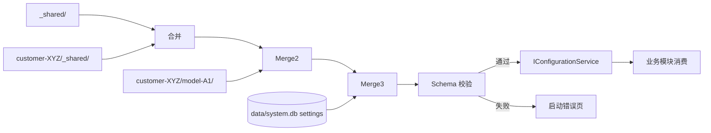
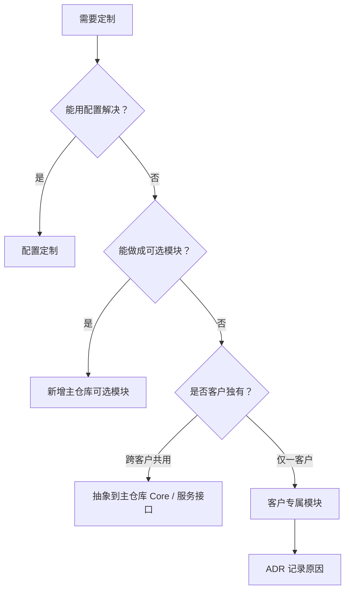
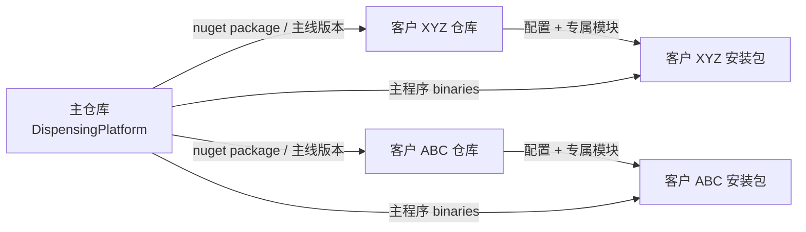

# 文档 9 — 配置与多客户管理（Config-Multitenancy.md）

> 版本：v0.1 · 最后更新：2026-05-20

本文是"标准平台 + 定制配置"商业模式的工程载体。让"客户差异 = 一份配置"而不是"客户差异 = 一个分支"。

---

## 1. 商业模式与设计目标

### 1.1 商业模式回顾（参见文档 1 §1.2）

- 一套主代码库服务多个客户和多个机型
- 客户差异通过**配置包**承载
- 定制需求优先做成**可选模块**，主程序通过配置启用
- 极少数走"客户专属模块"，且**不允许修改 Core / Contracts**

### 1.2 设计目标

1. **零代码定制**：90% 的客户差异通过 JSON / 资源文件解决
2. **配置可继承**：客户机型继承客户共享，客户共享继承全局共享
3. **配置可校验**：JSON Schema 启动时强制校验，配置错误不进主界面
4. **配置可版本**：与代码同等地走 Git，可追溯
5. **配置可分发**：客户配置独立打包，独立升级
6. **客户隔离**：配置错误不影响其他客户

### 1.3 反模式（禁止）

- ❌ 在主代码 if-else 客户名
- ❌ 在主代码引用客户专属程序集
- ❌ 客户分支并行维护（主线 + customer-A 分支 + customer-B 分支）
- ❌ 在配置里塞代码逻辑（用脚本而非配置）
- ❌ 客户配置访问其他客户的数据

---

## 2. 配置层级

### 2.1 三层 + 运行时

```
┌─────────────────────────────────────────┐
│ 4. 运行时层（用户在 UI 修改）           │  → data/system.db settings 表
└──────────────────┬──────────────────────┘
                   │ 覆盖
┌──────────────────▼──────────────────────┐
│ 3. 机型层 customer-XYZ/model-A1/        │  → 最具体
└──────────────────┬──────────────────────┘
                   │ 继承
┌──────────────────▼──────────────────────┐
│ 2. 客户层 customer-XYZ/_shared/         │  → 客户共享
└──────────────────┬──────────────────────┘
                   │ 继承
┌──────────────────▼──────────────────────┐
│ 1. 全局层 _shared/                       │  → 跨客户基线
└──────────────────────────────────────────┘
```

每一层都是可选的（可全空）。最终生效配置 = 1 + 2 + 3 + 4 按顺序合并，后者覆盖前者。

### 2.2 _shared（全局层）

跨客户共用的基线，主仓库自带：

- 标准报警码表
- 单位约定
- 通用工艺模板（细线、粗线、点胶、填充）
- 默认主题
- 默认权限映射
- HAL 接口契约的版本号

更新由开发者维护，跟代码一起走 Git。

### 2.3 customer-XYZ/_shared（客户共享层）

跨该客户多个机型共享：

- 客户品牌（logo、品牌色）
- 客户级标定数据（如所有机型共用的相机参数）
- 客户专有报警码扩展
- 客户专有工艺模板
- 客户内网配置（NTP、备份目标、MES 接口）

### 2.4 customer-XYZ/model-A1（机型层）

最具体的层：

- 整机定义
- 硬件清单（具体型号 + 通讯参数）
- 轴定义
- IO 映射
- 启用的模块清单
- UI 布局定制
- 预置配方
- 标定数据
- 定制脚本

### 2.5 运行时层

用户在 UI 中修改的偏好：

- 主题选择
- 语言
- 时区
- 单位偏好
- 最近打开的文档
- 报警过滤设置

存于 `data/system.db` 的 `settings` 表。**不写入文件配置**，不进 Git。

### 2.6 配置数据流



---

## 3. 配置加载顺序与覆盖规则

### 3.1 加载顺序

启动 Stage 0（参见文档 1 §5.5）由 `IConfigurationLoader` 执行：

1. 读 `configs/_shared/`
2. 读 `configs/customer-XYZ/_shared/`
3. 读 `configs/customer-XYZ/model-A1/`
4. 读 `data/system.db.settings`

每一层按文件名分组（`hardware.json`、`modules.json`...）。同名文件后者覆盖前者。

### 3.2 合并语义

按 JSON 节点合并（"deep merge"）：

| 类型 | 合并规则 |
|------|----------|
| Object | 递归合并，子键各自合并 |
| Array | 默认整体替换；可加 `$merge: append` 追加；`$merge: prepend` 前置 |
| Scalar（string/number/bool） | 后者整体替换 |
| `null` | 显式删除该键 |

### 3.3 数组合并的语法

数组默认整体替换（更可预测），需要追加时用元数据：

```json
{
  "alarmCodes": {
    "$merge": "append",
    "items": [
      { "code": "ALM-CUSTOMER-XYZ-MOTION-0001", ... }
    ]
  }
}
```

或语义化命名：

```json
{
  "modules": {
    "enabled": ["Drafting", "Recipe"],
    "$enabledExtra": ["SpcAnalysis"]   // 客户层追加
  }
}
```

由 `IConfigurationLoader` 解析自定义 `$xxx` 元数据。

### 3.4 引用解析

配置可以引用全局常量：

```json
{
  "alarmThresholds": {
    "deviation": "${shared.deviation.linearMoveUm}"
  }
}
```

启动时由 `IConfigurationLoader` 解析所有 `${...}`。引用循环 → 启动错误。

### 3.5 客户级覆盖示例

**全局层** `_shared/persistence.json`：

```json
{
  "backup": { "dailyTime": "03:00", "retention": { "system": 30 } }
}
```

**客户层** `customer-XYZ/_shared/persistence.json`：

```json
{
  "backup": { "dailyTime": "02:00", "remoteDestination": "//xyz-nas/dispense" }
}
```

**机型层** `customer-XYZ/model-A1/persistence.json`：

```json
{
  "backup": { "retention": { "system": 60 } }
}
```

最终：

```json
{
  "backup": {
    "dailyTime": "02:00",                          // 客户层覆盖
    "remoteDestination": "//xyz-nas/dispense",     // 客户层加
    "retention": { "system": 60 }                  // 机型层覆盖
  }
}
```

### 3.6 加载失败的降级策略

每个文件独立失败：

- 已声明存在的配置文件 schema 校验失败 → 阻塞启动 + 错误页，避免错误配置被上一层静默掩盖
- 已声明存在的配置文件 JSON 解析失败 → 阻塞启动 + 错误页
- 可选文件缺失 → 使用上一层值或默认值，并写调试日志
- 必备文件缺失（machine.json）→ 阻塞启动 + 错误页

强制必备的配置文件清单见 §4。

### 3.7 加载性能

启动时一次性加载所有配置到内存。运行时配置不在文件系统读，全部从内存。

文件监视（FileSystemWatcher）仅在工程师"重新加载配置"命令下生效，避免运行期不一致。

---

## 4. 配置文件清单

每个文件都有明确职责。所有文件都是可选的（除非标 **必备**），缺失时使用默认值。

### 4.1 文件总览

```
machine.json              # 整机定义 [必备]
hardware.json             # 硬件清单 [必备]
axes.json                 # 轴定义
io-map.json               # IO 映射
modules.json              # 启用的 Prism 模块 [必备]
ui-layout.json            # UI 布局定制
state-machine.json        # 状态机配置
persistence.json          # 持久化策略
alarm-codes.json          # 报警码表（可扩展）
unit-conventions.json     # 单位约定
recipes/                  # 预置配方目录
calibrations/             # 标定数据目录
process-templates/        # 工艺模板目录
scripts/                  # 定制脚本
branding/                 # 品牌资源
i18n/                     # 国际化资源
```

### 4.2 machine.json（必备）

整机的最高层定义：

```json
{
  "$schema": "../../schemas/machine.schema.json",
  "schemaVersion": "1.0",

  "customerId": "XYZ",
  "modelId": "A1",
  "machineModelId": "XYZ.A1",

  "displayName": "XYZ 高精度点胶机 A1",
  "serialNumber": "{{INSTALLATION_SERIAL}}",

  "stations": [
    { "id": "main",  "kind": "Effector",  "displayName": "主执行头" },
    { "id": "stage", "kind": "Substrate", "displayName": "载台 1" }
  ],

  "primaryStation": "main",
  "language": "zh-CN",
  "timezone": "Asia/Shanghai",

  "physicalLimits": {
    "workspace": { "min": [0, 0, 0], "max": [400, 300, 100] }
  }
}
```

### 4.3 hardware.json（必备）

硬件清单：

```json
{
  "$schema": "../../schemas/hardware.schema.json",
  "schemaVersion": "1.0",

  "controllers": [
    {
      "id": "main-motion",
      "type": "Motion",
      "vendor": "Beckhoff",
      "assembly": "DispensingPlatform.Hal.Motion.Beckhoff",
      "connection": {
        "amsNetId": "192.168.1.10.1.1",
        "port": 851
      }
    }
  ],

  "cameras": [
    {
      "id": "down-cam",
      "vendor": "Basler",
      "assembly": "DispensingPlatform.Hal.Camera.Basler",
      "connection": { "ip": "192.168.1.20" }
    }
  ],

  "dispensers": [
    {
      "id": "valve-1",
      "vendor": "Generic",
      "assembly": "DispensingPlatform.Hal.Dispenser.Generic",
      "connection": { "ioOutput": "DO_VALVE_1" },
      "stationRef": "main"
    }
  ],

  "sensors": [
    {
      "id": "height-1",
      "vendor": "Keyence",
      "assembly": "DispensingPlatform.Hal.Sensor.Keyence",
      "connection": { "comPort": "COM3" }
    }
  ],

  "ioModules": [
    {
      "id": "io-main",
      "vendor": "Beckhoff",
      "assembly": "DispensingPlatform.Hal.Io.Beckhoff",
      "connection": { "amsNetId": "192.168.1.10.1.1" }
    }
  ]
}
```

启动时按硬件描述解析实现。若该实现已经独立插件化，则按 `assembly` 名称从 `plugins/` 加载对应 DLL；若当前仍在主项目内部实现，则 `assembly` 只作为实现标识，由内部注册表解析，按 `connection` 实例化。

### 4.4 axes.json

轴定义（细化 hardware.json 中的运动控制器）：

```json
{
  "axes": [
    {
      "id": "X",
      "controllerRef": "main-motion",
      "controllerAxisIndex": 0,
      "stationRef": "main",
      "displayName": "X 轴",
      "kind": "Linear",
      "unit": "mm",
      "stroke": { "min": 0, "max": 400 },
      "softLimits": { "min": 5, "max": 395 },
      "homing": { "mode": "ReferenceCam", "speed": 50 },
      "limits": {
        "maxVelocity": 500,
        "maxAcceleration": 5000,
        "maxJerk": 50000
      },
      "absoluteEncoder": true
    }
  ]
}
```

### 4.5 io-map.json

将 PLC IO 通道映射到逻辑名：

```json
{
  "digitalInputs": {
    "DI_EMERGENCY_STOP": { "controllerRef": "main-motion", "address": "GVL.bEmergencyStop" },
    "DI_SAFETY_DOOR":    { "controllerRef": "main-motion", "address": "GVL.bSafetyDoor" }
  },
  "digitalOutputs": {
    "DO_VALVE_1":        { "controllerRef": "main-motion", "address": "GVL.bDispenseOn" }
  },
  "analogInputs":  { ... },
  "analogOutputs": { ... }
}
```

### 4.6 modules.json（必备）

启用的 Prism 模块：

```json
{
  "enabled": [
    "Manual",
    "Recipe",
    "Drafting",
    "Vision",
    "Production",
    "Alarm",
    "Trace",
    "Calibration",
    "Setting",
    "Maintenance"
  ],
  "disabled": [
    "SpcAnalysis"
  ],
  "loadOrder": {
    "Alarm":  10,
    "Manual": 20
  }
}
```

模块名默认对应 `Modules/<Name>` 逻辑模块。只有该模块已经独立插件化时，才映射到 `DispensingPlatform.Modules.<Name>` 程序集。

### 4.7 ui-layout.json

UI 定制：

```json
{
  "topBar": {
    "showCustomerLogo": true,
    "showSyncStatus": true,
    "kpiOrder": ["cycleTime", "doneCount", "deviationP95"]
  },
  "sideNav": {
    "defaultCollapsed": false,
    "groupOrder": ["production", "engineering", "system"]
  },
  "statusBar": {
    "axisDisplayOrder": ["X", "Y", "Z", "R"],
    "showCommunicationLights": true
  },
  "operatorView": {
    "fontScale": 1.2,
    "buttonHeight": 64,
    "showAdvancedAlarmDetails": false
  }
}
```

字段不存在时使用默认值。

### 4.8 state-machine.json

文档 6 附录 B 已详述。

### 4.9 persistence.json

文档 7 附录 B 已详述。

### 4.10 alarm-codes.json

`_shared/` 自带标准报警码，客户层 / 机型层可扩展：

```json
{
  "extensions": [
    {
      "code": "ALM-CUSTOMER-XYZ-PROCESS-0001",
      "severity": "Critical",
      "category": "Process",
      "titleKey": "Alarms.Xyz.Process.0001.Title",
      "descriptionKey": "Alarms.Xyz.Process.0001.Description",
      "recoverability": "OperatorClear"
    }
  ]
}
```

i18n 文本在 `i18n/<locale>/alarms.json` 提供。

### 4.11 unit-conventions.json

```json
{
  "default": {
    "length": "mm",
    "speed": "mm/s",
    "pressure": "kPa",
    "temperature": "C"
  },
  "displayPreferences": {
    "length": ["mm", "um", "inch"],
    "pressure": ["kPa", "psi", "bar"]
  }
}
```

### 4.12 recipes/

预置配方目录（每份 `.dpdoc`）：

```
recipes/
├─ pcb-fanout-default.dpdoc
├─ ic-underfill-default.dpdoc
└─ ...
```

启动时导入 recipe.db（如果对应 uuid 不存在）。

### 4.13 calibrations/

```
calibrations/
├─ down-camera.json
├─ handeye.json
├─ tool-offsets.json
└─ ...
```

每份独立加载，写入 recipe.db 的 calibrations 表。

### 4.14 process-templates/

工艺模板：

```
process-templates/
├─ thin-line-0.2mm.json
├─ thick-line-0.5mm.json
├─ point-large-droplet.json
└─ fill-zigzag.json
```

### 4.15 scripts/

定制脚本（V2 启用，V1 仅占位）：

```
scripts/
├─ pre-job-checklist.lua
├─ custom-vision-postprocess.lua
└─ ...
```

### 4.16 branding/

```
branding/
├─ logo-light.png
├─ logo-dark.png
├─ icon.ico
└─ brand-color.json     { "color": "#0066CC" }
```

### 4.17 i18n/

```
i18n/
├─ zh-CN/
│   ├─ strings.json
│   ├─ alarms.json
│   └─ recipes.json
├─ en-US/
└─ ...
```

---

## 5. 配置 schema 与校验

### 5.1 JSON Schema

每份配置文件都有对应 schema：

```
configs/schemas/
├─ machine.schema.json
├─ hardware.schema.json
├─ axes.schema.json
├─ io-map.schema.json
├─ modules.schema.json
├─ ui-layout.schema.json
├─ state-machine.schema.json
├─ persistence.schema.json
├─ alarm-codes.schema.json
└─ ...
```

每份 schema 严格定义所有字段类型、范围、必备 / 可选。

### 5.2 启动时校验

```csharp
public interface IConfigurationValidator {
    ConfigurationValidationResult Validate(IMachineConfiguration config);
}

public sealed record ConfigurationValidationResult(
    bool IsValid,
    IReadOnlyList<ValidationDiagnostic> Errors,
    IReadOnlyList<ValidationDiagnostic> Warnings);
```

启动 Stage 0 校验全部，任意 Error → 阻塞启动 + 显示错误页。

### 5.3 错误页面

```
┌────────────────────────────────────────────┐
│  ⚠ 配置错误，无法启动                       │
│                                            │
│  customer-XYZ/model-A1/hardware.json       │
│  Line 23: "controllers[0].connection"      │
│    缺少必备字段 "amsNetId"                 │
│                                            │
│  customer-XYZ/_shared/persistence.json     │
│  Line 8: "backup.retention.system"         │
│    类型应为 number，实际为 string          │
│                                            │
│  [打开配置目录]   [复制错误]   [退出]        │
└────────────────────────────────────────────┘
```

工程师看到这页能立刻修。

### 5.4 schema_version 字段

每份配置文件**必须**带 `schemaVersion`：

```json
{
  "schemaVersion": "1.0",
  ...
}
```

应用启动时按 schemaVersion 选择对应 schema：

- 大版本不同（1.x vs 2.x） → 阻塞，需要工程师介入升级
- 小版本不同（1.0 vs 1.2） → 自动迁移并校验
- schemaVersion 缺失 → Error，阻塞启动；只有开发期迁移工具可用 `--assume-current-schema` 临时处理

### 5.5 IDE 友好

每份配置文件首行加 `$schema`：

```json
{
  "$schema": "../../schemas/hardware.schema.json",
  ...
}
```

VS Code / Rider / Cursor 自动校验 + 自动补全。开发期错误立刻可见。

### 5.6 配置 lint 工具

`tools/Scripts/validate-config.ps1`：

- 扫描整个 configs/ 目录
- 校验所有 JSON 文件
- 输出报告

CI 上每次 PR 跑一次，确保提交的配置都合法。

---

## 6. 模块启用机制

### 6.1 modules.json 与 Prism Module 注册

启动时 Prism Module Catalog 由 `modules.json` 动态构建：

以下示例仅适用于模块已经独立插件化的阶段；当前最小骨架可以先由 Shell 注册内置页面/模块。

```csharp
public sealed class ConfigurableModuleCatalog : IModuleCatalog {
    public IEnumerable<IModuleInfo> Modules => _modules;

    public void Initialize(IModuleManifest manifest) {
        foreach (var entry in manifest.Enabled.OrderBy(e => e.LoadOrder)) {
            var info = new ModuleInfo {
                ModuleName = entry.Name,
                ModuleType = $"DispensingPlatform.Modules.{entry.Name}.{entry.Name}Module, " +
                             $"DispensingPlatform.Modules.{entry.Name}",
                InitializationMode = InitializationMode.WhenAvailable,
                Ref = $"plugins/Modules/DispensingPlatform.Modules.{entry.Name}.dll"
            };
            _modules.Add(info);
        }
    }
}
```

### 6.2 模块依赖声明

模块通过 `IModuleInfo.DependsOn` 声明依赖：

```csharp
[ModuleDependency("Recipe")]
[ModuleDependency("Calibration")]
public sealed class DraftingModule : IModule {
    public void RegisterTypes(IContainerRegistry registry) { ... }
}
```

Prism 自动按拓扑排序加载。循环依赖 → 启动错误。

### 6.3 模块加载失败的隔离

非关键模块加载失败 → 降级（其他模块继续）。关键模块（Alarm / Production）失败 → 阻塞启动。

通过 `criticality` 元数据标注：

```json
{
  "enabled": ["Manual", "Recipe", ...],
  "criticality": {
    "Alarm": "critical",
    "Production": "critical",
    "Trace": "optional"
  }
}
```

### 6.4 缺失硬件时的降级

如果某硬件配置缺失（如客户没买视觉），相关模块自动隐藏：

```json
{
  "enabled": ["Manual", "Recipe", "Drafting", "Vision", ...],
  "autoDisableIfMissingHardware": {
    "Vision": ["cameras"]
  }
}
```

启动时检查 `hardware.cameras` 是否为空，为空则自动从启用列表移除 Vision。

### 6.5 客户专属模块

客户专属模块（极少数情况）：

- 实现在 `DispensingPlatform.Modules.Customer.<XYZ>.<FeatureName>`
- DLL 单独打包到客户 `plugins/` 目录
- modules.json 启用
- **不允许修改 Core / Contracts**
- 客户专属模块的接口必须先抽象到 Contracts 提案 ADR，避免主线碎片化

### 6.6 模块裁剪

部分客户不需要某些功能（如不需要 SPC 分析）：

```json
{
  "disabled": ["SpcAnalysis", "MesAdapter"]
}
```

被禁用的模块连 DLL 都不加载（节省内存 / 启动时间）。

---

## 7. 硬件清单到 HAL 实现的映射

### 7.1 hardware.json 中的声明

如 §4.3 所示，每个硬件描述包含：

- `id`：逻辑标识
- `type` / `vendor`：用于显示和能力推断
- `assembly`：实现标识；当实现已经插件化时，也是 DLL / 程序集名
- `connection`：厂家专有连接参数

### 7.2 启动时 DI 容器解析

```csharp
public void RegisterHardware(IContainerRegistry registry, IHardwareDescriptor hw) {
    foreach (var ctrl in hw.Controllers) {
        var asm = LoadAssembly(ctrl.AssemblyName);
        var factoryType = asm.GetTypes()
            .Single(t => typeof(IMotionControllerFactory).IsAssignableFrom(t) && !t.IsAbstract);
        var factory = (IMotionControllerFactory)Activator.CreateInstance(factoryType);
        var instance = factory.Create(ctrl.ConnectionParameters);

        registry.RegisterInstance<IMotionController>(instance, ctrl.Id);
    }
    // 同理 cameras / dispensers / sensors / ioModules
}
```

服务实现通过硬件注册表按 id 获取，避免业务代码依赖容器的命名注入细节：

```csharp
public sealed class MotionService(IHardwareRegistry hardware) : IMotionService {
    public IMotionGroup MainGroup => hardware.GetMotionGroup("main");
}
```

### 7.3 仿真模式自动替换

启动时若 `--simulator` 参数或 `machine.json.simulationMode = true`：

- 所有硬件实现标识 / `assembly` 字段重写为 `DispensingPlatform.Hal.Simulator`
- 同一份 connection 参数交给 Simulator 用（用于配置仿真行为）

切换简单：

```bash
DispensingPlatform.exe --customer XYZ --model A1 --simulator
```

仿真模式 UI 上明确标识，避免误操作。

### 7.4 硬件能力查询

每个 HAL 实现声明能力（参见文档 3 §1.6 Capability Flags）。业务层通过：

```csharp
if (motion.Capabilities.Has(MotionCapabilities.PositionSync)) {
    // 启用 PSO 飞行点胶选项
} else {
    // 隐藏该选项 + 提示"当前控制器不支持"
}
```

UI 自动响应能力差异，无需在 UI 代码 if 客户名。

### 7.5 多控制器并存

同一台机器可有多个控制器（Beckhoff 主控 + ACS 副控）：

```json
{
  "controllers": [
    { "id": "main",       "vendor": "Beckhoff", ... },
    { "id": "high-speed", "vendor": "ACS",      ... }
  ]
}
```

业务层按 id 选择：

```csharp
var ctrl = _motion.GetController(stationConfig.ControllerRef);
```

### 7.6 硬件版本兼容

每个 HAL 实现声明它支持的硬件版本范围：

```json
{
  "vendor": "Beckhoff",
  "assembly": "DispensingPlatform.Hal.Motion.Beckhoff",
  "supportedFirmware": [">=4.10", "<5.0"]
}
```

启动时实际握手版本不在范围 → 警告 + 进入"兼容模式"或拒绝。

## 8. 定制扩展三种形态

按"侵入性从低到高"排序，**优先用低侵入方案**。

### 8.1 配置定制（首选）

适用 90% 客户差异：

- 硬件清单不同
- 启用 / 禁用模块
- UI 布局微调
- 工艺模板预置
- 报警码扩展
- 国际化 / 品牌

只改 `configs/customer-XYZ/`，主代码完全不动。

### 8.2 可选模块（次选）

某些功能并非所有客户都要（SPC 分析、MES 上传、特殊视觉算法）：

- 优先在主仓库 `src/Modules/` 下实现为可选逻辑模块
- 只有需要独立加载、客户裁剪或单独发布时，才拆成独立 Prism Module 项目
- 默认在 `_shared/modules.json` 的 `disabled` 列表
- 客户机型层把它移到 `enabled`

特点：

- 主线维护
- 跨客户复用
- 不强制所有客户

### 8.3 客户专属模块（末选）

仅在前两种方案都不够时使用：

- 实现在客户配置仓库（不在主代码仓库）
- 命名 `DispensingPlatform.Modules.Customer.<XYZ>.<FeatureName>`
- 单独 csproj，依赖主仓库的 NuGet 包（不是 ProjectReference）
- 单独打包到客户 `plugins/Modules/`

约束：

- **不允许修改主仓库代码**
- **不允许改 Core / Contracts / Hal.Contracts**
- 必须只通过公开接口扩展
- 客户专属代码必须有 ADR 记录"为何不能用前两种方案"

### 8.4 决策树



### 8.5 示例：客户 XYZ 要"双胶水自动切换"功能

判断流程：

- 配置能否解决？双阀切换涉及 IO 联动 + 状态机扩展，配置无法覆盖 → 否
- 可选模块？跨客户可能复用（其他客户也可能要），加 `Modules/MultiGlue` 逻辑模块 → 选这条
- 在主仓库 `src/Modules/` 下新增 `MultiGlue`；只有需要独立加载或裁剪时，再创建 `DispensingPlatform.Modules.MultiGlue` 项目

### 8.6 示例：客户 XYZ 要"按图层名映射到客户特定 PLM 系统"

判断流程：

- 配置能解决吗？需要调用 PLM API → 否
- 跨客户共用吗？仅 XYZ 内部 PLM → 否
- → 客户专属模块 `DispensingPlatform.Modules.Customer.Xyz.PlmIntegration`

写 ADR：为何不抽到主仓库（PLM 系统是 XYZ 私有协议，无通用价值）。

### 8.7 不允许的反例

- ❌ 在 `Modules/Drafting` 加 `if (customerId == "XYZ") { ... }`
- ❌ 在 `Core/Services` 加客户专属字段
- ❌ 在 `Core/Contracts` 加客户专属枚举值
- ❌ 客户专属模块直接 `using` 主仓库 internal 类

CI 上有架构测试（参见文档 2 的依赖边界原则）强制：

- 主仓库代码不允许出现客户名字符串（除测试）
- 客户专属程序集不能引用主仓库的 internal

---

## 9. 敏感信息处理

### 9.1 敏感数据分类

| 类别 | 处理方式 |
|------|----------|
| 客户专属标定数据 | 加密存储 / 不进 Git |
| 客户密码 / API 密钥 | 加密存储 / 不进 Git / DPAPI |
| 客户私有协议参数 | 加密存储 / 单独客户仓库 |
| 客户内网 IP / 端口 | 视情况，建议不进主仓库 |
| 客户 logo / 名称 | 公开，可进 Git |
| 客户工艺参数 | 视客户协议，默认进 Git |

### 9.2 加密存储

敏感字段在配置里用占位符：

```json
{
  "mes": {
    "endpoint": "https://mes.xyz-corp.local",
    "apiKey": "{{secret:mes.apiKey}}"
  }
}
```

`{{secret:xxx}}` 启动时由 `ISecretStore` 解析，从加密存储读取真实值：

- 开发期：本机 DPAPI（用户级）
- 生产期：硬件密钥模块 / 客户提供的 KMS

`ISecretStore` 接口：

```csharp
public interface ISecretStore {
    Task<string?> GetAsync(string key, CancellationToken ct);
    Task SetAsync(string key, string value, CancellationToken ct);
}
```

### 9.3 不进 Git 的目录

`.gitignore` 默认排除：

```
configs/**/secrets/
configs/**/calibrations/*.priv.json
configs/**/credentials.json
```

客户私有数据放这些路径，不会被误提交。

### 9.4 客户专有标定的隔离

部分客户视标定数据为商业机密：

- 标定数据放 `configs/customer-XYZ/_shared/calibrations/`
- 主仓库不存储
- 客户安装时由客户工程师导入
- 启动时如缺失 → 提示"请先完成标定"

### 9.5 配置传输安全

客户配置包通过加密通道传输（VPN / SFTP）。文档 10 详述发布流程。

### 9.6 审计

敏感信息访问写审计：

- 谁读取了哪个 secret
- 谁修改了哪个 calibration
- 谁导出了配置包

详见文档 7 §11.3。

---

## 10. 多客户协作

### 10.1 客户 / 机型矩阵

每个客户支持多个机型：

```
configs/
├─ customer-A/
│   ├─ _shared/
│   ├─ model-A1/
│   └─ model-A2/
├─ customer-B/
│   ├─ _shared/
│   └─ model-B1/
└─ customer-C/
    ├─ _shared/
    ├─ model-C1/
    ├─ model-C2/
    └─ model-C3/
```

机型间共享通过客户层；客户间共享通过全局层。**客户间不直接共享**。

### 10.2 跨客户改动的回流流程

发现某客户的功能/修复对其他客户有用：

1. 提案：在 `docs/adr/` 写 ADR 说明
2. 评估：哪些客户受影响
3. 实施：把相关逻辑抽到主仓库
4. 通知：影响到的客户接收升级
5. 客户配置层移除已上升到主线的部分

### 10.3 客户分支策略

主仓库只有一条主线（main）。

- 不允许 `customer-xyz-branch`
- 客户配置走独立仓库（详见 §11）
- 紧急修复走 hotfix 分支，但合到 main 后立即合到所有客户配置

### 10.4 客户优先级

不同客户对同一 bug 的优先级可能不同。优先级管理：

- 主仓库 issue 标签 `customer:xyz`
- 客户付费等级影响 SLA
- 不允许在代码里 if 客户名

### 10.5 客户协同的安全边界

- 客户 A 的代码 / 配置 / 数据**绝不**出现在客户 B 的安装包
- 工程师维护期间也要遵守（不要在客户 B 现场看客户 A 的资料）
- 备份 / 诊断包不允许跨客户传递

---

## 11. 配置版本管理

### 11.1 配置文件 Git 化

`configs/_shared/` 与可公开的客户层进入主仓库，与代码同步演进：

```
DispensingPlatform/                # 主仓库
├─ src/                            # 代码
├─ configs/
│   ├─ _shared/                    # 进 Git
│   └─ public-templates/           # 公共示例
└─ ...
```

### 11.2 客户配置仓库

客户专属配置 + 敏感信息 + 客户专属模块：

```
DispensingPlatform-Customer-XYZ/   # 独立 Git 仓库（私有）
├─ configs/
│   └─ customer-XYZ/
│       ├─ _shared/
│       ├─ model-A1/
│       └─ model-A2/
├─ secrets/                        # 加密存储引用
├─ plugins/                        # 客户专属模块 DLL
└─ docs/                           # 客户专属文档
```

部署时：把客户配置仓库覆盖到主仓库的 `configs/` 与 `plugins/` 目录。

### 11.3 主仓库与客户仓库的关系



打包流程详见文档 10。

### 11.4 客户仓库不允许 fork 主仓库

- ❌ 客户仓库 = fork(主仓库) + 修改源码
- ✅ 客户仓库 = 主仓库的"配置 + 插件"卫星仓库

理由：避免客户分支腐化、便于主线升级。

### 11.5 升级时的配置迁移

主仓库 schema 升级时（如 hardware.json 字段变化）：

- 主仓库提供迁移工具 `tools/Scripts/migrate-config.ps1`
- 客户配置仓库的维护者运行该工具
- 工具读旧 schema → 输出新 schema
- 迁移结果走 PR / Code Review
- 不可自动迁移的 → 工具提示哪里需要人工

### 11.6 配置变更的审计

客户配置仓库的 commit history 即审计来源：

- 谁、何时、改了什么
- PR 评审记录
- 关联的现场工单 / 变更单

合规客户可以拿这套作为变更证据。

### 11.7 配置发布版本号

每份客户配置带版本：

```json
{
  "configurationVersion": "2026.05.20-1"
}
```

启动时与主程序版本对照，记录到审计与诊断包。

---

## 12. 客户切换工具

主要面向开发期（同一台开发机切换多客户调试）。

### 12.1 启动参数

```bash
DispensingPlatform.exe --customer XYZ --model A1
```

### 12.2 环境变量

```
DP_CUSTOMER=XYZ
DP_MODEL=A1
DP_DATA_DIR=./data-xyz   # 可选，独立数据目录
```

### 12.3 注册表（生产机器固化）

```
HKLM\Software\DispensingPlatform\
├─ ActiveCustomer = "XYZ"
├─ ActiveModel    = "A1"
└─ DataDirectory  = "C:\DispensingPlatform\data"
```

生产机器一次安装后固化，不让用户随意切换（避免误用别的客户配置）。

### 12.4 开发期切换

`%APPDATA%\DispensingPlatform\active.json`：

```json
{
  "customer": "XYZ",
  "model": "A1",
  "dataDirectory": "./data-xyz",
  "simulationMode": true
}
```

开发者切换文件即可切客户，便于本机同时调试多个客户配置。

### 12.5 启动客户选择对话框

某些场景（首次启动、未配置时）显示客户选择对话框：

```
┌──────────────────────────────────┐
│  选择客户与机型                   │
│                                  │
│  客户 [▼ XYZ          ]          │
│  机型 [▼ A1           ]          │
│                                  │
│  □ 仿真模式                       │
│  □ 记住选择                       │
│                                  │
│         [取消]  [启动]            │
└──────────────────────────────────┘
```

### 12.6 不同客户的数据隔离

每个客户独立 `data/` 目录，避免跨客户数据混淆。开发机切换时按 `DP_DATA_DIR` 决定。

生产机器一台只服务一个客户，不存在跨客户数据。

### 12.7 切换的安全检查

切换客户前 / 后：

- 当前 Job 必须停止
- 配方 / 标定 / 历史不可跨客户访问
- UI 标题栏显示当前客户 + 机型，避免误操作

---

## 13. 测试策略

### 13.1 配置 schema 校验

每份 schema 配套单元测试：

- 合法配置应通过
- 各种非法变体应失败
- schema_version 升级路径测试

### 13.2 多层合并测试

测试覆盖：

- 全局 + 客户层合并
- 全局 + 客户 + 机型合并
- 数组合并（替换 / append / prepend）
- null 显式删除
- 引用解析（`${...}`）
- 循环引用检测

### 13.3 客户配置 lint

每个客户至少有一份"smoke 测试"配置纳入 CI：

```
tests/CustomerConfigSmokeTests/
├─ Customer.Xyz.A1.Tests.cs
└─ Customer.Abc.B1.Tests.cs
```

测试内容：

- 配置加载成功
- 所有 schema 校验通过
- 模块加载顺序合理
- 仿真模式下能启动到 Idle
- 至少跑一个 Job（仿真）

CI 上每次 PR 跑全部客户配置 smoke。

### 13.4 配置回归测试

主仓库改动可能影响客户配置：

- 新增配置项 → 旧客户配置应仍然可以加载（默认值）
- 字段重命名 → 自动迁移
- 字段删除 → schema 升级 + 迁移工具

测试用例覆盖每次 schema 变更。

### 13.5 客户专属模块测试

客户专属模块在客户仓库内有独立测试：

- 单元测试
- 与主仓库主线版本的集成测试

主仓库主线升级时，客户仓库 CI 跑回归。

### 13.6 配置可用性测试

工程师手动测试：

- 一份新客户配置从零搭建可用
- 启动 / 停止 / 跑 Job 全流程
- 切换主题 / 语言
- 报警 / 审计 / 备份正常

文档化在客户上线 checklist。

### 13.7 性能测试

配置加载性能：

- 配置文件总大小通常 < 10 MB（含预置配方）
- 启动加载时间 < 2 秒
- 大量预置配方（> 100）的导入性能

CI 跑 BenchmarkDotNet。

---

## 附录 A — 关键接口速查

```
DispensingPlatform.Core.Contracts.Configuration
├─ IConfigurationService
├─ IConfigurationLoader
├─ IConfigurationValidator
├─ IMachineConfiguration
├─ IHardwareDescriptor
├─ IModuleManifest
├─ IUiLayoutDescriptor
├─ IBrandingDescriptor
└─ ISecretStore

DispensingPlatform.Core.Infrastructure.Configuration
├─ ConfigurationLoader（实现）
├─ JsonSchemaValidator
├─ DpapiSecretStore
└─ ConfigurationFileWatcher（仅工程师可用）
```

---

## 附录 B — 配置树速查

```
configs/
├─ schemas/                          # JSON Schema 文件
├─ _shared/                          # 全局层（主仓库）
│   ├─ alarm-codes.json
│   ├─ unit-conventions.json
│   ├─ recipe-templates/
│   ├─ process-templates/
│   ├─ persistence.json
│   ├─ state-machine.json
│   └─ i18n/
└─ customer-XYZ/                     # 客户层
    ├─ _shared/                      # 客户共享
    │   ├─ branding/
    │   ├─ alarm-codes.json
    │   ├─ persistence.json
    │   ├─ recipes/
    │   └─ i18n/
    ├─ model-A1/                     # 机型层
    │   ├─ machine.json              [必备]
    │   ├─ hardware.json             [必备]
    │   ├─ axes.json
    │   ├─ io-map.json
    │   ├─ modules.json              [必备]
    │   ├─ ui-layout.json
    │   ├─ state-machine.json
    │   ├─ persistence.json
    │   ├─ recipes/
    │   ├─ calibrations/
    │   ├─ process-templates/
    │   └─ scripts/
    └─ model-A2/
```

---

## 附录 C — 客户接入 Checklist

新客户首次接入流程：

```
□ 创建客户 Git 仓库 DispensingPlatform-Customer-<ID>
□ 申请客户 ID（不与现有客户冲突）
□ 复制 configs/templates/customer-template/ 到客户仓库
□ 填 machine.json / hardware.json / modules.json
□ 配置 axes.json + io-map.json
□ 提供 branding 资源
□ 翻译需要的 i18n 资源
□ 准备预置配方（可选）
□ 配置 persistence + state-machine（可选，否则用默认）
□ 处理敏感信息（写入 ISecretStore，不进 Git）
□ 本地启动测试（仿真模式）
□ 跑 smoke 测试 + 一个完整 Job
□ 撰写客户上线 checklist
□ 现场部署 + 验证
□ 培训操作员 / 工程师
□ 留下诊断包导出方式 + 售后联系方式
```

---

## 附录 D — 与其他文档的关系

- 文档 1 Architecture：商业模式 / 部署形态
- 文档 2 Solution-Structure：configs/ 目录在解决方案中的位置
- 文档 3 Core-Contracts：配置接口（IMachineConfiguration / IHardwareDescriptor / IModuleManifest）
- 文档 6 StateMachine-Design：state-machine.json
- 文档 7 Data-Persistence：persistence.json
- 文档 8 Design-System：branding / ui-layout.json
- 文档 10 DevOps：客户配置仓库的 CI / 安装包打包流程
